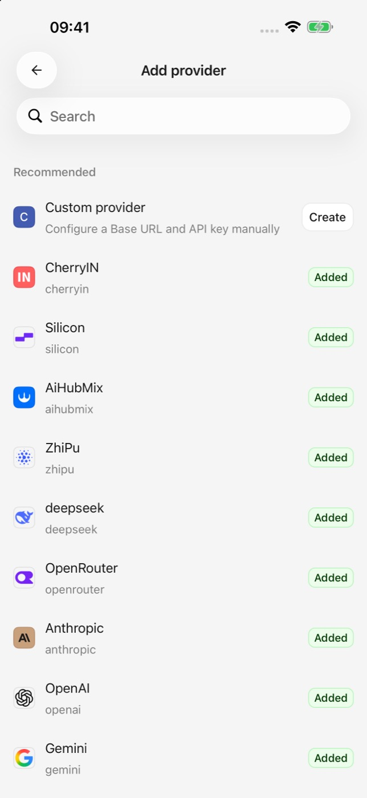
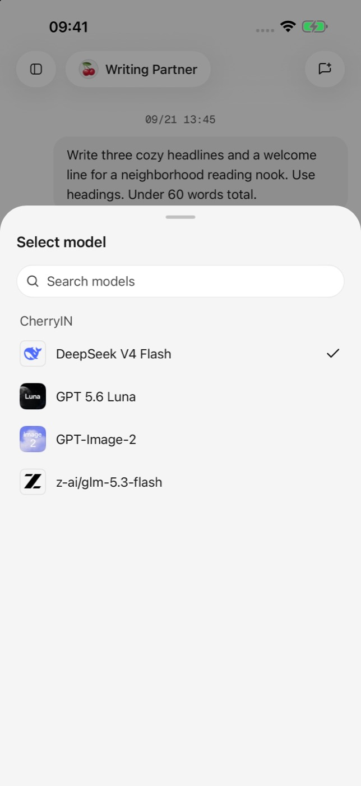

# Quick start

Complete these four steps to send your first message.

## 1. Add a provider

Open model services in app settings and choose a built-in provider. For a compatible API, create a custom provider and enter its Base URL.

## 2. Add credentials

Enter the API key issued by the provider, then save or test the connection as prompted. Never share the key or include it in public chats, screenshots, or bug reports.

## 3. Add a model

Fetch or add models for the provider and enable at least one model. Support for chat, vision, tools, and image generation varies by model.

<figure data-mobile-shot="phone"><figcaption>
<strong>Step 1</strong> · Choose a built-in provider or create a custom one
</figcaption></figure>
<figure data-mobile-shot="phone"><figcaption>
<strong>Step 3</strong> · Select an enabled model inside the conversation
</figcaption></figure>

## 4. Send a message

Return to Chat, open the default assistant or create one, select a model, and send a short message. Receiving a response confirms the basic setup works.

Next, read [Providers and models](providers-and-models.md) or learn about [Chat and files](chat-and-files.md).
