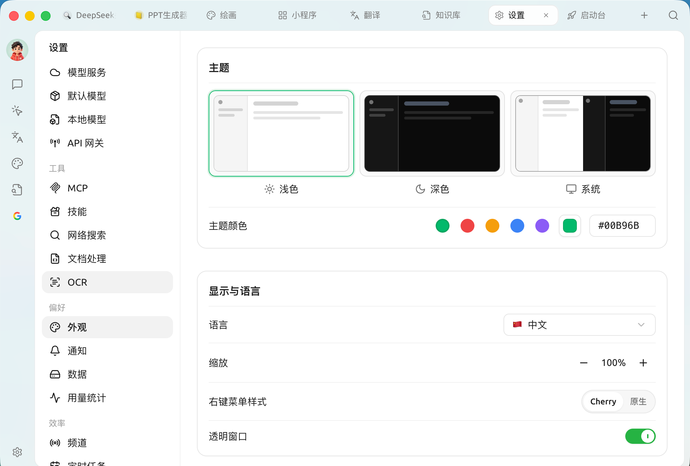
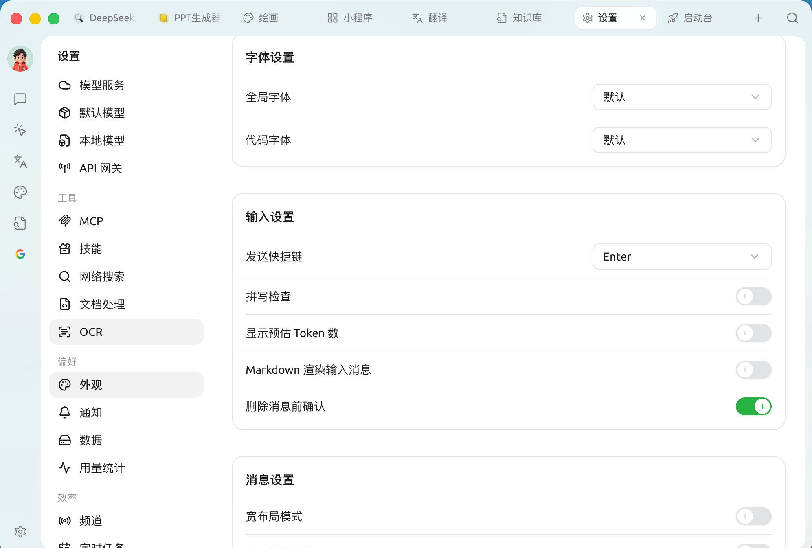
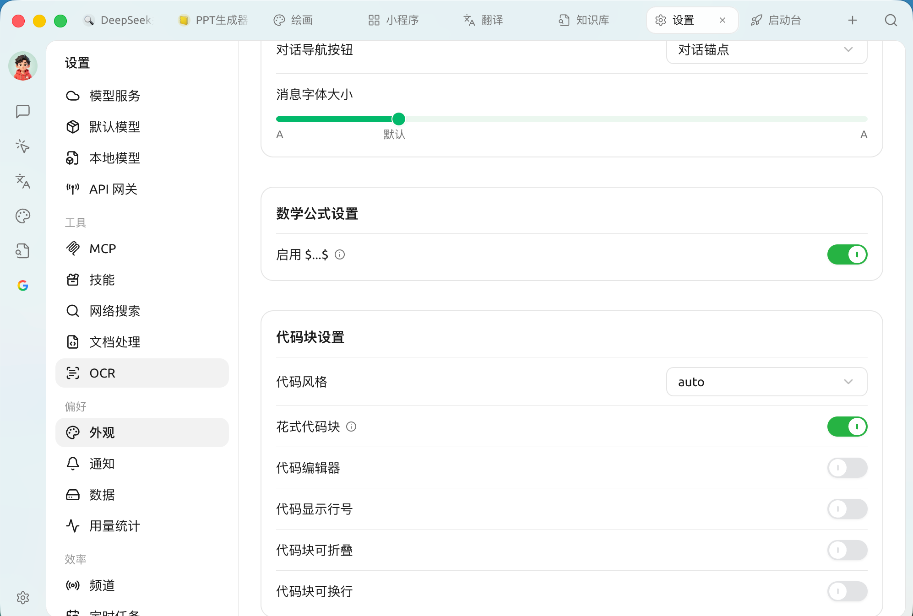

# Appearance

Appearance settings gather all your preferences for **how the interface looks, how messages are displayed, and how code and formulas are rendered**. Open `Settings → Appearance`; from top to bottom you'll find the Theme, Display and Language, Font, Input, Message, Math Formula and Code Block sections.

> Need more than these options? You can go further with [Custom CSS](../../../pre-basic/personalization-settings/custom-css.md).

### Theme and Theme Color

<figure><figcaption>
Theme, theme color and display language
</figcaption></figure>

* **Theme**: switch between **Light / Dark / System** ("System" follows your operating system's light or dark mode).
* **Theme color**: choose the interface's primary color from several presets, or enter a hex value on the right (such as `#00B96B`) for a custom color.

### Display and Language

| Setting | Description |
| --- | --- |
| **Language** | Interface language; supports Simplified Chinese, Traditional Chinese, English, Japanese, German, French and more |
| **Zoom** | Overall interface scale; adjust it for large or small screens, or if the text feels too small |
| **Context menu style** | Switch between Cherry's own menu and the system's **native** right-click menu |
| **Transparent window** | Enables a translucent frosted-glass window effect (**macOS only**; may affect performance on some graphics cards) |

### Font Settings

* **Global font**: the font used across the interface. It defaults to the system font; you can switch to any font you like.
* **Code font**: the monospaced font used in code blocks.

For font suggestions, see [Font Recommendations](../../../pre-basic/personalization-settings/font.md).

### Input Settings

<figure><figcaption>
Font, input and message display settings
</figcaption></figure>

| Setting | Description |
| --- | --- |
| **Send shortcut** | The key used to send a message (such as `Enter` or `Shift+Enter`) |
| **Spell check** | Shows a red wavy line under misspelled English words; turn it off if you mainly type Chinese to avoid false alarms |
| **Show estimated token count** | Shows the estimated tokens your input will use in the input box (for reference only, not actual billing) |
| **Markdown render input messages** | When off, the messages you send aren't rendered as Markdown; only model replies are |
| **Confirm before deleting messages** | Asks for confirmation before a message is deleted, to prevent accidents |

### Message Settings

Controls how AI replies appear in the chat area:

| Setting | Description |
| --- | --- |
| **Wide layout** | Lets message content fill a wider area |
| **Use serif font** | Switches body text to a serif font, which is more comfortable for long reads |
| **Auto-collapse thinking content** | For reasoning models, collapses the thinking process automatically once it's done |
| **Show message outline** | Generates a clickable outline for longer replies |
| **Message style** | Switch between **Bubble** and **Plain** styles |
| **Multi-model answer style** | Layout when comparing multiple models, such as **Horizontal** |
| **Conversation navigation button** | How to jump around long conversations, such as **Conversation anchors** |
| **Message font size** | Drag the slider to adjust the font size in the chat area |

### Math Formulas

* **Enable `$...$`**: when on, inline math wrapped in `$` is recognized and rendered as a formula.

### Code Block Settings

<figure><figcaption>
Math formula and code block settings
</figcaption></figure>

| Setting | Description |
| --- | --- |
| **Code style** | Syntax highlighting color scheme (default `auto` follows the theme) |
| **Fancy code blocks** | A more polished code block look |
| **Code editor** | Displays code in an editable code editor style |
| **Show line numbers** | Shows line numbers on the left of code blocks |
| **Collapsible code blocks** | Collapses long code automatically |
| **Wrap code blocks** | Wraps overly long lines to avoid horizontal scrolling |

> With **Code editor** turned on, four more switches appear — **Highlight active line / Fold controls / Autocomplete / Keyboard shortcuts** — for finer control over the editor.

### Code Execution

* **Code execution**: lets you run model-generated code snippets directly in the conversation.
* **Enable preview tools**: provides instant previews of rendered output, such as charts from mermaid code blocks.


Code execution runs model-generated code on your computer. Only turn it on if you understand and trust the content.


### Custom CSS

The editor at the bottom of the panel lets you write custom CSS directly for finer personalization of the interface. For syntax and examples, see [Custom CSS](../../../pre-basic/personalization-settings/custom-css.md); to restore the defaults, see [Clear CSS Settings](../../../pre-basic/personalization-settings/clear-css.md).

***

### Get Help and Submit Feedback

If you have any questions, bugs, or feature suggestions during configuration or use, please use the official channels listed in [Feedback and Suggestions](../../../question-contact/suggestions.md).
