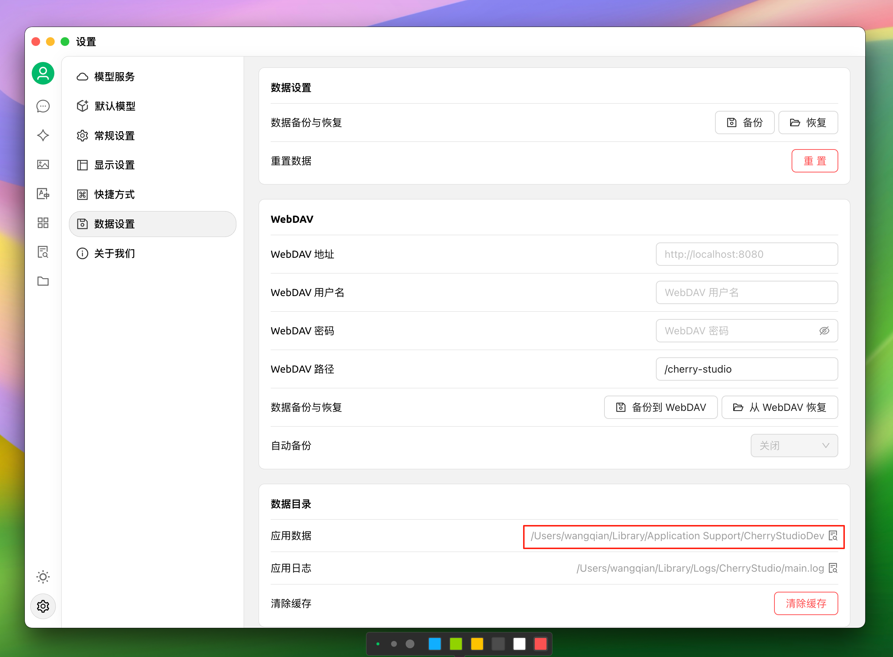

# Change Storage Location

## Default Storage Location

Cherry Studio data storage adheres to system specifications, and data is automatically placed in the user directory. The specific directory locations are as follows:

> macOS: /Users/username/Library/Application Support/CherryStudioDev

> Windows: C:\Users\username\AppData\Roaming\CherryStudio

> Linux: /home/username/.config/CherryStudio

You can also view it in the following location:

<figure><figcaption></figcaption></figure>

## Change Storage Location (for reference)

Method 1:

This can be achieved by creating a symbolic link. Exit the software, move the data to your desired location, and then create a link in the original location pointing to the new location.

For detailed steps, please refer to: [https://github.com/CherryHQ/cherry-studio/issues/621#issuecomment-2588652880](https://github.com/CherryHQ/cherry-studio/issues/621#issuecomment-2588652880)

Method 2:
Based on the characteristics of Electron applications, modify the storage location by configuring startup parameters.

> \--user-data-dir\
> E.g.: Cherry-Studio-\*-x64-portable.exe --user-data-dir="%user\_data\_dir%"

> Example:

```shell
PS D:\CherryStudio> dir


    Directory: D:\CherryStudio


Mode                 LastWriteTime         Length Name
----                 -------------         ------ ----
d-----         2025/4/18     14:05                user-data-dir
-a----         2025/4/14     23:05       94987175 Cherry-Studio-1.2.4-x64-portable.exe
-a----         2025/4/18     14:05            701 init_cherry_studio.bat
```

> init\_cherry\_studio.bat (encoding: ANSI)

```bash
@title CherryStudio Initialization
@echo off

set current_path_dir=%~dp0
@echo Current path:%current_path_dir%
set user_data_dir=%current_path_dir%user-data-dir
@echo CherryStudio Data Path:%user_data_dir%

@echo Searching for Cherry-Studio-*-portable.exe in current path
setlocal enabledelayedexpansion

for /f "delims=" %%F in ('dir /b /a-d "Cherry-Studio-*-portable*.exe" 2^>nul') do ( #This code is adapted for versions downloaded from GitHub and the official website, please modify for others
    set "target_file=!cd!\%%F"
    goto :break
)
:break
if defined target_file (
    echo File found: %target_file%
) else (
    echo No matching file found, exiting script
    pause
    exit
)

@echo Confirm to continue
pause

@echo Starting CherryStudio
start %target_file% --user-data-dir="%user_data_dir%"

@echo Operation finished
@echo on
exit
```

> Directory structure after user-data-dir initialization:

```shell
PS D:\CherryStudio> dir .\user-data-dir\


    Directory: D:\CherryStudio\user-data-dir


Mode                 LastWriteTime         Length Name
----                 -------------         ------ ----
d-----         2025/4/18     14:29                blob_storage
d-----         2025/4/18     14:07                Cache
d-----         2025/4/18     14:07                Code Cache
d-----         2025/4/18     14:07                Data
d-----         2025/4/18     14:07                DawnGraphiteCache
d-----         2025/4/18     14:07                DawnWebGPUCache
d-----         2025/4/18     14:07                Dictionaries
d-----         2025/4/18     14:07                GPUCache
d-----         2025/4/18     14:07                IndexedDB
d-----         2025/4/18     14:07                Local Storage
d-----         2025/4/18     14:07                logs
d-----         2025/4/18     14:30                Network
d-----         2025/4/18     14:07                Partitions
d-----         2025/4/18     14:29                Session Storage
d-----         2025/4/18     14:07                Shared Dictionary
d-----         2025/4/18     14:07                WebStorage
-a----         2025/4/18     14:07             36 .updaterId
-a----         2025/4/18     14:29             20 config.json
-a----         2025/4/18     14:07            434 Local State
-a----         2025/4/18     14:29             57 Preferences
-a----         2025/4/18     14:09           4096 SharedStorage
-a----         2025/4/18     14:30            140 window-state.json
```