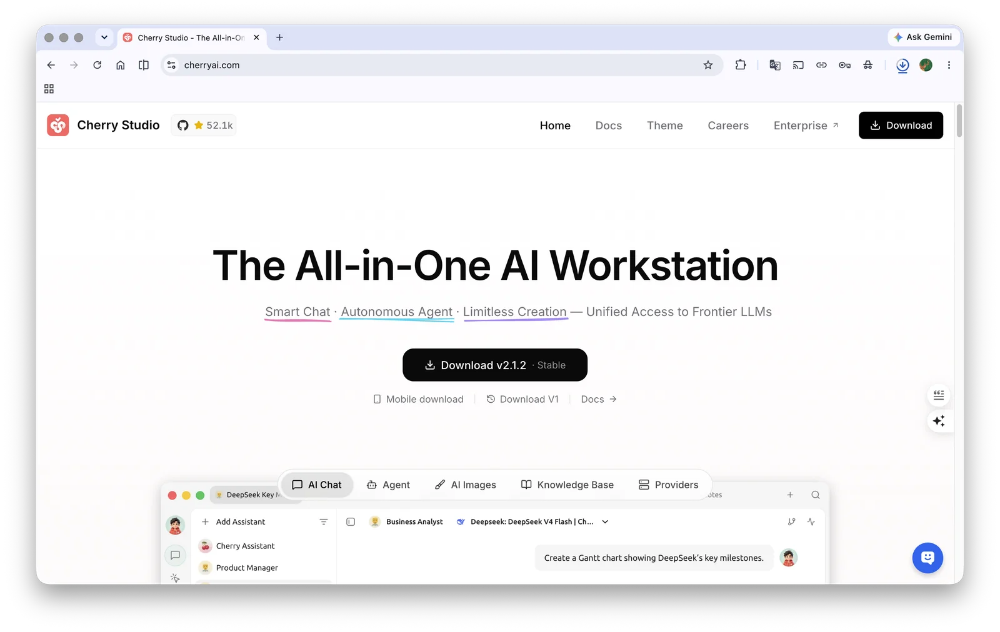
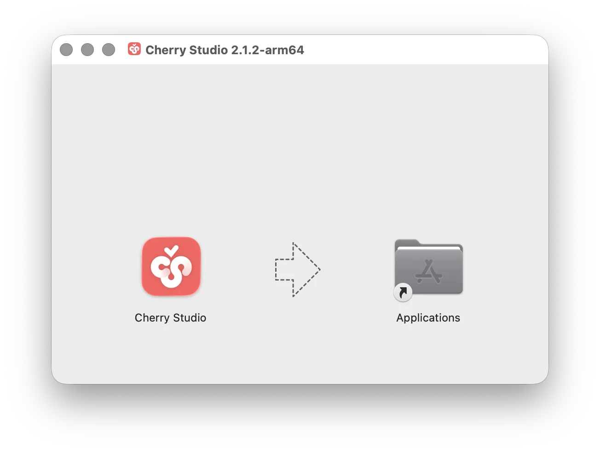
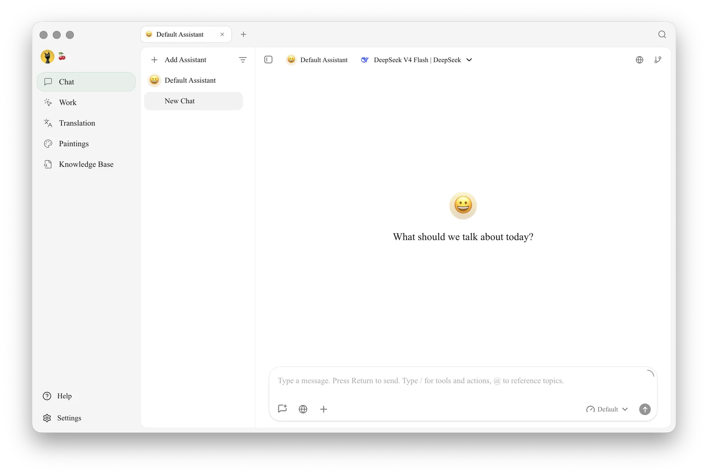

# macOS

1. First, go to the [official website](https://cherryai.com), click **Download**, and download the Mac version, or click directly below.

<figure><figcaption>
Cherry Studio official website
</figcaption></figure>

Please make sure to download the **chip version corresponding to your Mac**

If you don't know which chip version your Mac should use:

*   Click the  menu in the top left corner of your Mac
*   Click "About This Mac" in the dropdown menu
*   Check the processor information in the pop-up window

If it's an Intel chip, download the Intel version installer.

If it's an Apple M\* chip, download the Apple Silicon installer.




2. After the download is complete, open the downloaded file (for example, from your browser's download list)

<figure><figcaption>
On the download page, macOS offers Apple Chip and Intel Chip installers
</figcaption></figure>

3. Drag the Cherry Studio icon into the Applications folder to install

<figure><figcaption></figcaption></figure>

Find the Cherry Studio icon in Launchpad and click on it. If the Cherry Studio main interface opens, the installation is successful.

<figure><figcaption></figcaption></figure>