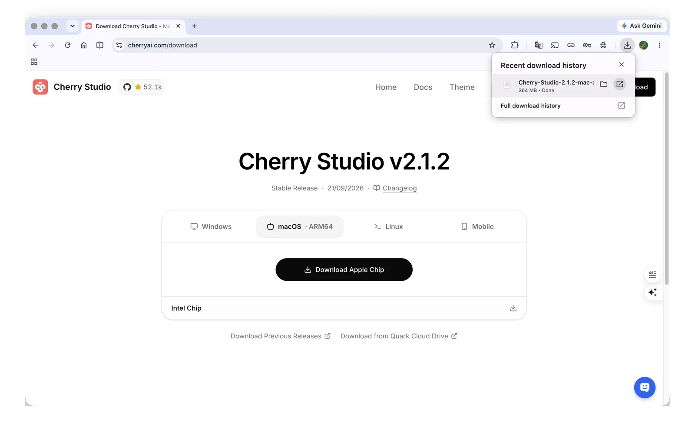

# Windows Installation

## 1. Download the Installer

Open the [official download page](https://cherryai.com/download/v2) and select **Windows**.

<figure><figcaption>
The official download page: select the Windows tab
</figcaption></figure>

Most Intel / AMD PCs should choose the **standard Windows** build; Windows on ARM devices should choose the build marked **ARM**. If you want a portable version that doesn't install into the system, choose the portable build for the same architecture.

Not sure about your device's architecture? Open **Settings → System → About** in Windows and check **System type**.

## 2. Install and Launch

1. Double-click the downloaded installer;
2. When Windows shows a User Account Control prompt, confirm the file comes from an official source and choose to continue;
3. Follow the setup wizard to finish installing;
4. Launch Cherry Studio from the Start menu.

## FAQ

### Missing runtime library

The installer checks for the Microsoft Visual C++ runtime matching your device's architecture and downloads and installs it automatically if it's missing.

If the automatic download or installation fails, open the official Microsoft download link from the error message, install the runtime, then run the Cherry Studio installer again:

* [x64 runtime](https://aka.ms/vs/17/release/vc_redist.x64.exe)
* [ARM64 runtime](https://aka.ms/vs/17/release/vc_redist.arm64.exe)

### Cherry Studio won't start

First make sure the installer's architecture matches your device, and check whether security software is blocking it. If it still won't start, include your Windows version, device architecture, installer file name and the full error message in your feedback.

## Next Step

Once you see the Cherry Studio main window, continue with Quick Start.
