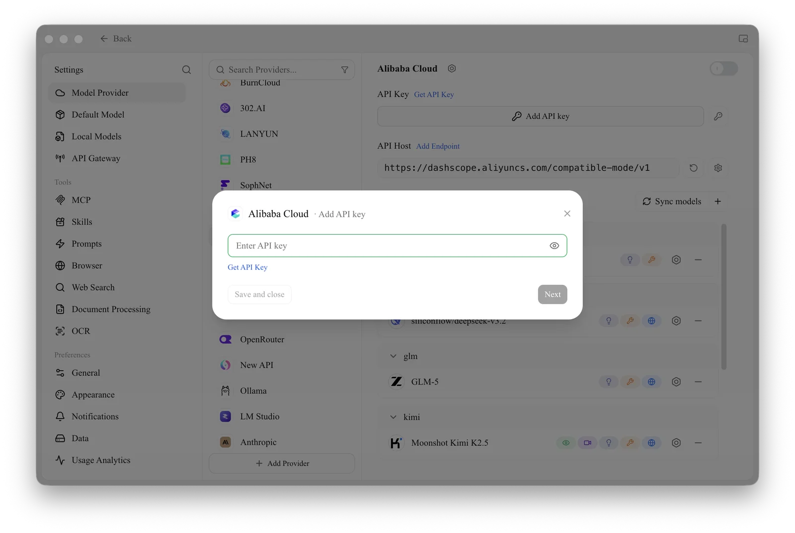

# Alibaba Cloud Bailian

1.  Log in to [Alibaba Cloud Bailian](https://bailian.console.aliyun.com/?tab=model#/api-key). If you don't have an Alibaba Cloud account, you need to register.

2.  Click the `Create My API-KEY` button in the top right corner.
    <figure><figcaption>Creating an API Key for Alibaba Cloud Bailian</figcaption></figure>

3.  In the pop-up window, select the default business space (or you can customize it), and you can fill in a description if you wish.
    <figure><figcaption>Create API Key Pop-up Window for Alibaba Cloud Bailian</figcaption></figure>

4.  Click the `OK` button in the bottom right corner.

5.  Afterward, you should see a new row added to the list. Click the `View` button on the right.
    <figure><figcaption>Viewing the API Key for Alibaba Cloud Bailian</figcaption></figure>

6.  Click the `Copy` button.
    <figure><figcaption>Copying the API Key for Alibaba Cloud Bailian</figcaption></figure>

7.  Go to Cherry Studio, find `API Key` in `Settings` → `Model Provider` → `Alibaba Cloud Bailian`, and paste the copied API key here.
    <figure><figcaption>Entering the API Key for Alibaba Cloud Bailian</figcaption></figure>

8.  You can adjust relevant settings as described in [Model Services](../../cherrystudio/preview/settings/providers.md), and then you can start using it.

If you find that there are no Alibaba Cloud Bailian models in the model list, please ensure that you have added the models as described in [Model Services](../../cherrystudio/preview/settings/providers.md) and enabled this provider.
