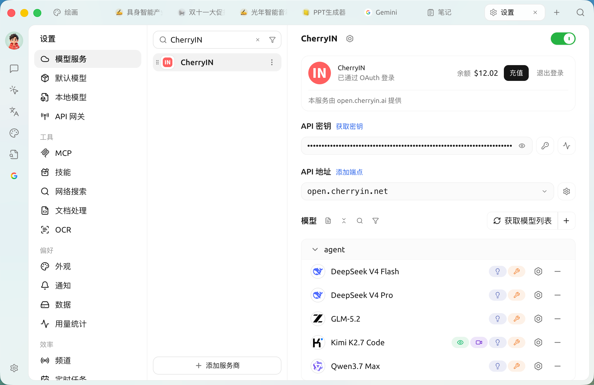
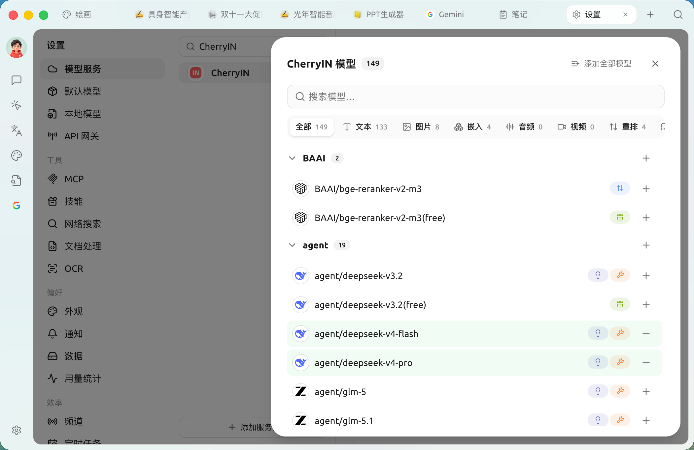
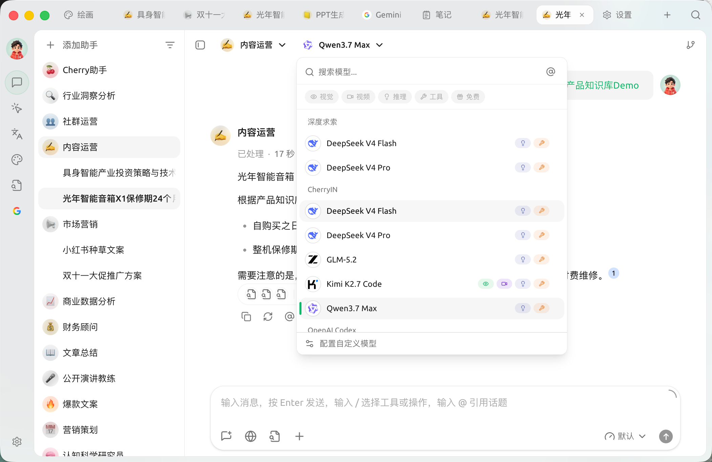

# CherryIN

1. On the CherryIN provider page, click "Click here to get a key"

<figure><figcaption></figcaption></figure>

2. Create a key in the CherryIN console. Note that when creating a key, different token groups have different model multipliers — that is, different discounts.

<figure><figcaption></figcaption></figure>

3. Click the button next to the key to copy it to the clipboard

<figure><figcaption></figcaption></figure>

4. Paste the key into Cherry Studio (the API Key field on the provider page from step 1)

5. Click Sync models and add models

<figure><figcaption></figcaption></figure>

6. Select the model in Cherry Studio and start chatting

<figure><figcaption></figcaption></figure>

***

### Get Help and Submit Feedback

If you have any questions, bugs, or feature suggestions during configuration or use, please use the official channels listed in [Feedback and Suggestions](../../../../../question-contact/suggestions.md).
