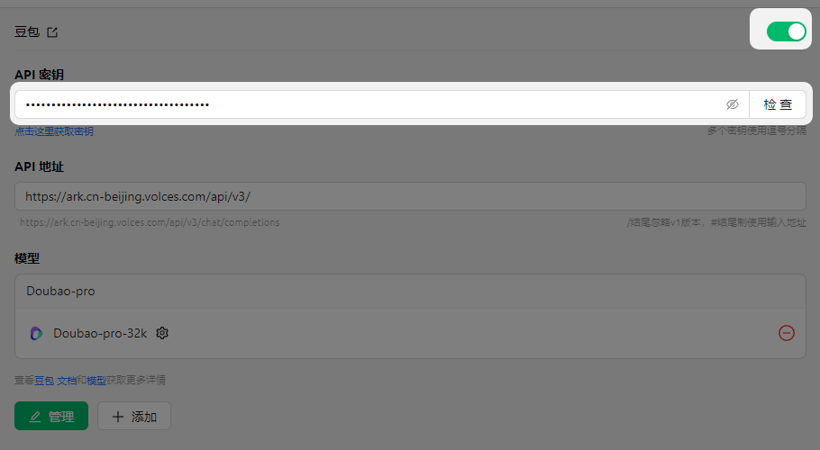
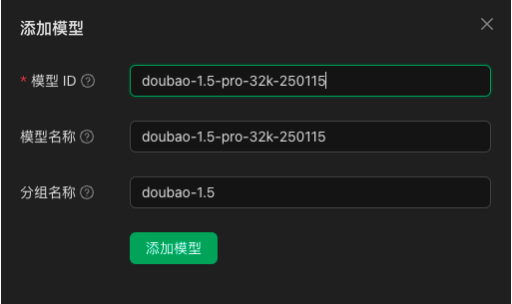

# ByteDance (Doubao)

*   Log in to [Volcano Engine](https://console.volcengine.com/)
*   Click [here to go directly](https://console.volcengine.com/ark/region:ark+cn-beijing/openManagement?LLM=%7B%7D)

<figure><figcaption></figcaption></figure>

### Obtain API Key

*   Click [API Key Management](https://console.volcengine.com/ark/region:ark+cn-beijing/apiKey) at the bottom of the sidebar.
*   Create an API Key

<figure><figcaption></figcaption></figure>

*   After successful creation, click the eye icon next to the created API Key to view and copy it.

<figure><figcaption></figcaption></figure>

*   Paste the copied API Key into CherryStudio, then enable the provider switch.

<figure><figcaption></figcaption></figure>

### Activate and Add Models

*   In the Ark console, at the very bottom of the sidebar, navigate to [Open Management](https://console.volcengine.com/ark/region:ark+cn-beijing/openManagement?LLM=%7B%7D\&OpenTokenDrawer=false) to activate the models you want to use. Here, you can activate Doubao series and DeepSeek models as needed.

<figure><figcaption></figcaption></figure>

*   In the [Model List Documentation](https://www.volcengine.com/docs/82379/1330310#%E6%96%87%E6%9C%AC%E7%94%9F%E6%88%90), find the Model ID corresponding to the desired model.

<figure><figcaption></figcaption></figure>

*   Open Cherry Studio's [Model Service](../../cherrystudio/preview/settings/providers.md) settings and find Volcano Engine.
*   Click "+" next to Sync models, then copy the previously obtained Model ID into the Model ID text box.

<figure><figcaption></figcaption></figure>

*   Add models one by one following this process.

### API Address

There are two ways to write the API address:

*   The default client setting is: `https://ark.cn-beijing.volces.com/api/v3/`
*   The second way to write it is: `https://ark.cn-beijing.volces.com/api/v3/chat/completions#`


There is no significant difference between the two forms. It is fine to keep the default and no modification is needed.

For the difference between `/` and `#` endings, please refer to the API Address section of the provider settings documentation, [click to go there](../../cherrystudio/preview/settings/providers.md#api-di-zhi).


<figure><figcaption>
Official documentation cURL example
</figcaption></figure>