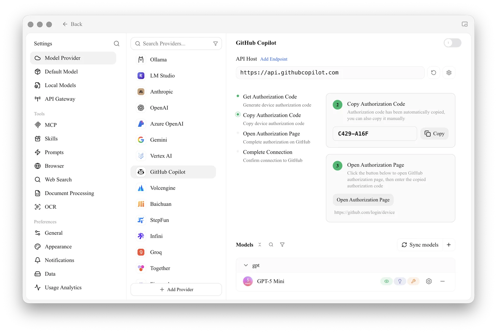

# GitHub Copilot

To use GitHub Copilot, you need to have a GitHub account and subscribe to the GitHub Copilot service. A free subscription is also acceptable, but the free version does not support the latest Claude 3.7 model. For details, please refer to the [official GitHub Copilot website](https://github.com/features/copilot).

## Obtain Device Code

On the GitHub Copilot provider page, follow the three steps: **Get Authorization Code**, **Copy Authorization Code** (it is copied automatically; you can also click **Copy**), then **Open Authorization Page**.

<figure><figcaption>
Get and copy the authorization code, then open the authorization page
</figcaption></figure>

## Enter Device Code in Browser and Authorize

After successfully obtaining the Device Code, click the link to open your browser, log in to your GitHub account in the browser, enter the Device Code, and authorize.

<figure><figcaption>
GitHub Authorization
</figcaption></figure>

After successful authorization, return to Cherry Studio, click "Connect GitHub", and your GitHub username and avatar will be displayed upon success.

<figure><figcaption>
GitHub Connection Successful
</figcaption></figure>

## Click "Sync models" to Get the Model List

Click "Sync models" to automatically retrieve the list of currently supported models online.

<figure><figcaption>
Sync models
</figcaption></figure>

## Frequently Asked Questions

### Failed to Obtain Device Code, Please Retry

Currently, requests are built using Axios, which does not support SOCKS proxies. Please use a system proxy or HTTP proxy, or do not set a proxy directly in CherryStudio and use a global proxy instead. First, please ensure your network connection is normal to avoid failures in obtaining the Device Code.