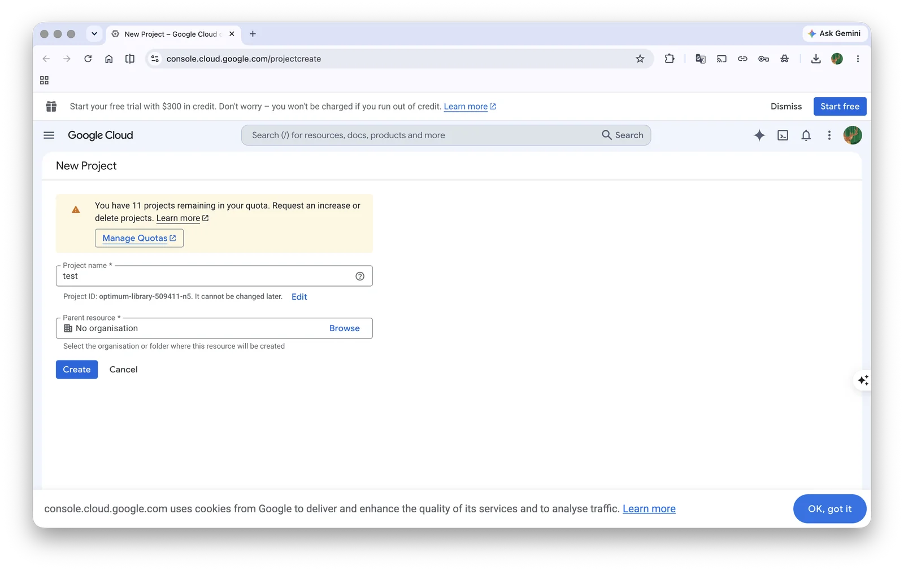
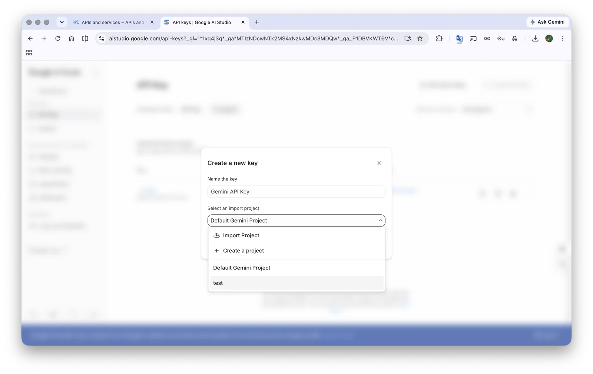
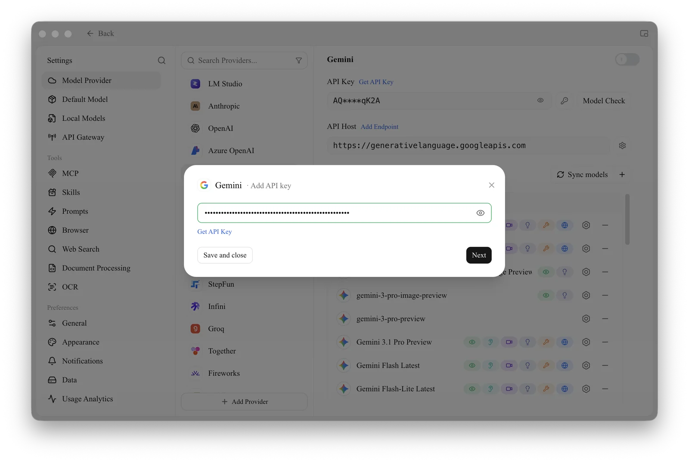

# Google Gemini

## Get API Key

*   Before getting a Gemini API key, you need a Google Cloud project (if you already have one, you can skip this step)
*   Go to [Google Cloud](https://console.cloud.google.com/projectcreate) to create a project, fill in the project name, and click "Create Project"

<figure><figcaption></figcaption></figure>

*   On the official [API Key page](https://aistudio.google.com/app/apikey?hl=zh-cn), click `Create API Key`

<figure><figcaption></figcaption></figure>

*   Copy the generated key and open CherryStudio's [Service Provider Settings](../../pre-basic/settings/providers.md)
*   Find the service provider Gemini and paste the key you just obtained

<figure><figcaption></figcaption></figure>

*   Click "Manage" or "Add" at the bottom to add supported models, then turn on the service provider switch in the upper right corner to start using it.


- Google Gemini services are not directly available in China (excluding Taiwan); you need to resolve proxy issues yourself.
