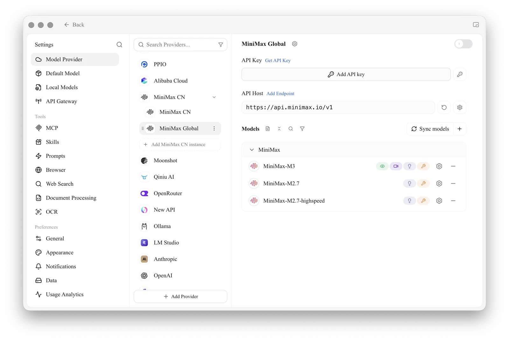
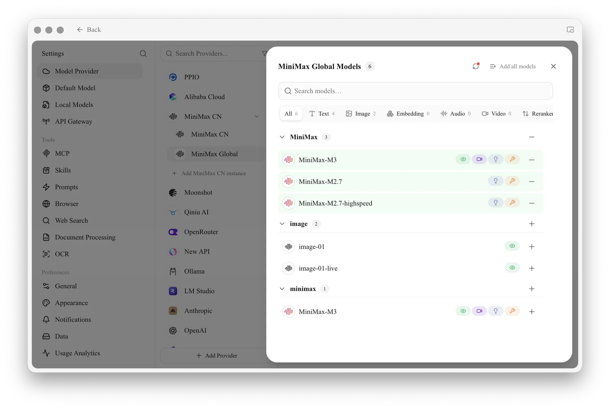

# MiniMax Coding Plan

**Coding Plan** is a cost-effective coding subscription service launched by MiniMax (e.g., Starter/Plus plans). By configuring this plan in Cherry Studio, you can use the `MiniMax-M2.1` model at a very low fixed cost (starting from ¥29/month).


**Core Advantages**

* **Target Audience**: Users with a MiniMax Coding Plan subscription (Starter / Plus / Max).
* **Billing Model**: Quota refreshes by time period (e.g., 40 Prompts every 5 hours) rather than per Token, so you don't need to worry about rapid consumption.


### 1. Preparation

Before starting, ensure you have purchased the plan and obtained your key:

1. Log in to the [**MiniMax Open Platform**](https://platform.minimaxi.com/).
2. Go to the [**Coding Plan** page](https://platform.minimaxi.com/subscribe/coding-plan?code=FYWiC6CtHy\&source=link) and ensure the plan is active.

    <figure><figcaption></figcaption></figure>
3. Copy your dedicated `API Key` in **Coding Plan** (starts with `sk-`).

<figure><figcaption></figcaption></figure>

### 2. Configuration Steps

#### Step 1: Locate the Provider

Open Cherry Studio, click **Settings** > **Model Provider** in the sidebar, and find **MiniMax** in the list.


If the list is long, you can type `mini` in the search box at the top to locate it quickly.


#### Step 2: Fill in Configuration

You do **not** need to modify complex API addresses; use the default configuration. Please fill in the details as described below:

<table><thead><tr><th width="128.20703125">Parameter</th><th>Description</th></tr></thead><tbody><tr><td><strong>API Key</strong></td><td>Paste your Coding Plan dedicated key <em>(Note: It must be the Key generated after purchasing the plan; do not include extra spaces)</em></td></tr><tr><td><strong>API Address</strong></td><td>Keep the default <code>https://api.minimaxi.com/v1</code></td></tr><tr><td><strong>Toggle</strong></td><td>Click the toggle in the top-right corner to ensure it is <strong>Green (ON)</strong></td></tr></tbody></table>

<figure><figcaption></figcaption></figure>

#### Step 3: Add the Specified Model (Critical)

The Coding Plan supports only specific models. Selecting the wrong model will result in inability to use the service or incur extra costs.

1. Click **Sync models** next to the Models heading on the configuration page.

<figure><figcaption></figcaption></figure>

2. Find and add **`MiniMax M2.1`** in the list.


**Please make sure to select the correct model!**

* ✅ **Recommended**: `MiniMax M2.1` (The primary model designated for Coding Plan).


#### Step 4: Save and Verify 

1. Click the **Model Check** button next to the API key input field.
2. If **Success** is displayed in green, your Coding Plan subscription is successfully connected!

### 3. Usage and Limitations

The billing model for Coding Plan is completely different from the standard API. Please understand the following mechanisms:


**Quota Refresh Mechanism** Coding Plan quotas are **refreshed periodically**. For example, the Starter plan provides **40** conversation credits **every 5 hours**.

* **If it stops responding**: This indicates that your current 5-hour quota has been exhausted.
* **Solution**: Wait a few hours for the quota to automatically recover. No additional payment is required.


### 4. Troubleshooting Common Issues


**Encountering a `429 Too Many Requests` error?**

This is not a software failure but rather a trigger of the **Coding Plan rate limit**.

* This means you have used up your "message count" for the current period.
* Please wait patiently for the next 5-hour cycle to refresh.



**Encountering a `401 Unauthorized` error?**

* Check if there are any extra spaces in your API Key.
* Log in to the MiniMax official website to confirm whether your Coding Plan subscription has expired.


***

### Get Help and Submit Feedback

If you have any questions, bugs, or feature improvement suggestions during configuration or usage, please refer to the official channels provided in [Feedback and Suggestions](../../question-contact/suggestions.md).
