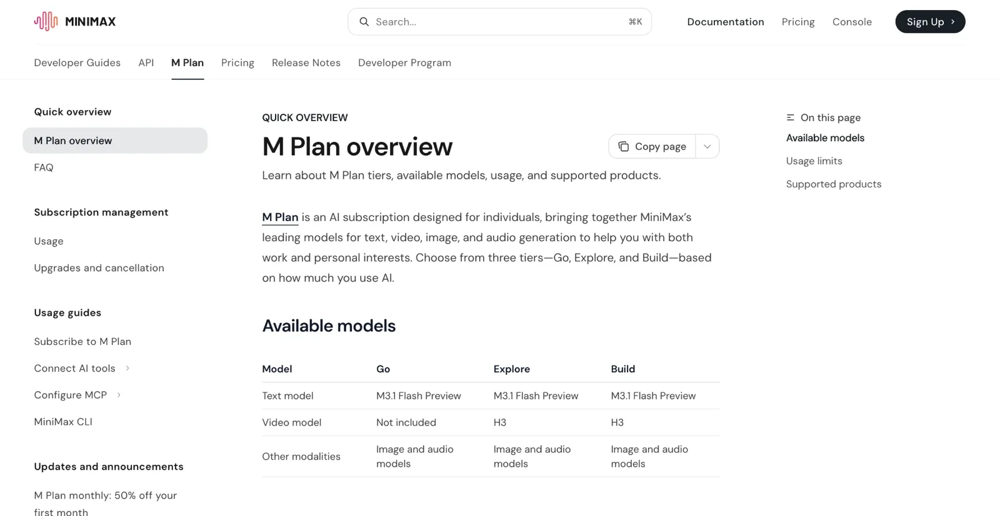
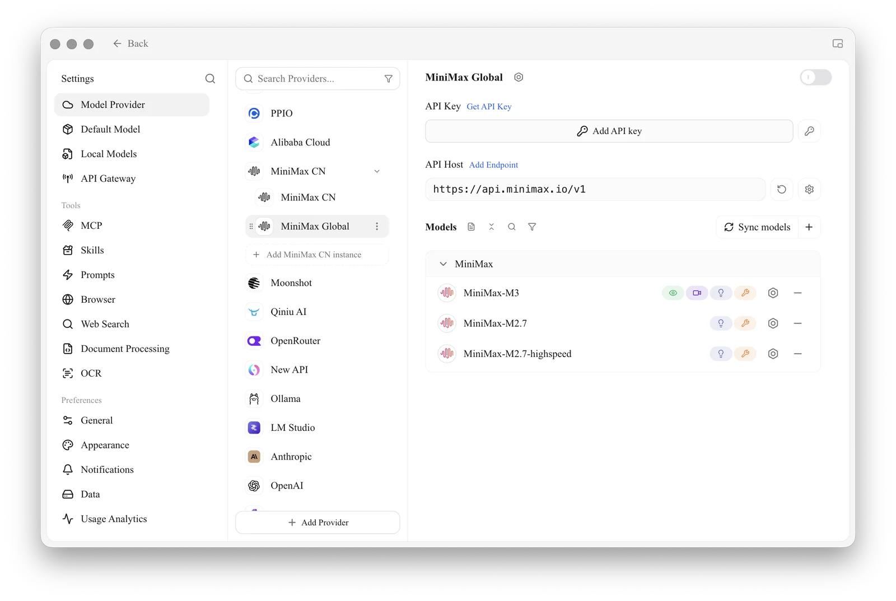
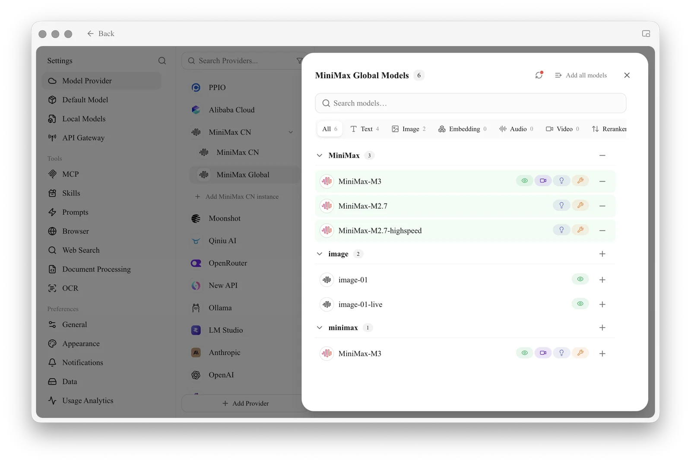

# MiniMax M Plan

**M Plan** is MiniMax's AI subscription for individuals (formerly Coding Plan). It bundles MiniMax's text, image, audio and video models, and comes in three tiers: **Go**, **Explore** (3× Go's usage) and **Build** (7.5× Go's usage). By configuring your M Plan key in Cherry Studio, you can use the plan's text model for chat and coding at a fixed subscription price instead of paying per token.


**Core Advantages**

* **Target Audience**: Users with a MiniMax M Plan subscription (Go / Explore / Build).
* **Billing Model**: Usage resets on a 5-hour window and a weekly window instead of being billed per token. See MiniMax for current tiers and prices.


<figure><figcaption>
M Plan tiers and the models each one includes
</figcaption></figure>

### 1. Preparation

1. Log in to the [**MiniMax Open Platform**](https://platform.minimax.io/) and subscribe to [**M Plan**](https://platform.minimax.io/docs/m-plan/intro).
2. Open the [**API Key** page for your plan](https://platform.minimax.io/console/plan) and copy your M Plan key.


The M Plan key is separate from a pay-as-you-go API key. The two cannot be used interchangeably.


### 2. Configuration Steps

#### Step 1: Locate the Provider

Open Cherry Studio, click **Settings** > **Model Provider** in the sidebar, and find **MiniMax Global** in the list.


If the list is long, you can type `mini` in the search box at the top to locate it quickly.


#### Step 2: Fill in Configuration

You do **not** need to change the API address; keep the default. Fill in the details as described below:

<table><thead><tr><th width="128.20703125">Parameter</th><th>Description</th></tr></thead><tbody><tr><td><strong>API Key</strong></td><td>Paste your M Plan key <em>(Note: it must be the M Plan key, not a pay-as-you-go key; do not include extra spaces)</em></td></tr><tr><td><strong>API Address</strong></td><td>Keep the default <code>https://api.minimax.io/v1</code> (MiniMax Global)</td></tr><tr><td><strong>Toggle</strong></td><td>Click the toggle in the top-right corner to ensure it is <strong>Green (ON)</strong></td></tr></tbody></table>

<figure><figcaption></figcaption></figure>

#### Step 3: Add the Model

1. Click **Sync models** next to the Models heading on the configuration page.

<figure><figcaption></figcaption></figure>

2. Find and add **M3.1 Flash Preview**, the text model included in every M Plan tier.


Use the models included in your plan. Other models may not work with an M Plan key.


#### Step 4: Save and Verify

1. Click the **Model Check** button next to the API key input field.
2. If **Success** is displayed in green, your M Plan subscription is connected.

### 3. Usage and Limits


**How usage resets**: text, image and audio models have a **5-hour window** and a **weekly window**; both start with your first use. When a window ends, usage returns to your tier's full limit. Longer contexts and more complex tasks use more of the limit.

* **If it stops responding**: you have reached the limit for the current window.
* **Solution**: wait for the window to reset, upgrade your tier, or switch to a pay-as-you-go API key.


### 4. Troubleshooting Common Issues


**Encountering a `429 Too Many Requests` error?**

This is not a software failure: you have hit the M Plan usage or rate limit. Short rate limits usually recover within about a minute; if you have used up the current window, wait for it to reset.



**Encountering a `401 Unauthorized` error?**

* Check that you pasted the M Plan key (not a pay-as-you-go key) and that it has no extra spaces.
* Log in to the MiniMax platform to confirm that your M Plan subscription is active.


***

### Get Help and Submit Feedback

If you have any questions, bugs, or feature improvement suggestions during configuration or usage, please refer to the official channels provided in [Feedback and Suggestions](../../question-contact/suggestions.md).
