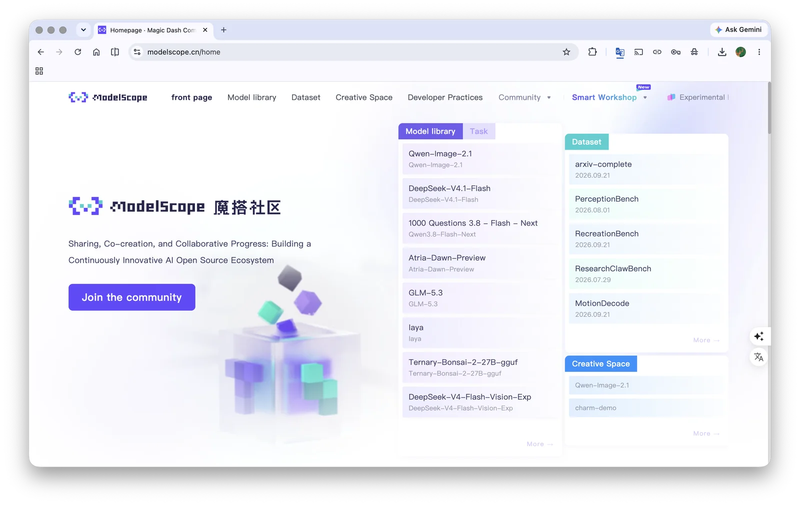
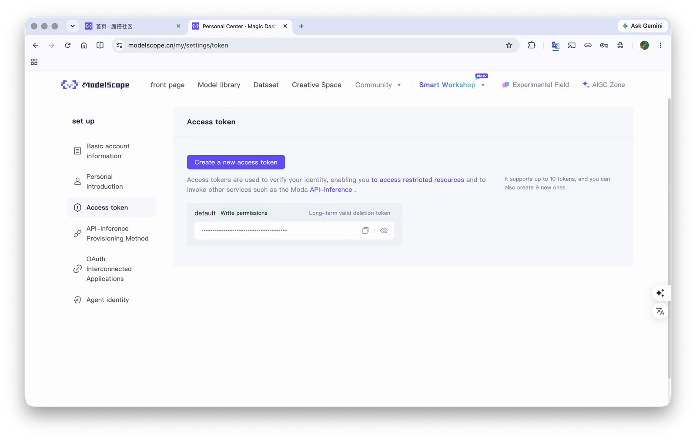
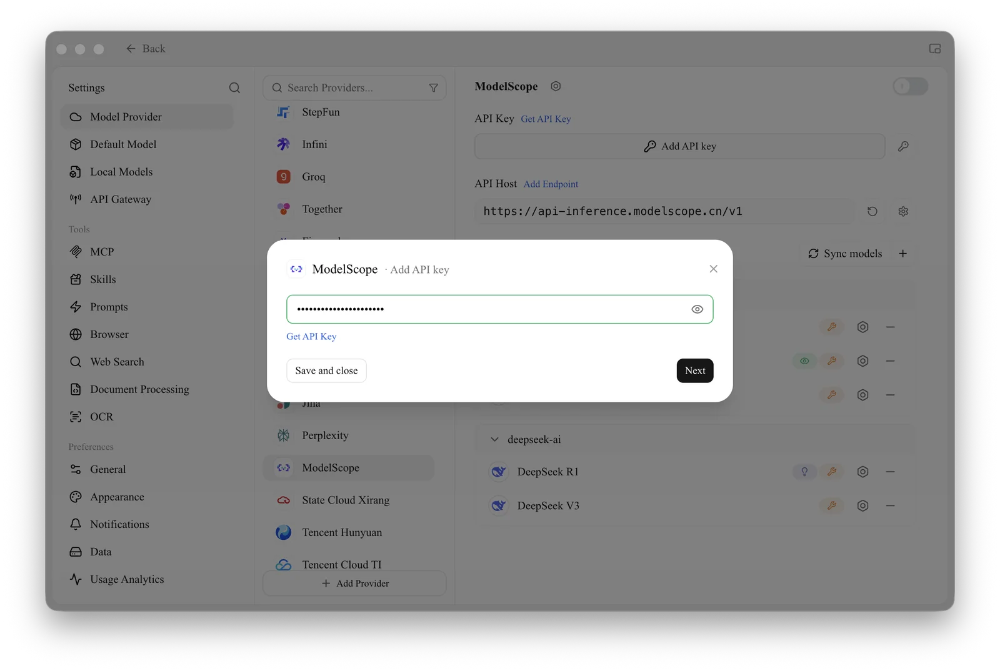
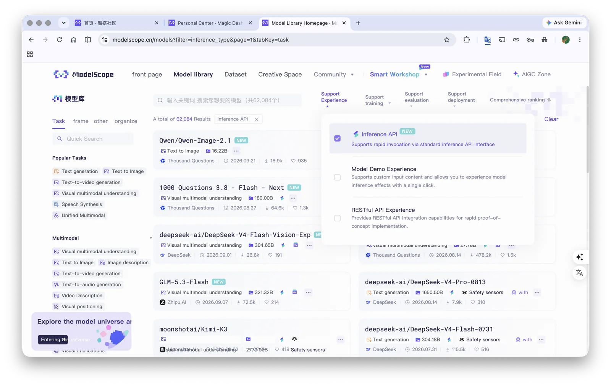
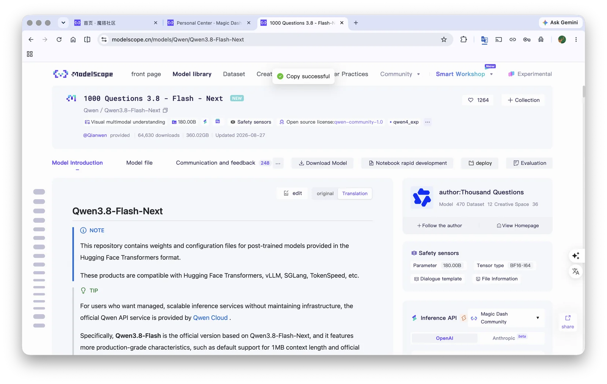
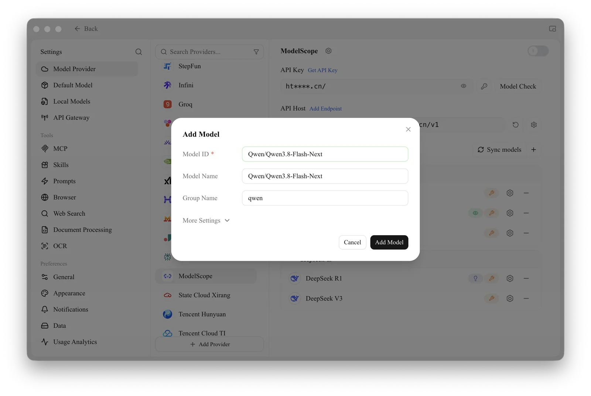

# ModelScope (MaDap) Platform Access Guide

## What is ModelScope?
> ModelScope is a new generation open-source Model-as-a-Service (MaaS) sharing platform, dedicated to providing general AI developers with **flexible, easy-to-use, and low-cost** one-stop model service solutions, making model application simpler!
>
> Through its **API-Inference as a service capability**, the platform standardizes open-source models into callable API interfaces. Developers can lightly and quickly integrate model capabilities into various AI applications, supporting innovative scenarios such as tool calling and prototype development.

### Core Advantages
- ✅ **Free Quota**: Provides **2000 free API calls** daily ([Billing Rules](#billing-and-quota-rules))
- ✅ **Rich Model Library**: Covers over 1000+ open-source models in NLP, CV, speech, multimodal, etc.
- ✅ **Ready-to-Use**: No deployment needed, quick invocation via RESTful API

---

## Cherry Studio Access Process
### Step 1: Obtain ModelScope API Token
1. **Log in to the Platform**
   - Visit [ModelScope Official Website](https://modelscope.cn) → Click **Login** in the top right corner → Select authentication method
   
2. **Create Access Token**
   - Go to **[Account Settings → Access token](https://modelscope.cn/my/settings/token)**
   - Click **`Create a new access token`** → **Copy the generated token** (you can also copy the existing `default` token) (*See page example below*)
   
   > 🔑 **Important Tip**: Token leakage will compromise account security!

### Step 2: Configure Cherry Studio
- Open **Cherry Studio** → **Settings → Model Provider → ModelScope**
- Click **`Add API key`**, paste the copied token, then click **`Save and close`**
  
- The API Host is filled in by default (`https://api-inference.modelscope.cn/v1`); you don't need to change it

### Step 3: Call Model API
1. **Find API-supported Models**
   - Visit [ModelScope Model Hub](https://modelscope.cn/models)
   - Open the **Support Experience** filter and check **Inference API** (or look for the Inference API icon on the model card)
   
   > The coverage of API-Inference models is primarily determined by their popularity within the MaDap community (referencing data like likes and downloads). Therefore, the list of supported models will continuously iterate as more powerful and highly-regarded next-generation open-source models are released.
2. **Obtain Model ID**
   - Go to the target model's detail page → click the copy icon next to the model path to copy the **Model ID** (format like `Qwen/Qwen3.8-Flash-Next`)
   
3. **Enter into Cherry Studio**
   - On the ModelScope provider page, click **+** next to **Sync models**. In the **Add Model** dialog, paste the ID into **Model ID** (Model Name and Group Name are filled in automatically), then click **Add Model**
   

---

## Billing and Quota Rules
### Important Notes
- 🎫 **Free Quota**: Each user gets **2000 API calls daily** (*subject to the latest rules on the official website*)
- 🔁 **Quota Reset**: Automatically resets daily at UTC+8 00:00, **does not support cross-day accumulation or upgrades**
- 💡 **Exceeding Quota**:
  - API will return `429 error` after reaching the daily limit
  - Solutions: Switch to a backup account / Use other platforms / Optimize call frequency

> ⚠️ Note: The inference API-Inference has a free daily quota of 2000 calls. For more calling needs, consider using cloud services like Alibaba Cloud Bailian.