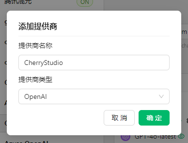
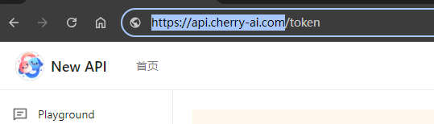

# NewAPI

* Log in to your NewAPI instance, create a token on its token page, and copy it
* Open Cherry Studio's Provider Settings and click 'Add' at the bottom of the provider list
* Enter a remark name, select OpenAI as the provider, and click "OK"

<figure><figcaption></figcaption></figure>

* Fill in the key you just copied
* Go back to the API Key acquisition page, copy the root address from the browser's address bar, e.g.:

<figure><figcaption>
<strong>Only copy https://xxx.xxx.com; content after "/" is not needed</strong>
</figcaption></figure>


* When the address is IP+Port, simply fill in http://IP:Port, e.g., http://127.0.0.1:3000
* Strictly distinguish between `http` and `https`; if SSL is not enabled, do not fill in https


* Add models (click "Sync models" to fetch them automatically, or "+" to enter one manually). Turn on the switch in the upper right corner to use.