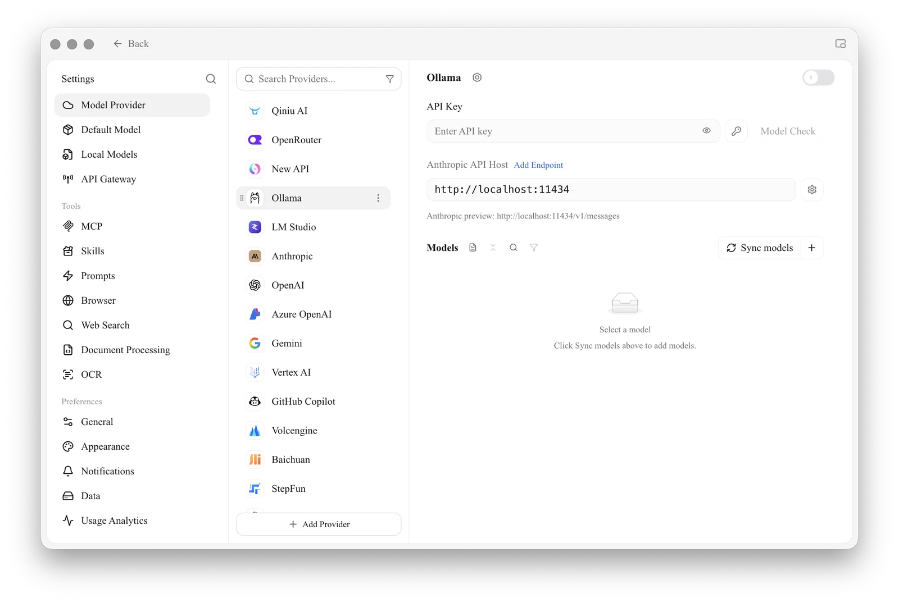

# Project Introduction


<figure><figcaption></figcaption></figure>

Cherry Studio is an all-in-one AI assistant platform integrating multi-model conversations, knowledge base management, AI painting, translation, and more.

### Star History

[Star History](https://cherrystarhistory.ocool.online/)

## Follow Our Social Accounts

<table data-view="cards"><thead><tr><th></th><th data-hidden data-card-cover data-type="files"></th><th data-hidden data-card-target data-type="content-ref"></th></tr></thead><tbody><tr><td><a href="https://www.xiaohongshu.com/user/profile/662b6853000000000b031d9a?xsec_token=YB_1nKvlH4r5hPYVVbbsNHF8Y6n6AKlm5-DaggPCtd2DQ%3D&#x26;xsec_source=app_share&#x26;xhsshare=CopyLink&#x26;appuid=662b6853000000000b031d9a&#x26;apptime=1738627324&#x26;share_id=ace5db41b5954fab8d98a2a7865a62bc&#x26;share_channel=copy_link">Xiaohongshu</a></td><td><a href=".gitbook/assets/1.png">1.png</a></td><td><a href="https://www.xiaohongshu.com/user/profile/662b6853000000000b031d9a?xsec_token=YB_1nKvlH4r5hPYVVbbsNHF8Y6n6AKlm5-DaggPCtd2DQ%3D&#x26;xsec_source=app_share&#x26;xhsshare=CopyLink&#x26;appuid=662b6853000000000b031d9a&#x26;apptime=1738627324&#x26;share_id=ace5db41b5954fab8d98a2a7865a62bc&#x26;share_channel=copy_link">https://www.xiaohongshu.com/user/profile/662b6853000000000b031d9a?xsec_token=YB_1nKvlH4r5hPYVVbbsNHF8Y6n6AKlm5-DaggPCtd2DQ%3D&#x26;xsec_source=app_share&#x26;xhsshare=CopyLink&#x26;appuid=662b6853000000000b031d9a&#x26;apptime=1738627324&#x26;share_id=ace5db41b5954fab8d98a2a7865a62bc&#x26;share_channel=copy_link</a></td></tr></tbody></table>

# Ollama

Ollama is an excellent open-source tool that allows you to easily run and manage various large language models (LLMs) locally. Cherry Studio now supports Ollama integration, enabling you to interact directly with locally deployed LLMs within a familiar interface, without relying on cloud services!

## What is Ollama?

Ollama is a tool that simplifies the deployment and use of large language models (LLM). It has the following features:

*   **Local Execution:** Models run entirely on your local computer, without needing an internet connection, protecting your privacy and data security.
*   **Easy to Use:** Download, run, and manage various LLMs with simple command-line instructions.
*   **Rich Model Support:** Supports many popular open-source models such as Llama 2, Deepseek, Mistral, Gemma, and more.
*   **Cross-Platform:** Supports macOS, Windows, and Linux systems.
*   **Open API:** Supports OpenAI-compatible interfaces for integration with other tools.

## Why Use Ollama in Cherry Studio?

*   **No Cloud Services Needed:** No longer limited by cloud API quotas and costs; enjoy the full power of local LLMs.
*   **Data Privacy:** All your conversation data remains local, eliminating concerns about privacy breaches.
*   **Offline Availability:** Continue interacting with LLMs even without an internet connection.
*   **Customization:** Choose and configure the LLM that best suits your needs.

## Configuring Ollama in Cherry Studio

### **1. Install and Run Ollama**

First, you need to install and run Ollama on your computer. Please follow these steps:

*   **Download Ollama:** Visit the Ollama official website ([https://ollama.com/](https://ollama.com/)) and download the appropriate installation package for your operating system.
    On Linux, you can install Ollama directly by running the command:

    ```sh
    curl -fsSL https://ollama.com/install.sh | sh
    ```
*   **Install Ollama:** Follow the installer's instructions to complete the installation.
*   **Download Models:** Open your terminal (or command prompt) and use the `ollama run` command to download the model you want to use. For example, to download the Llama 2 model, you can run:

    ```sh
    ollama run llama3.2
    ```

    Ollama will automatically download and run the model.
*   **Keep Ollama Running:** Ensure Ollama remains running while you interact with Ollama models using Cherry Studio.

### **2. Add Ollama Provider in Cherry Studio**

Next, add Ollama as a custom AI provider in Cherry Studio:

*   **Open Settings:** In the Cherry Studio interface, click "Settings" (gear icon) in the left navigation bar.
*   **Go to Model Provider:** On the settings page, select "Model Provider" in the left menu.
*   **Add Provider:** Click Ollama in the list.

<figure><figcaption></figcaption></figure>

### **3. Configure the Ollama Provider**

Locate the newly added Ollama in the provider list and configure it in detail:

1.  **Enabled Status:**
    *   Ensure the toggle switch on the far right of the Ollama provider is turned on, indicating it is enabled.
2.  **API Key:**
    *   Ollama **does not** require an API key by default. You can leave this field blank or enter any content.
3.  **API Address:**
    *   Enter the local API address provided by Ollama. Typically, the address is:

        ```
        http://localhost:11434/
        ```

        If the port has been modified, please change it accordingly.
4.  **Keep Alive Time:** This option sets the session's keep-alive duration, in minutes. If there are no new conversations within the set time, Cherry Studio will automatically disconnect from Ollama and release resources.
5.  **Model Management:**
    *   Click the "+ Add" button to manually add the name of the model you have already downloaded in Ollama.
    *   For example, if you have downloaded the `llama3.2` model via `ollama run llama3.2`, then you can enter `llama3.2` here.
    *   Use the settings icon or "−" next to each model to edit or remove added models.

## Get Started

After completing the above configurations, you can select the Ollama provider and your downloaded model in Cherry Studio's chat interface to start conversing with your local LLM!

## Tips and Tricks

*   **First Time Running a Model:** The first time you run a model, Ollama needs to download the model files, which may take a considerable amount of time. Please be patient.
*   **View Available Models:** Run the `ollama list` command in the terminal to view a list of your downloaded Ollama models.
*   **Hardware Requirements:** Running large language models requires certain computing resources (CPU, memory, GPU). Please ensure your computer's configuration meets the model's requirements.
*   **Ollama Documentation:** You can click the 'View Ollama Documentation and Models' link on the configuration page to quickly jump to the official Ollama documentation.