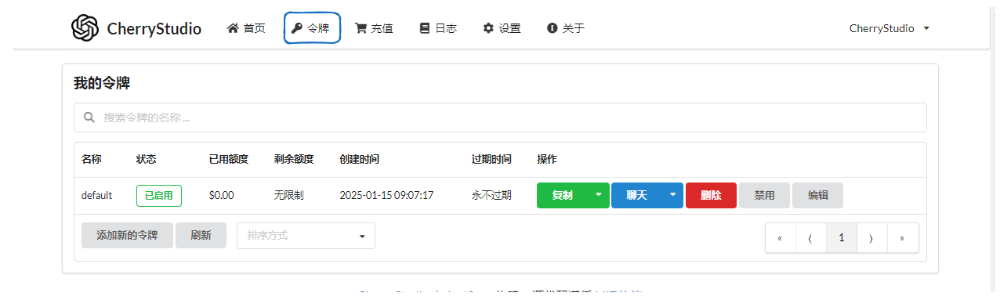
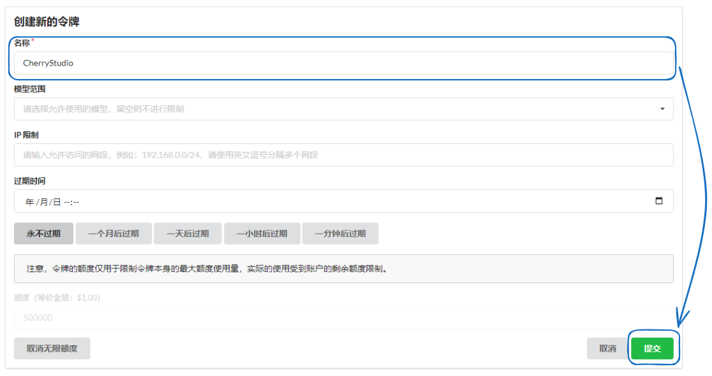
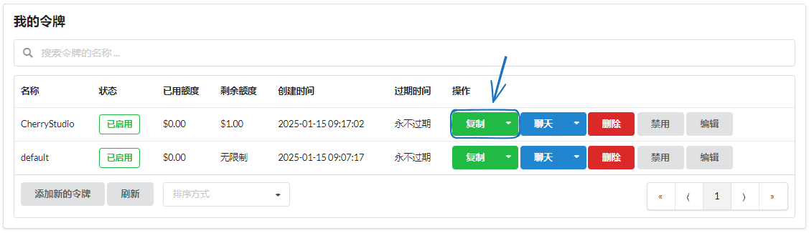
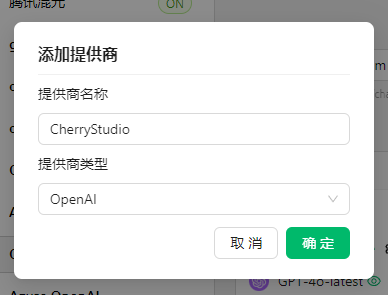
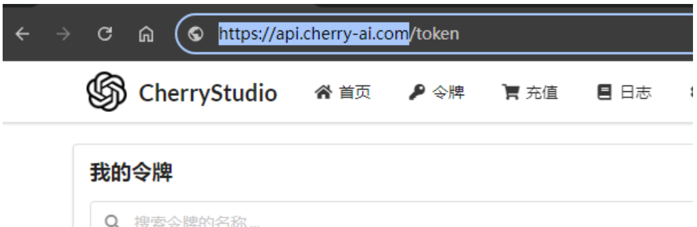

# OneAPI

*   Log in and go to the token page

<figure><figcaption></figcaption></figure>

*   Create a new token (you can also use the default token directly ↑)

<figure><figcaption></figcaption></figure>

*   Copy the token

<figure><figcaption></figcaption></figure>

*   Open CherryStudio's service provider settings and click `Add` at the bottom of the service provider list.
*   Enter a remark name, select OpenAI as the provider, and click Confirm.

<figure><figcaption></figcaption></figure>

*   Fill in the key you just copied.
*   Go back to the API Key acquisition page, and copy the root address from the corresponding browser's address bar, e.g.:

<figure><figcaption>
<strong>Only copy https://xxx.xxx.com; the "/" and anything after it are not needed.</strong>
</figcaption></figure>


*   When the address is IP+Port, just fill in http://IP:Port, e.g., http://127.0.0.1:3000
*   Strictly distinguish between `http` and `https`; if SSL is not enabled, do not use `https`.


*   Add a model (click Sync models to fetch them automatically, or + to enter one manually) and turn on the switch in the upper right corner to use it.


Other OneAPI themes might have different interfaces, but the adding method is consistent with the process described above.
