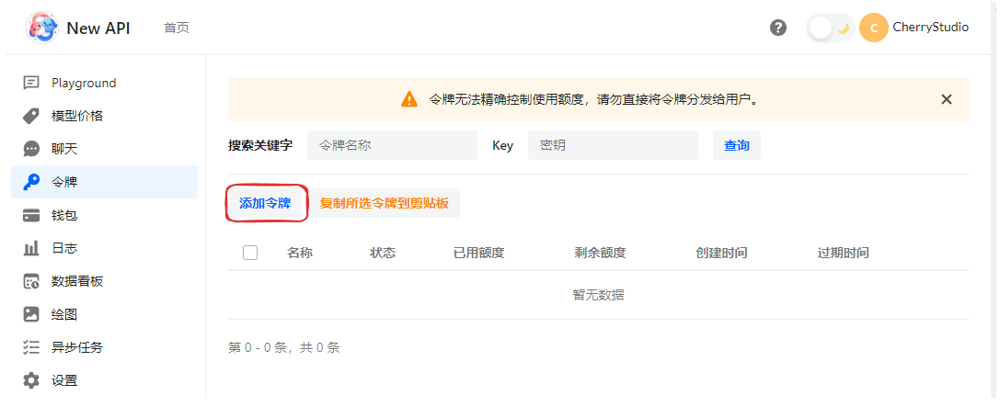
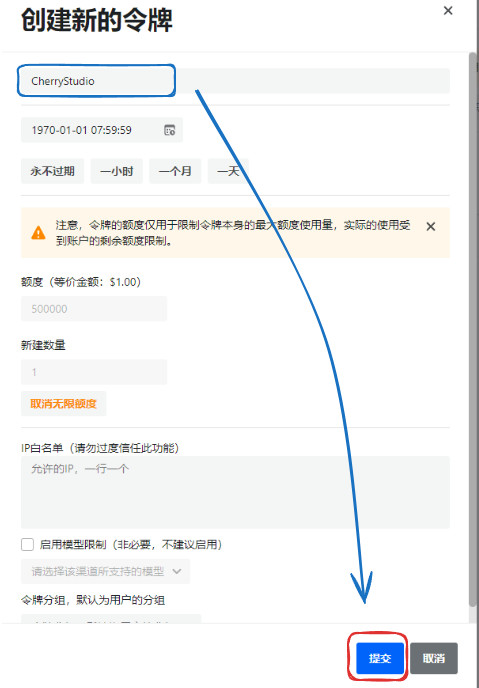
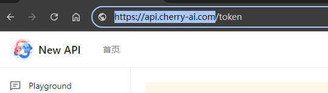

# NewAPI

* Log in and open the token page  
* Click "Add Token"  

<figure><figcaption></figcaption></figure>

* Enter a token name and click Submit (configure other settings if needed)  

<figure><figcaption></figcaption></figure>

* Open CherryStudio's provider settings and click `Add` at the bottom of the provider list  
* Enter a remark name, select OpenAI as the provider, and click OK  

<figure><figcaption></figcaption></figure>

* Paste the key you just copied  
* Return to the API Key acquisition page and copy the root address from the browser's address bar, for example:  

<figure><figcaption>
<strong>Only copy https://xxx.xxx.com; content after '/' is not needed</strong>
</figcaption></figure>


* When the address is IP + port, enter http://IP:port (e.g., http://127.0.0.1:3000)  
* Strictly distinguish between `http` and `https` - do not enter https if SSL is not enabled  


* Add models (click Sync models to fetch them automatically, or + to enter one manually) and toggle the switch at the top right to use.