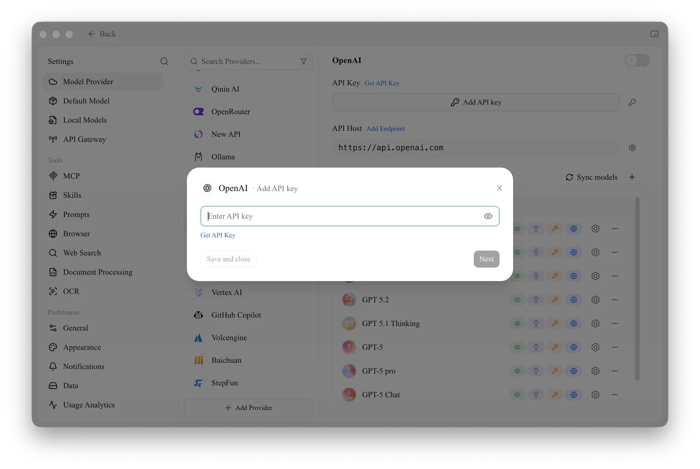

# OpenAI

## Obtain API Key

*   On the official [API Key page](https://platform.openai.com/api-keys), click <mark style="background-color:green;">`+ Create new secret key`</mark>

*   Copy the generated key and open CherryStudio's [Provider Settings](../../pre-basic/settings/providers.md)
*   Find the provider OpenAI, click **Add API key**, paste the key you just obtained, then click **Save and close**.

<figure><figcaption>
Add API key dialog
</figcaption></figure>

*   Click "Sync models" (or "+" to add one manually) next to the Models heading to add supported models and enable the provider switch in the top right corner to start using it.


- OpenAI services cannot be directly used in mainland China (excluding Taiwan); you need to resolve proxy issues yourself;
- A balance is required.
