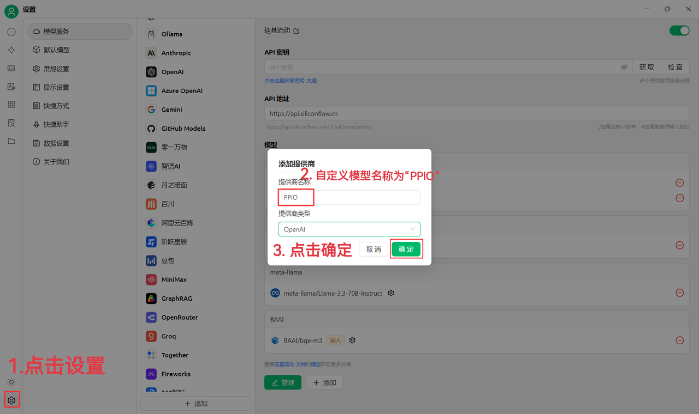
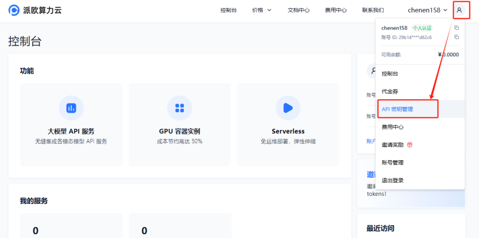
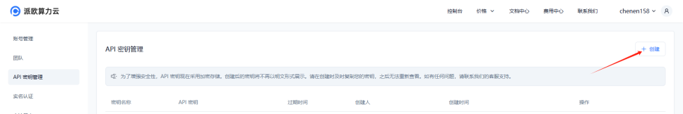
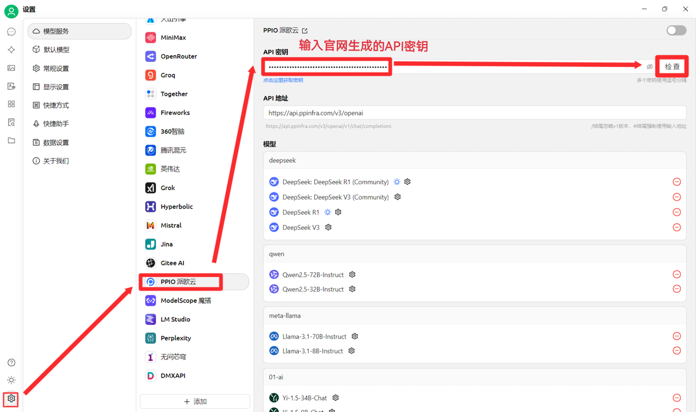
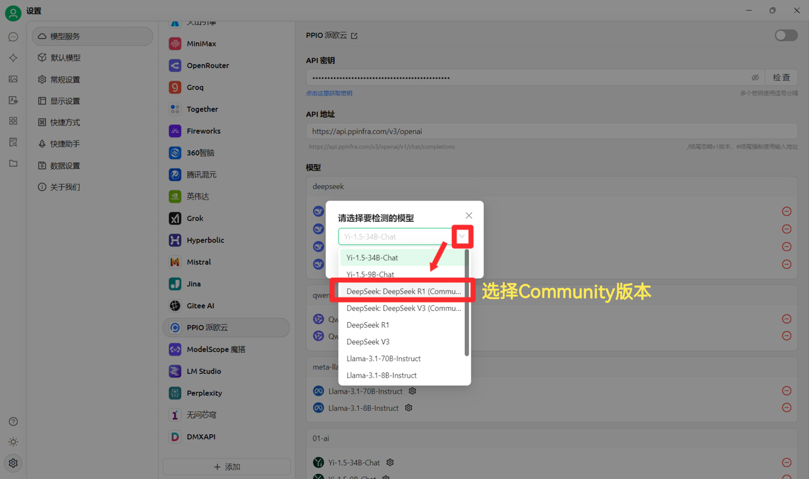
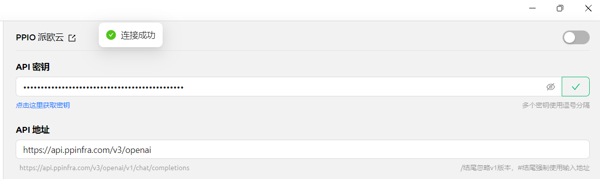
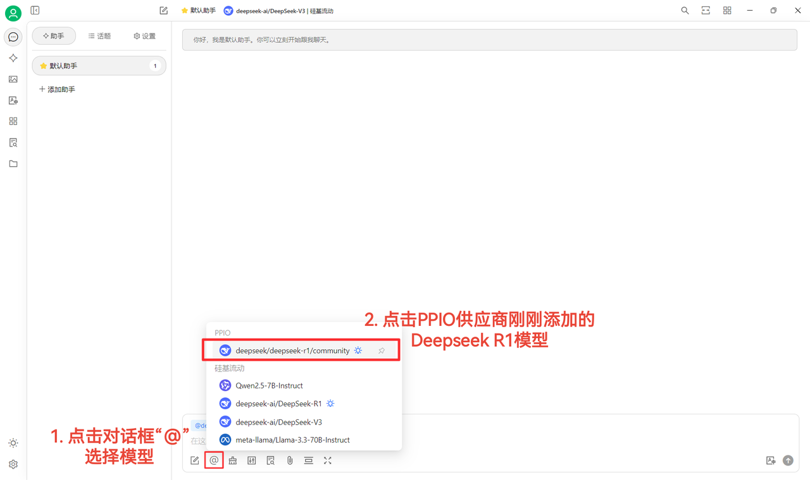

# PPIO PiO Cloud

## Cherry Studio Integrates PPIO LLM API

### [​](https://ppinfra.com/docs/third-party/cherry-studio-use#%E6%95%99%E7%A8%8B%E6%A6%82%E8%BF%B0)Tutorial Overview 

Cherry Studio is a multi-model desktop client currently supporting Windows, Linux, and macOS computer installation packages. It integrates mainstream LLM models and provides multi-scenario assistance. Users can enhance work efficiency through intelligent conversation management, open-source customization, and multi-theme interfaces.

Cherry Studio is now deeply integrated with **PPIO's high-performance API channel** – ensuring **DeepSeek-R1/V3 high-speed response** and **99.9% service availability** through enterprise-grade computing power, bringing you a fast and smooth experience.

The tutorial below includes a complete integration solution (with key configuration). In 3 minutes, you can enable the advanced mode of "Cherry Studio Intelligent Scheduling + PPIO High-Performance API".

### [​](https://ppinfra.com/docs/third-party/cherry-studio-use#1-%E8%BF%9B%E5%85%A5-cherrystudio%EF%BC%8C%E6%B7%BB%E5%8A%A0-%E2%80%9Cppio%E2%80%9D-%E4%BD%9C%E4%B8%BA%E6%A8%A1%E5%9E%8B%E6%8F%90%E4%BE%9B%E5%95%86)1. Enter CherryStudio and add "PPIO" as a model provider 

First, go to the official website to download Cherry Studio: [https://cherry-ai.com/download](https://cherry-ai.com/download) (If you cannot access it, you can open the Quark Drive link below to download the version you need: [https://pan.quark.cn/s/c8533a1ec63e#/list/share](https://pan.quark.cn/s/c8533a1ec63e#/list/share)

(1) First, click "Settings" in the bottom left, customize the provider name to: `PPIO`, and click "Confirm".

<figure><figcaption></figcaption></figure>

(2) Go to [PiO Computing Cloud API Key Management ](https://ppinfra.com/user/register?invited_by=JYT9GD\&utm_source=github_cherry-studio), click [User Avatar] — [API Key Management] to enter the console.

<figure><figcaption></figcaption></figure>

Click the [+ Create] button to create a new API key. Customize a key name. **The generated key is only displayed at the time of creation, so be sure to copy and save it to a document to avoid affecting subsequent use.**

<figure><figcaption></figcaption></figure>

(3) In CherryStudio, enter the key. Click "Settings", select [PPIO PiO Cloud], enter the API key generated on the official website, and finally click [Check].

<figure><figcaption></figcaption></figure>

(4) Select the model: deepseek/deepseek-r1/community as an example. If you need to switch to another model, you can do so directly.

<figure><figcaption></figcaption></figure>

The DeepSeek R1 and V3 community versions are for trial purposes only and are full-parameter, full-performance models with no difference in stability or effect. If large-scale calls are required, you must **recharge and switch to a non-community version**.

### [​](https://ppinfra.com/docs/third-party/cherry-studio-use#2-%E6%A8%A1%E5%9E%8B%E4%BD%BF%E7%94%A8%E9%85%8D%E7%BD%AE)2. Model Usage Configuration 

(1) After clicking [Check] and seeing "connection successful", you can use it normally.

<figure><figcaption></figcaption></figure>

(2) Finally, click [@], select the DeepSeek R1 model just added under the PPIO provider, and you can successfully start chatting~

<figure><figcaption></figcaption></figure>

[Partial material source: [ Chen En ](https://www.kdocs.cn/l/ctGiF5K6PQoO)]

### [​](https://ppinfra.com/docs/third-party/cherry-studio-use#3-ppio%C3%97cherry-studio-%E8%A7%86%E9%A2%91%E4%BD%BF%E7%94%A8%E6%95%99%E7%A8%8B)3. PPIO×Cherry Studio Video Tutorial 

If you prefer visual learning, we have prepared a video tutorial on Bilibili. Through step-by-step instruction, it will help you quickly master the configuration method for "PPIO API+Cherry Studio." Click the link below to go directly to the video and start a smooth development experience → [《【Still frustrated with DeepSeek's endless loading?】PiO Cloud + DeepSeek Full-Powered Version =? No more congestion, take off now!》](https://www.bilibili.com/video/BV1BZNmeTEwg/?buvid=XX82F37818653072D274A6BB8A4FE7938A30C\&from_spmid=search.search-result.0.0\&is_story_h5=false\&mid=3CpKQv%2Bjnb8k6iTGl1eH8FTQ%2FSZMtL1rElX6M3iMo%3D\&plat_id=116\&share_from=ugc\&share_medium=android\&share_plat=android\&share_session_id=b892268f-5751-4f6e-9690-50b37855d346\&share_source=WEIXIN\&share_source=weixin\&share_tag=s_i\&spmid=united.player-video-detail.0.0\&timestamp=1739160448\&unique_k=eKDZuRP\&up_id=3546757841554023\&vd_source=50fea165795ccc47455a165f5bcaeed2)

[Video material source: sola]