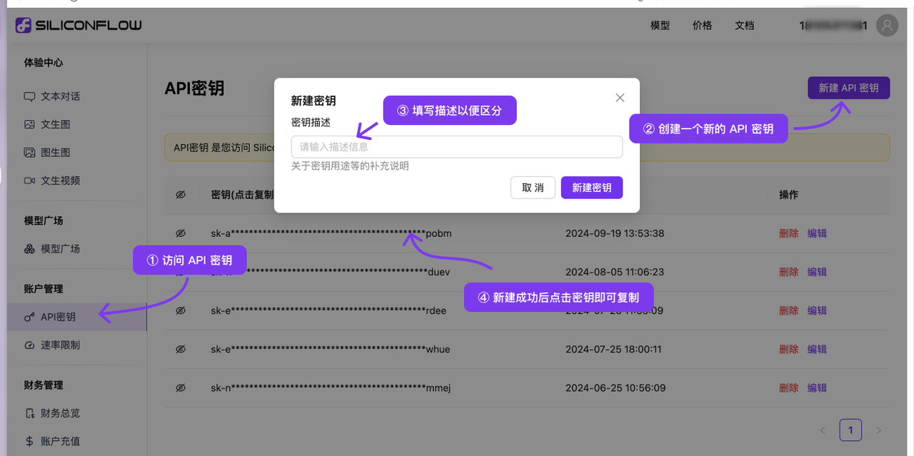
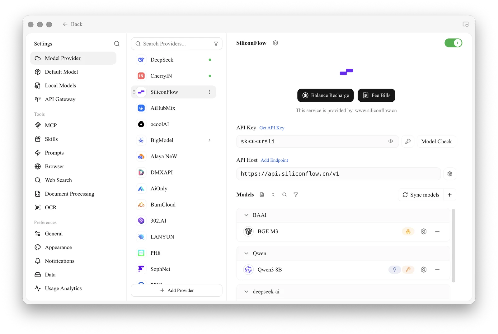
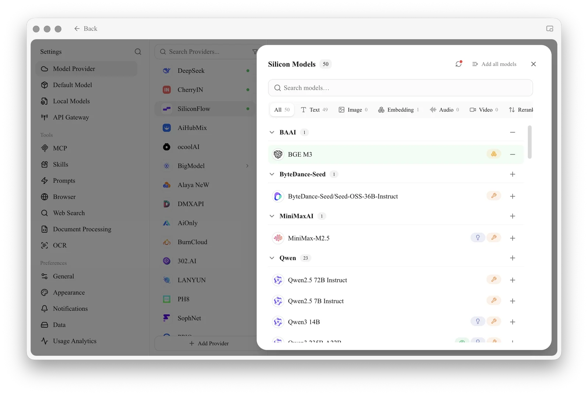
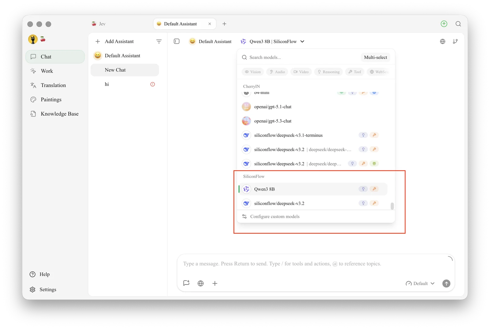

# SiliconFlow

SiliconFlow is an inference platform that hosts many open-source models (Qwen, DeepSeek, GLM, BGE and more) behind one API. International users sign up on siliconflow.com; the mainland China platform is siliconflow.cn.

## 1. Get an API Key

1. Sign up or log in on [SiliconFlow](https://cloud.siliconflow.com/) (mainland China users: [cloud.siliconflow.cn](https://cloud.siliconflow.cn/))
2. Open the **API Keys** page, then create a new key or copy an existing one

<figure><figcaption></figcaption></figure>

## 2. Configure in Cherry Studio

1. Open `Settings → Model Provider` and select **SiliconFlow**
2. Click **Add API key**, paste your key, then click **Save and close**
3. Make sure the **API Host** matches the platform your key comes from: `https://api.siliconflow.com/v1` for siliconflow.com, `https://api.siliconflow.cn/v1` for mainland China

<figure><figcaption></figcaption></figure>

4. Click **Sync models** and add the models you want

<figure><figcaption></figcaption></figure>

## 3. Start Chatting

1. Click **Chat** in the left sidebar
2. Select a SiliconFlow model from the model selector in the top bar
3. Type in the input box to start chatting

<figure><figcaption></figcaption></figure>


SiliconFlow also offers embedding models such as `BAAI/bge-m3`, which you can use for [knowledge bases](../../knowledge-base/knowledge-base.md).


***

### Get Help and Submit Feedback

If you have any questions, bugs, or feature suggestions during configuration or use, please use the official channels listed in [Feedback and Suggestions](../../question-contact/suggestions.md).
