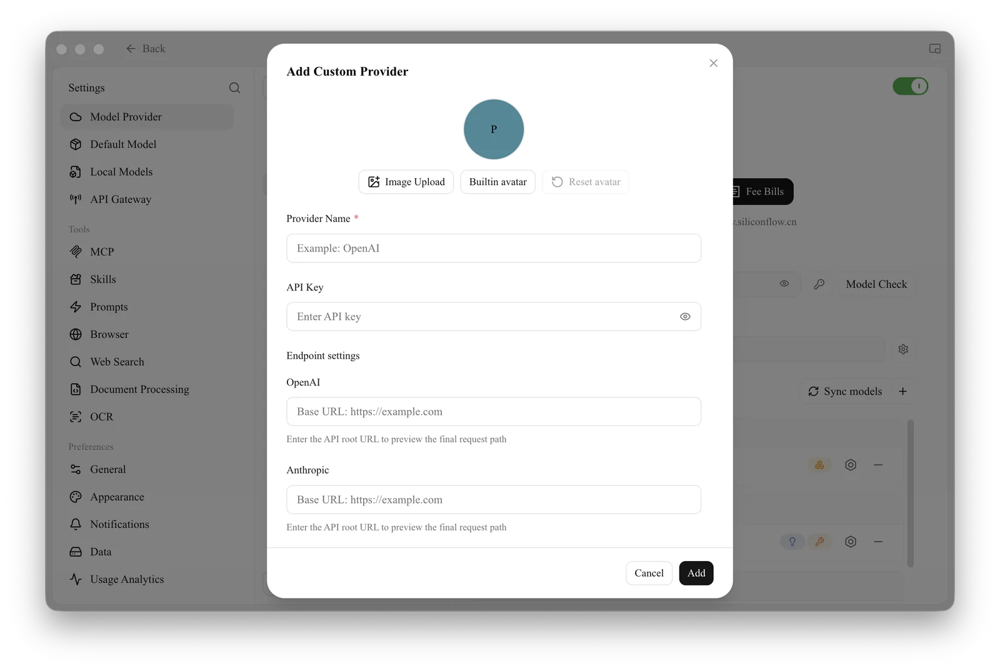

# Custom AI Service Provider

Cherry Studio not only integrates mainstream AI model services but also empowers you with powerful customization capabilities. Through the **Custom AI Service Provider** feature, you can easily connect to any AI model you need.

## Why Do You Need Custom AI Service Providers?

*   **Flexibility:** No longer limited by a predefined list of providers, you are free to choose the AI model that best suits your needs.
*   **Diversity:** Experiment with AI models from various platforms to discover their unique strengths.
*   **Controllability:** Directly manage your API keys and access addresses, ensuring security and privacy.
*   **Customization:** Integrate privately deployed models to meet the demands of specific business scenarios.

## How to Add a Custom AI Service Provider?

Adding your custom AI service provider to Cherry Studio takes just a few simple steps:

1.  **Open Settings:** In the left navigation bar of the Cherry Studio interface, click "Settings" (gear icon).
2.  **Go to Model Provider:** On the settings page, select "Model Provider" in the left menu.
3.  **Add Provider:** Click **+ Add Provider** at the bottom of the provider list to open the **Add Custom Provider** dialog.
4.  **Fill in Information:**
    *   **Avatar (optional):** upload an image, pick a built-in avatar, or keep the default letter avatar.
    *   **Provider Name** (required): an easy-to-identify name, e.g. MyCustomOpenAI.
    *   **API Key:** the key provided by your AI service.
    *   **Endpoint settings:** enter the API root URL (Base URL) for each protocol your service supports, such as **OpenAI** and **Anthropic**. You only need to fill in the ones your service offers; a preview of the final request path appears below each field.
5.  **Save Configuration:** Click **Add**.

<figure><figcaption><p>The Add Custom Provider dialog</p></figcaption></figure>

## Configure Custom AI Service Provider

After adding, you need to find the provider you just added in the list and configure it in detail:

1.  **Enable Status:** In the top-right corner of the provider's page, there is an enable switch. Turning it on means enabling this custom service.
2.  **API Key:**
    *   Enter the API Key provided by your AI service provider.
    *   Click the "Model Check" button on the right to verify the validity of the key.
3.  **API Host:**
    *   Check or change the API access address (Base URL) for the AI service.
    *   Please be sure to refer to the official documentation provided by your AI service provider to get the correct API address.
4.  **Model Management:**
    *   Click **Sync models** to fetch models automatically, or the **+** next to it to manually add the model ID you want to use under this provider. For example, `gpt-3.5-turbo`, `gemini-pro`, etc.
    *   If you are unsure of the specific model name, please refer to the official documentation provided by your AI service provider.
    *   Use the settings icon or "−" next to each model to edit or remove models that have already been added.

## Get Started

After completing the above configuration, you can select your custom AI service provider and model in Cherry Studio's chat interface and start conversing with AI!

## Using vLLM as a Custom AI Service Provider

vLLM is a fast and easy-to-use LLM inference library similar to Ollama. Here are the steps on how to integrate vLLM into Cherry Studio:

1.  **Install vLLM:** Install vLLM according to the official vLLM documentation ([https://docs.vllm.ai/en/latest/getting\_started/quickstart.html](https://docs.vllm.ai/en/latest/getting_started/quickstart.html)).

    ```sh
    pip install vllm # If you use pip
    uv pip install vllm # If you use uv
    ```
2.  **Start vLLM Service:** Start the service using vLLM's OpenAI-compatible API. There are two main methods, as follows:

    *   Start using `vllm.entrypoints.openai.api_server`

    ```sh
    python -m vllm.entrypoints.openai.api_server --model gpt2
    ```

    *   Start using `uvicorn`

    ```sh
    vllm --model gpt2 --served-model-name gpt2
    ```

    Ensure the service starts successfully and listens on the default port `8000`. Of course, you can also specify the vLLM service's port number using the `--port` parameter.

3.  **Add vLLM Provider in Cherry Studio:**
    *   Follow the steps described above to add a new custom AI service provider in Cherry Studio.
    *   **Provider Name:** `vLLM`
    *   **Provider Type:** Select `OpenAI`.
4.  **Configure vLLM Provider:**
    *   **API Key:** Since vLLM does not require an API key, this field can be left blank or filled with any content.
    *   **API Address:** Enter the API address of the vLLM service. By default, the address is: `http://localhost:8000/` (if a different port is used, please modify accordingly).
    *   **Model Management:** Add the name of the model you loaded in vLLM. In the example of running `python -m vllm.entrypoints.openai.api_server --model gpt2` above, you should enter `gpt2` here.
5.  **Start Conversation:** Now, you can select the vLLM provider and the `gpt2` model in Cherry Studio to start a conversation with your vLLM-powered LLM!

## Tips and Tricks

*   **Read the Documentation Carefully:** Before adding a custom service provider, be sure to carefully read the official documentation of the AI service provider you are using to understand key information such as API keys, access addresses, and model names.
*   **Check API Key:** Use the "Model Check" button to quickly verify the validity of the API key, avoiding usability issues due to incorrect keys.
*   **Pay Attention to API Address:** Different AI service providers and models may have different API addresses, so be sure to fill in the correct address.
*   **Add Models as Needed:** Please only add models that you will actually use, avoid adding too many unnecessary models.