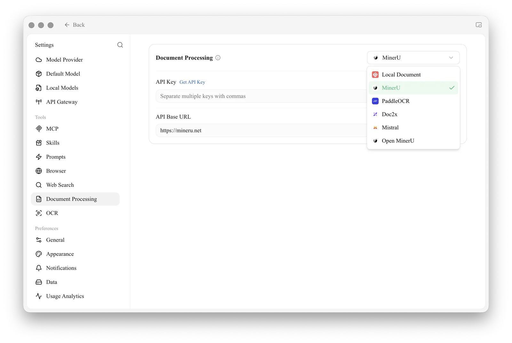

# Document Processing

In short: **This is the central configuration in Cherry Studio for converting "PDFs / complex layout documents" into clean, structured text.**

PDFs with tables, multi-column layouts, or scanned pages (such as academic papers, contracts, or research reports) often produce garbled results when passed directly to a model. Document Processing first uses a dedicated parsing engine to convert them into clearly structured text, which is then used in conversations or the [Knowledge Base](../../knowledge-base/knowledge-base.md).


**Document Processing vs. OCR**: These are two separate settings pages.

* **Document Processing** (this page): Manages structured parsing of **PDFs / complex layout documents**.
* **[OCR](ocr.md)**: Manages text recognition in **images / scanned documents**.

Neither is needed for plain text PDFs or text paragraphs in `.md`/`.txt`/`.docx`; these can be read directly.


### Configuration Entry

Open **Settings** → **Document Processing**. Select the parsing engine from the dropdown in the top-right corner. **The selected engine becomes the default.**

<figure><figcaption>
Document Processing settings: ① Select the parsing engine from the top-right dropdown (default is MinerU); enter the API key and API address for the selected engine below
</figcaption></figure>

### Built-in Parsing Engines

Document Processing includes 6 built-in engines, with **MinerU** as the default:

| Engine | Description | Integration Method |
| --- | --- | --- |
| **Local Document** | Built-in local parsing, no service needed | None |
| **MinerU** (default) | High-quality open-source PDF extraction tool by OpenDataLab | API key ([mineru.net/apiManage](https://mineru.net/apiManage)) |
| **PaddleOCR** | Baidu PaddlePaddle OCR recognition system | Enter API key ([PaddlePaddle Galaxy Community](https://aistudio.baidu.com/paddleocr/)); if self-deployed, point the API address to your service |
| **Doc2x** | Advanced file restoration engine | API key ([open.noedgeai.com](https://open.noedgeai.com/apiKeys)) |
| **Mistral** | File parsing and understanding service | API key ([mistral.ai](https://mistral.ai/api-keys)) |
| **Open MinerU** | Self-deployable MinerU service, suitable for teams wanting to control the processing pipeline | Enter API address after self-deployment (enter API key if required) |

### Configuring MinerU (Default Option)



### Enter API Key

Enter the key obtained from MinerU in the **API Key** field (click "Get Key" on the right to jump to the application page; separate multiple keys with commas).



### Confirm API Address

Keep the **API Address** as the default.



### Use Directly in Knowledge Base / Conversations

When importing complex PDFs, the parsing settings here are automatically applied. No additional configuration is needed when switching to the Knowledge Base or conversations.




**Switching to Other Engines**: Select the engine from the dropdown and enter its **API Key** / **API Address**. The selected engine becomes the default. **PaddleOCR** and **Open MinerU** support self-deployment—after deployment, enter your own service address in the **API Address** field.


### Relationship with Knowledge Base

* Document Processing is only responsible for the "complex document → clean text" step;
* The converted text continues to be vectorized via the [Embedding Model](../../knowledge-base/emb-models-info.md) and stored in the database;
* See [Knowledge Base Document Preprocessing](../../knowledge-base/document-preprocessing.md) for detailed steps on enabling this in the Knowledge Base.

### Tips and Tricks

* MinerU performs significantly better on PDFs with tables / multi-column layouts; it is the preferred choice for academic papers, etc.;
* If you need to recognize **text in images** (screenshots, scanned documents) rather than PDF structure, use [OCR](ocr.md) instead.

***

### Getting Help and Submitting Feedback

If you have any questions, bugs, or feature improvement suggestions during configuration or usage, please refer to the official channels provided in [Feedback and Suggestions](../../question-contact/suggestions.md).
