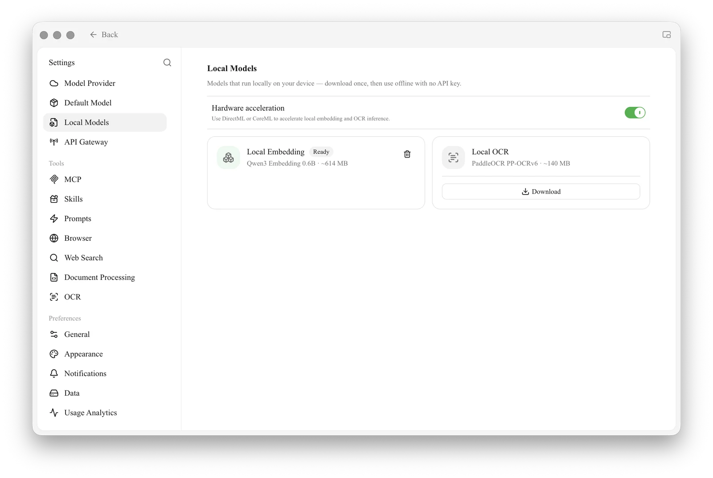

# Local Models

Local models are small, built-in models in Cherry Studio that **run offline after download**: they do not use any provider API and do not require an API Key. They are lightweight, run on your own computer, and are designed to cover basic capabilities that are not worth configuring a separate cloud model for.

Open `Settings → Local Models` to manage them:

<figure><figcaption>
Local Models: the Local Embedding model (shown as "Ready"; click the delete icon to remove it) and the Local OCR model (click Download to install it). The Hardware acceleration switch at the top uses DirectML or CoreML to speed up local inference
</figcaption></figure>

Two types of local models are currently built in:

| Local Model | Underlying Model | Size | Use Case |
| ------------- | -------------------- | -------- | --------------------------------------------------------------- |
| **Local Embedding Model** | Qwen3 Embedding 0.6B | ~614 MB | Converts text into vectors for [Knowledge Base](../../knowledge-base/knowledge-base.md) retrieval, recall, and similar scenarios |
| **Local OCR Model** | PaddleOCR PP-OCRv6 | ~140 MB | Offline recognition of text in images/scans, used by the [OCR](ocr.md) feature |

### Download and Status

* A status badge appears next to the model name: cards that have not been downloaded have a full-width **Download** button at the **bottom**; click it to start the download. Once complete, the badge changes to **Ready**.
* Ready models can be removed by clicking the **Delete** icon on the right to free up disk space; you can download them again if needed. (If the embedding model is still in use by the Knowledge Base, deletion will be rejected and the weights will be retained.)
* On some platforms/architectures that do not support local inference, the panel will display "**Current platform does not support local models**", and no download option will be provided.

If one mirror is unavailable during download, Cherry Studio will automatically try other download sources. After download, the local embedding model runs inference on your machine without an internet connection.


If the page displays "Model file is incomplete. Please re-download to repair.", it means necessary files are missing from the local cache. Delete or re-download the model to fix this; do not manually combine model files.



Local models are **optional**. If you have already configured a cloud embedding model in [Model Services](providers.md), or if your system's built-in OCR is sufficient, you do not need to download them.


### When to Use Local Models

* **No cloud embedding model / do not want to pay separately for the Knowledge Base**: Download the local embedding model to enable indexing and retrieval in the Knowledge Base while fully offline.
* **Need offline OCR**: In scenarios without network access or where you do not want images uploaded to third parties, download the local OCR model and select "Local PaddleOCR" in [OCR Settings](ocr.md).
* **Privacy first**: All computation is performed locally, and content does not leave your computer.


Local models are a lightweight "good enough" solution. If you have high requirements for retrieval accuracy or recognition precision, cloud-based [Embedding Models](../../knowledge-base/emb-models-info.md) and more powerful OCR services typically deliver better results.


***

### Get Help and Submit Feedback

If you have any questions, bugs, or feature improvement suggestions while configuring or using the feature, please refer to the official channels provided in [Feedback and Suggestions](../../question-contact/suggestions.md).
