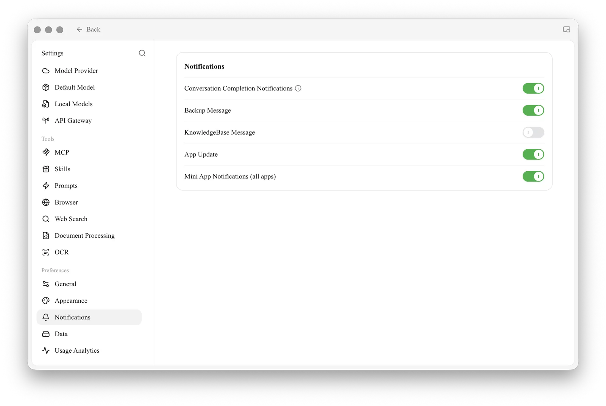

# Notifications

Notification settings control **how the software alerts you while running in the background**. When you switch to another window, Cherry Studio can display system notifications upon the completion of key events, preventing you from waiting idly or missing results.

Open `Settings → Notifications`, where you will find these independent toggles:

<figure><figcaption>
Notification Settings Panel
</figcaption></figure>

| Toggle | When You Are Notified | Recommendation |
| --- | --- | --- |
| **Conversation Completion Notifications** | Notifies when an AI reply is **successful** and generation **takes more than 30 seconds** (an ⓘ icon provides details next to the toggle) | **Enable**. Useful when using reasoning models or generating long texts, so you don't have to watch the screen |
| **Backup Message** | When automatic or manual backups are completed | **Enable**. Confirms that data has been safely archived |
| **KnowledgeBase Message** | Notifies when knowledge base-related tasks (such as index building) are completed | **Enable**. Building a knowledge base is usually time-consuming, and a notification upon completion is convenient |
| **App Update** | When a new version of Cherry Studio is available | **Enable** |
| **Mini App Notifications (all apps)** | Allows mini apps to send system notifications | Enable if you rely on mini app alerts |


These notifications use the operating system's notification center. If you do not receive any alerts, check whether your system allows Cherry Studio to send notifications (macOS "Notifications", Windows "Notifications and Actions").


***

### Get Help and Submit Feedback

If you have any questions, encounter bugs, or have feature improvement suggestions while configuring or using the software, please refer to the official channels provided in [Feedback and Suggestions](../../question-contact/suggestions.md).
