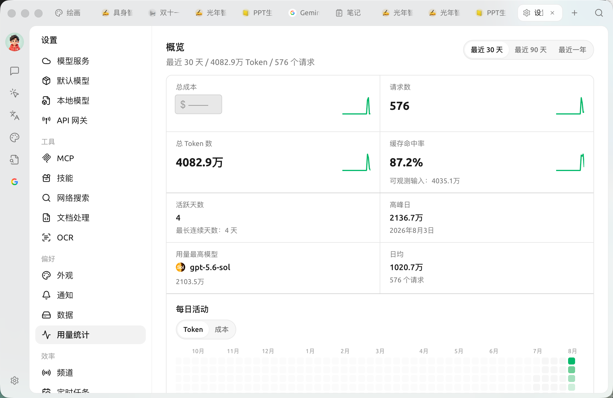

# Usage Statistics

Usage Statistics aggregates your **model invocation data in Cherry Studio into a visual dashboard**: total cost, token consumption, request volume, and top-performing models are displayed at a glance. It helps you estimate costs, identify abnormal consumption, and make informed decisions about model usage.

Open `Settings → Usage Statistics`. The page is divided into **Overview / Explore / Requests** sections. In the top-right corner, you can switch between **Last 30 days / Last 90 days / Last year**, and all data is calculated based on the selected period.

<figure><figcaption>
Usage Statistics [Overview]: Top metric cards + daily activity heatmap below (total cost in the image is redacted)
</figcaption></figure>

### Overview

A set of metric cards at the top:

| Metric | Description |
| --- | --- |
| **Total Cost** | Estimated spending within the period (converted based on public pricing for each model, for reference only) |
| **Request Count** | Total number of requests initiated |
| **Total Tokens** | Total input + output tokens |
| **Cache Hit Rate** | Percentage of prompt cache hits (cache reads ÷ observable inputs); higher rates reduce costs |
| **Active Days / Longest Streak** | Number of days with usage records and the longest consecutive usage streak |
| **Peak Day** | The date with the highest single-day usage and its token volume |
| **Top Model** | The model with the highest consumption within the period |
| **Daily Average** | Average daily token volume and request count |

The **Daily Activity** heatmap below displays usage intensity by day. You can switch between **Token / Cost** dimensions; darker colors indicate higher usage for that day.

### Explore / Analysis

Switch to **Explore** to break down usage for analysis: split by **Group** (Provider / Model / API Key / Assistant·Agent), select a **Metric**, and view distribution and trends using **Bar Chart / Line Chart / Pie Chart / Segment** charts.

### Request Details

**Requests** lists individual request records, helping you identify which requests generated the primary consumption.

> Want to view data for a specific day? Click a day in the **Daily Activity** heatmap in the Overview. The Explore section (Analysis + Requests) will **drill down** to that day, and the title will change to "Details for [Date]". Click "Clear Date Filter" to return.


Costs are **estimated values**: they are converted based on the model's public pricing. Actual billing is subject to the invoices from each model provider. Free models and local models do not incur costs.


***

### Get Help and Submit Feedback

If you have any questions, bugs, or feature improvement suggestions during configuration or usage, please refer to the official channels provided in [Feedback and Suggestions](../../question-contact/suggestions.md).
