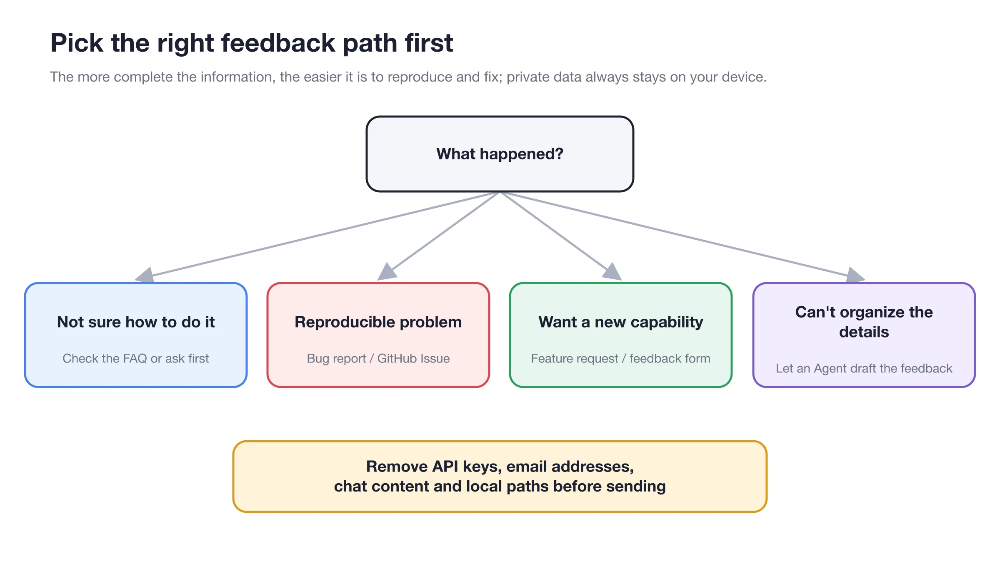

# Effective Questioning Methods

A question that's easy to answer doesn't have to be long, but it should let others know what you're trying to do, what actually happened, and how to see the same problem themselves.

<figure><figcaption><p>First decide whether it's a usage question, a reproducible problem or a feature suggestion, then prepare the matching material.</p></figcaption></figure>

### Choose the Right Place First

| Your situation | Where to go |
| ------------ | ----------------------------- |
| Not sure whether it's a configuration or a product problem | Sidebar **Help → Feedback → Ask the Feedback Assistant** |
| Confirmed, reproducible bug | GitHub Bug Report |
| You want a new capability | GitHub Feature Request |
| Discussing usage or approaches | GitHub Discussions / Questions |
| You only need the steps for something | These docs and Cherry Assistant |

Cherry Assistant can read information about your installed version and, with your consent, collect the diagnostics it needs. It shows you a redacted preview before submitting feedback or generating a diagnostic package — you don't need to learn how to read logs first.

### What Your Question Should Include



#### 1. State your goal in one sentence

For example: "I want an Agent to post the daily report to a Feishu (Lark) group every weekday morning."



#### 2. Describe the actual and expected results

Actual result: "The task ran successfully, but nothing arrived in Feishu." Expected result: "When the run finishes, the specified group receives the daily report."



#### 3. Give the shortest steps to reproduce

Start from the entry point where the problem reliably occurs, and describe in 3–6 steps what you click, what you select and where the error appears.



#### 4. Add your environment

Include your operating system, the version shown in **Settings → About & Feedback**, and the relevant provider or channel type. Never make API keys or account credentials public.



#### 5. Attach screenshots, recordings or logs

Screenshots should show both the error and the page it's on; for logs, include only the relevant time window and redact them first. For problems with model output, include the input, the model and the expected format.



### A Ready-to-Use Template

```
Title: Agent scheduled task runs successfully, but the Feishu channel receives no result

Goal: Send the operations daily report to a specific Feishu group at 09:00 on weekdays.
Actual result: Run history shows success; no message in Feishu.
Expected result: The group receives one daily report message.

Steps to reproduce:
1. Open Settings → Scheduled Tasks.
2. Select the daily report task and click Run.
3. Wait for the task to finish.
4. Check the Feishu group: no new message.

Environment: macOS / version shown in Cherry Studio's About & Feedback / Feishu channel.
Already tried: Re-enabled the channel; sent the bot a test message in Feishu.
Attachments: Channel status screenshot with credentials masked; the matching run record.
```

### What to Remove From Screenshots and Logs


Before submitting, remove API keys, Authorization headers, cookies, bot tokens, app secrets, email addresses, full local paths, chat content and business data. If a key is ever exposed, revoke it immediately with the provider or platform.


### Small Habits That Speed Up Troubleshooting

* Reproduce only one problem at a time;
* Use the smallest configuration that still shows the problem;
* Say whether the problem happens every time;
* Don't just write "it doesn't work" — include the exact error text;
* Don't upload entire logs unrelated to the problem;
* If you find an identical issue, add your environment and new clues to it instead of opening a duplicate.

<details>

<summary>Can I just have Cherry Assistant submit it for me?</summary>

Yes. Open Cherry Assistant through **Feedback**, describe the problem, and explicitly ask it to submit. It will ask for permission to collect diagnostic data, show you a redacted preview, and then handle it the way you choose. It only files a GitHub Issue if you explicitly ask for GitHub.

</details>
