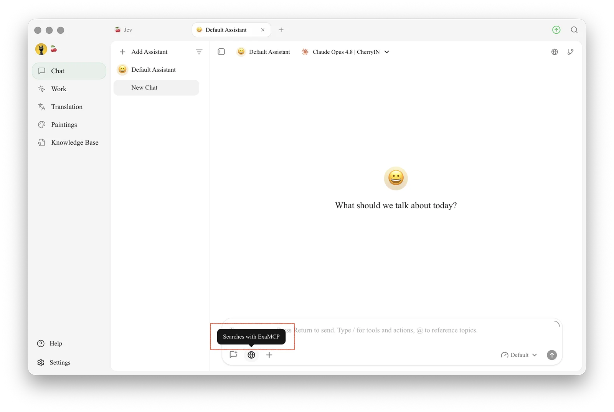
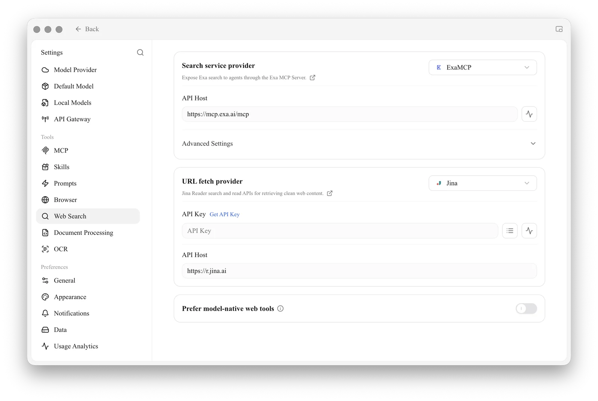
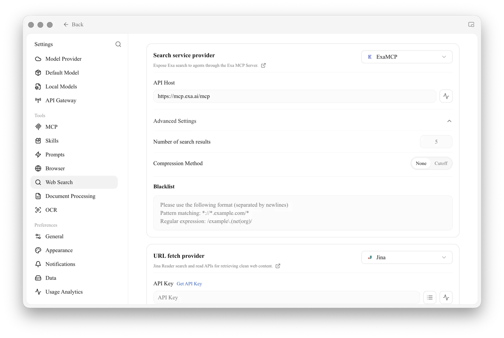

# Web Search Mode


Web search mode lets the AI search for the latest information before answering. It's useful for:

* **Time-sensitive information**: news, prices and exchange rates from today, this week, or just now
* **Real-time data**: dynamic values such as weather, stock prices and product inventory
* **Emerging knowledge**: newly released tools, concepts and technologies


## Turn On Web Search

Click the 🌐 **globe** icon in the toolbar of the chat input box to turn on web search for the current conversation.

<figure><figcaption>
The globe icon in the chat input bar: click it to turn on web search for the current conversation (the tooltip shows the current search provider)
</figcaption></figure>

**Works out of the box**: Cherry Studio comes with **Exa MCP** built in as the default search provider, which **needs no API key** (it uses the public MCP endpoint `mcp.exa.ai`), and the default URL fetch provider is **Jina**. So once installed, you can click 🌐 and search the web right away.

## Configured Service or the Model's Own Search

Which route web search takes is decided by the **"Prefer model-native web tools"** switch at the bottom of `Settings → Web Search`, which is **off by default**:

* **Off (default)**: clicking 🌐 uses the service configured in `Settings → Web Search` — initially the key-free Exa MCP.
* **On**: if the model itself has **native search** (a small globe icon 🌐 next to the model name), the model handles web search on its own.

Rely on the 🌐 icon next to the model name to tell whether native search is supported, rather than a fixed list of models. Common cases today include:

* **DeepSeek**: models that support it can use native web search;
* **OpenRouter**: chat models can use native web search and URL content reading;
* **Alibaba Cloud Bailian**: models that support it can use native web search, and some Qwen models also support URL content reading;
* Some models from Google Gemini, Zhipu AI, xAI Grok and other providers also support native web search.

Model capabilities change as providers update them. Look for the 🌐 icon when choosing a model; if there isn't one, using a configured search service is the safer choice.


A few models can search the web even without the globe icon, depending on the provider's configuration — for example, the case described in [Web Search with Volcengine](../../../pre-basic/websearch/volcengine.md).


## Configure Services in Settings

Open `Settings → Web Search`. The configuration has two parts, each with a dropdown for choosing a provider; **the selected one becomes the default for that capability**:

| Section | Purpose |
| ------------- | --------------------- |
| **Search provider** | Searches the web based on your question and returns result summaries |
| **URL fetch provider** | Fetches the main text of a given URL to fill in the content of search results |

<figure><figcaption>
Web Search settings: the Search provider and URL fetch provider sections, and the "Prefer model-native web tools" switch at the bottom
</figcaption></figure>

### Built-in Providers

The following services are built in, in two types — **API** and **MCP**:

| Service | Type | Capability | Notes |
| ------------- | --- | ----------- | ------------------------------- |
| **Exa MCP** | MCP | Search | **Default**, works without a key |
| **Tavily** | API | Search | Search engine optimized for LLMs |
| **Bocha** | API | Search | Chinese search API for AI use cases, with real-time web and structured results |
| **Exa** | API | Search | Neural search designed for AI apps, good at semantic retrieval |
| **Zhipu** | API | Search | Zhipu GLM Web Search, for web search and real-time information |
| **Querit** | API | Search | Web retrieval service for AI applications |
| **SearXNG** | API | Search | Free, self-hostable metasearch engine |
| **Firecrawl** | API | Search | Web scraping and search; can convert results to Markdown |
| **Jina** | API | Search · URL fetch | Jina Reader; also the **default URL fetch provider** |
| **Fetch** | API | URL fetch | Built-in URL fetching that extracts the main text from a given URL |

> Apart from the default **Exa MCP** (no key needed), most API providers require their own API key; **SearXNG** needs the address of your own deployment, and **Fetch** is built in and needs no configuration.

### Advanced Settings

* **Number of search results**: how many results are returned per search (default 5, up to 100). Without compression, a large number consumes more tokens.
* **Search result compression**: compresses the returned content before passing it to the model, saving tokens. Choose **None** to pass results as-is, or **Cutoff** to truncate each result to a set length.
* **Search result blacklist**: blocks websites you don't want to see; see [Web Search Blacklist Configuration](../../../pre-basic/websearch/blacklist.md).

<figure><figcaption>
Advanced settings: number of results, compression method (None / Cutoff), and blacklist
</figcaption></figure>

## Related Guides

The default Exa MCP works without a key. To switch to another service or configure things in more depth, see:

* [Free Web Search Mode](../../../pre-basic/websearch/free-search.md) — use search without paying
* [Tavily Registration Guide](../../../pre-basic/websearch/tavily.md) — how to sign up and get a key when switching to Tavily
* [SearXNG Local Deployment and Configuration](../../../pre-basic/websearch/searxng.md) — self-hosted and fully local
* [Web Search Blacklist Configuration](../../../pre-basic/websearch/blacklist.md) — block websites you don't want

## How It Works

Whichever route is used, the conversation flow is:

1. You ask, "What's the weather in Shanghai today?"
2. Cherry Studio first sends the question to the search service
3. The search service returns summaries of relevant web pages
4. Cherry Studio adds these summaries to the prompt and sends it to the AI model
5. The AI answers you based on real-time data

***

### Get Help and Submit Feedback

If you have any questions, bugs, or feature suggestions during configuration or use, please use the official channels listed in [Feedback and Suggestions](../../../question-contact/suggestions.md).
