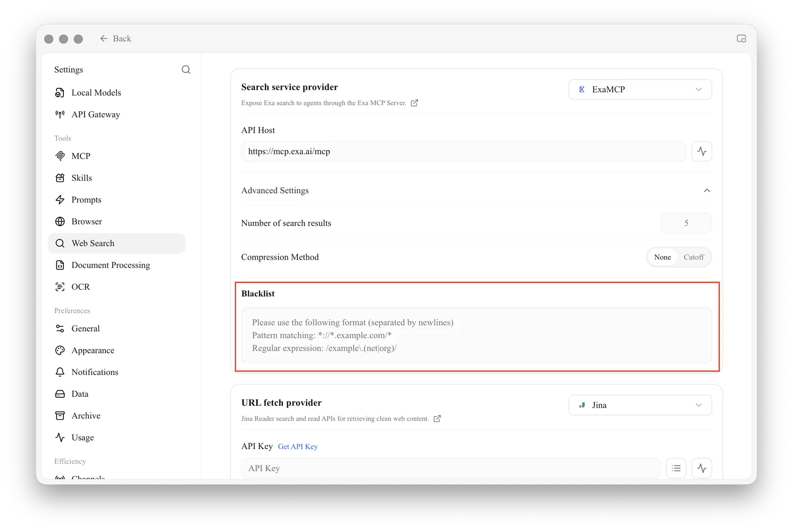

# Web Search Blacklist Configuration

Use the blacklist to keep specific sites out of web search results. Rules follow the format of [ublacklist](https://github.com/iorate/ublacklist).

Open **Settings → Web Search**, expand **Advanced Settings** under the search service provider, and enter rules in the **Blacklist** box, one per line. Rules can be specified using: [Match Patterns](https://developer.mozilla.org/en-US/docs/Mozilla/Add-ons/WebExtensions/Match_patterns) (e.g., `*://*.example.com/*`) or [Regular Expressions](https://developer.mozilla.org/en-US/docs/Web/JavaScript/Guide/Regular_expressions) (e.g., `/example\.(net|org)/`).

<figure><figcaption>
Enter blacklist rules in Settings → Web Search → Advanced Settings
</figcaption></figure>
