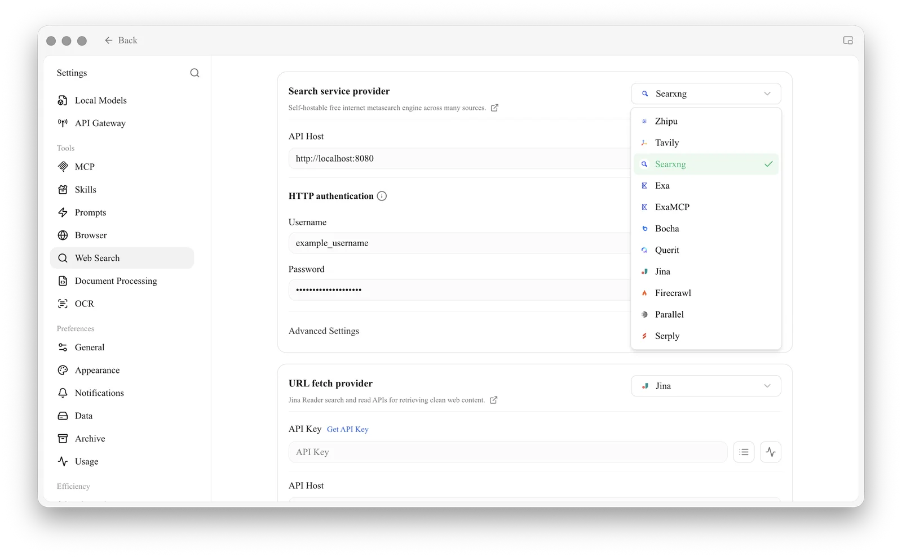
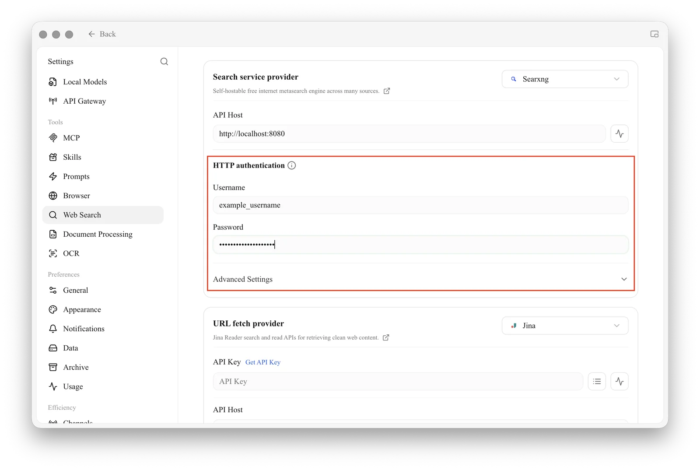
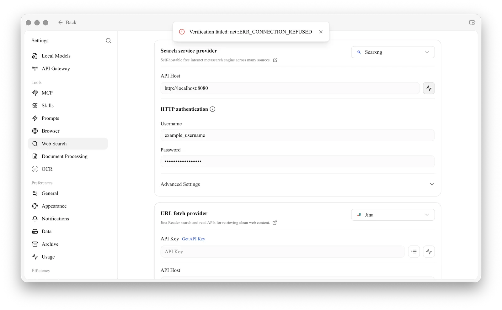

# SearXNG Local Deployment and Configuration

[SearXNG](https://github.com/searxng/searxng) is an open-source metasearch engine: it sends your query to engines such as Google, Bing and DuckDuckGo and combines the results. Cherry Studio can use a SearXNG instance you run yourself as its web search provider.

* Open source and free, no API key required
* Good privacy, since you control the instance
* Highly customizable

Unlike hosted providers such as Tavily or Exa, SearXNG has to be deployed first, either on your own computer or on a server. If you just want web search to work, a hosted provider is quicker to set up; see [Web Search](README.md).

## 1. Deploy SearXNG

### On your computer

With [Docker](https://www.docker.com/) installed, run:

```bash
mkdir -p searxng
docker run -d --name searxng -p 8080:8080 \
  -v "$(pwd)/searxng:/etc/searxng" \
  searxng/searxng:latest
```

Open `http://localhost:8080` in your browser. If the SearXNG search page appears, the deployment works.

### On a server

To share one instance or avoid installing Docker locally, deploy SearXNG on a server with the official [searxng-docker](https://github.com/searxng/searxng-docker) setup, following its README. Start it with `docker compose up -d` and check the logs with `docker compose logs -f searxng`.

SearXNG has no login of its own. If the instance is reachable from the internet, put it behind a reverse proxy with [HTTP Basic Authentication](https://developer.mozilla.org/en-US/docs/Web/HTTP/Guides/Authentication), which Cherry Studio supports. With Nginx, add these two lines to the `location` block that proxies SearXNG:

```conf
auth_basic "Please enter your username and password";
auth_basic_user_file /etc/nginx/conf.d/search.htpasswd;
```

Then create the password file (replace the username and password) and reload Nginx:

```bash
echo "example_name:$(openssl passwd -5 'example_password')" > /etc/nginx/conf.d/search.htpasswd
```

Open the site in a browser; it should ask for the username and password before showing the SearXNG page.

## 2. Enable JSON output

Cherry Studio reads results in JSON, which SearXNG does not return by default. Open `settings.yml` (for the local setup above it is in the `searxng` folder; for searxng-docker it is `searxng/settings.yml`) and make sure `json` is listed under `search.formats`:

```yaml
search:
  formats:
    - html
    - json
```

For a private instance, also turn off the rate limiter so Cherry Studio's requests are not blocked:

```yaml
server:
  limiter: false
```

Restart SearXNG after saving (`docker restart searxng`, or `docker compose restart` for searxng-docker).

## 3. Configure Cherry Studio

Open **Settings → Web Search**, choose **Searxng** from the **Search service provider** dropdown, and enter your SearXNG address in **API Host**, for example `http://localhost:8080`. If Cherry Studio itself runs in Docker, use `http://host.docker.internal:8080`.

<figure><figcaption><p>Choose Searxng as the search service provider</p></figcaption></figure>

If you set up HTTP Basic Authentication, enter the username and password under **HTTP authentication**:

<figure><figcaption><p>Enter the HTTP Basic Authentication username and password</p></figcaption></figure>

Click the check button next to **API Host** to verify the connection. If it fails, a "Verification failed" message appears at the top of the window:

<figure><figcaption><p>A connection error such as ERR_CONNECTION_REFUSED means the address is unreachable</p></figcaption></figure>

## Common Reasons for Verification Failure

| Symptom | Fix |
| --- | --- |
| Connection refused or timed out | Check that SearXNG is running and that the address and port in **API Host** are correct |
| 401 error | The reverse proxy requires login: fill in **HTTP authentication** |
| 403 error or no results | `json` is missing from `search.formats` in `settings.yml`; add it and restart |
| Works at first, then fails with frequent searches | The rate limiter is blocking requests: set `limiter: false` and restart |
| No results for some queries | The engines SearXNG uses may be blocked from your network. Cherry Studio uses engines in the `web` and `general` categories, so adjust or enable engines in `settings.yml` (see the [SearXNG settings documentation](https://docs.searxng.org/admin/settings/index.html)) |


The preferences page in the SearXNG web interface only affects searches made in the browser. To change the engines Cherry Studio uses, edit `settings.yml`.

