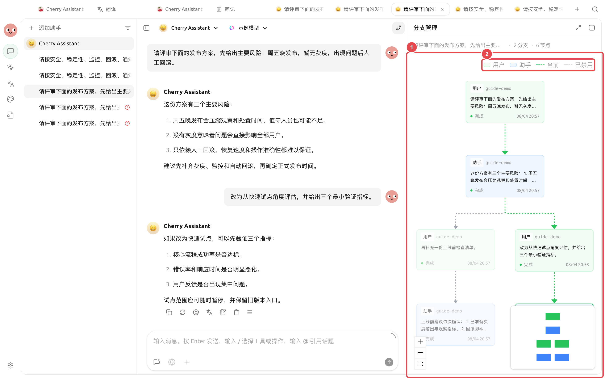

# Comparaison multi-modèles et branches de messages

La comparaison multi-modèles est adaptée aux questions sans réponse unique, telles que l'évaluation de plans, l'orientation de la rédaction ou la vérification croisée de documents. Les branches de messages vous permettent d'explorer une autre voie à partir d'un nœud spécifique, sans avoir à copier l'intégralité de la conversation.

## Comparer plusieurs modèles simultanément



### 1. Ouvrir la [Conversation] et cliquer sur le nom du modèle

Cochez les modèles à comparer dans le sélecteur de modèles. Avant la première utilisation, vérifiez que les services associés à ces modèles sont correctement connectés.



### 2. Envoyer la même question

Incluez les critères d'évaluation dans la question, par exemple « Comparez sous les angles de la faisabilité, des risques et des coûts ». Ne posez pas simplement la question « Lequel est le meilleur ? ».



### 3. Comparer les différences, pas seulement choisir la réponse la plus longue

Concentrez-vous sur la cohérence des faits, la clarté des hypothèses, les éventuelles omissions et l'option la plus conforme à vos contraintes. Vérifiez toujours les faits importants dans les sources originales.



<figure><figcaption>
Sélectionnez plusieurs modèles dans le sélecteur de modèles, puis comparez les différences en utilisant la même question.
</figcaption></figure>


La sélection de plusieurs modèles déclenche des requêtes distinctes. En cas de coûts, de vitesse ou de données sensibles, commencez par une question courte pour vérifier la connexion et l'efficacité, avant de traiter des documents longs.


## Créer une branche à partir d'un message

Localisez le message que vous souhaitez réexplorer, ouvrez le menu du message et sélectionnez l'action de branchement. La nouvelle branche conserve le contexte antérieur, tandis que les messages suivants sont enregistrés séparément de la voie d'origine. Utilisez le gestionnaire de branches pour basculer, comparer et revenir entre les différentes voies.

Vous pouvez également créer une branche vide dans le canevas de branches. Une fois créée, la branche vide est immédiatement enregistrée, reste présente après le redémarrage de l'application et demeure dans le canevas de branches ; la prochaine fois que vous enverrez du contenu dans la zone de saisie, cette branche sera préremplie. Les branches vides inutiles peuvent être supprimées via le menu contextuel du nœud.

<figure><figcaption>
Le gestionnaire de branches conserve simultanément les voies « Liste de contrôle avant mise en ligne » et « Pilote rapide ».
</figcaption></figure>

Sur l'image : ① Nœud de branche et chemin actuel ; ② Légende pour l'utilisateur, l'assistant, le chemin actuel et le chemin désactivé. L'exemple conserve les deux voies « Liste de contrôle avant mise en ligne » et « Pilote rapide », soit 2 branches et 6 nœuds de messages.

### Cas d'application : Évaluer deux plans de publication

Demandez d'abord au modèle d'identifier les risques et les lacunes du plan, puis posez des questions complémentaires à partir de la même réponse : « Complétez la liste de contrôle avant mise en ligne » et « Évaluez sous l'angle d'un pilote rapide ». Une fois le gestionnaire de branches ouvert, les deux voies sont conservées côte à côte, permettant de poursuivre les questions sur l'une ou l'autre, ou de revenir à l'autre voie pour vérifier les conclusions.

Quand ne convient-il pas d'utiliser plusieurs modèles ?

Lorsqu'il s'agit simplement de vérifier un fait précis, de formater un texte court, ou lorsque les documents contiennent des éléments qui ne doivent pas être envoyés à plusieurs fournisseurs de services, l'utilisation d'un seul modèle est plus appropriée.

Les branches modifient-elles le message d'origine ?

Non. La branche se poursuit à partir du nœud sélectionné, la voie d'origine reste conservée et vous pouvez y revenir à tout moment.

