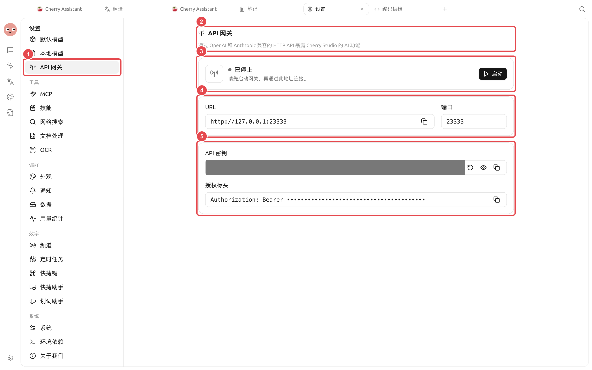

# Passerelle API

La passerelle API expose les capacités des modèles configurés dans Cherry Studio via des API HTTP compatibles OpenAI et Anthropic aux programmes locaux. Elle constitue également le service interne requis pour l'exécution de l'Agent.

Chemin : [Paramètres] → [Passerelle API].

<figure><figcaption>
Avant de connecter un programme externe, vérifiez l'état et le port ; ne fournissez la clé qu'aux programmes locaux de confiance ou aux réseaux contrôlés. 
</figcaption></figure>

## Distinction entre l'utilisation par l'Agent et les appels externes

* Utilisation exclusive de l'Agent Cherry Studio : suivez l'invite de l'application pour [Activer et démarrer], sans copier l'URL ou la clé vers d'autres programmes ;
* Appel de Cherry Studio par un programme local : démarrez la passerelle, copiez l'URL et la clé API, puis sélectionnez l'interface compatible selon la documentation API ;
* Accès depuis d'autres appareils : cela élargit la surface d'exposition. Vous devez vérifier vous-même l'écoute réseau, le pare-feu et le contrôle d'accès. Il n'est pas recommandé de l'ouvrir sans mesures de sécurité.

## Démarrage et connexion



### 1. Vérifier le port

Le port peut être modifié lorsque la passerelle est arrêtée. Choisissez un port non occupé par d'autres programmes ; en cas de conflit de port, le service ne peut pas démarrer correctement.



### 2. Démarrer la passerelle

Cliquez sur [Démarrer]. Une fois l'état passé à [En cours d'exécution], la page affiche l'URL disponible et propose un accès à la [Documentation API].



### 3. Configurer l'autorisation

Les programmes externes utilisent `Authorization: Bearer <clé API>`. Vous pouvez copier directement l'en-tête d'autorisation depuis la page. Ne stockez pas la clé dans un dépôt de code ou une capture d'écran.



### 4. Valider avec une requête minimale

Commencez par demander la liste des modèles ou envoyer un court texte selon la documentation API, avant d'intégrer l'application complète. En cas d'erreur, enregistrez le statut HTTP et la réponse, sans exposer l'en-tête d'autorisation complet.



## Cas d'usage : Appels de modèles par des scripts locaux

Vérifiez d'abord dans [Paramètres] → [Services de modèles] que le modèle peut converser normalement, puis démarrez la passerelle API. Le script ne doit stocker que l'adresse de la passerelle locale et la clé. Demandez d'abord la liste des modèles, puis envoyez un court texte. Avant d'intégrer le programme complet, assurez-vous que le client prend en charge les interfaces compatibles OpenAI ou Anthropic.

| Configuration | Point de départ recommandé | Rôle | Précautions |
| ------ | ---------- | --------- | ----------------- |
| Portée d'écoute | Usage local uniquement | Réduire l'exposition réseau | Ne pas ouvrir directement au réseau local ou à Internet pour faciliter le débogage |
| Clé API | Gérer séparément pour la passerelle actuelle | Valider les requêtes du client | Ne pas écrire dans les dépôts, captures d'écran ou journaux partagés |
| Requête de validation | Vérifier d'abord la liste des modèles et un court texte | Valider séparément la connexion et la génération | En cas d'échec, enregistrer le code de statut, pas la clé complète |

### Critères d'achèvement

La passerelle affiche [En cours d'exécution] ; la liste des modèles est lisible ; la requête de court texte réussit ; après l'arrêt de la passerelle, le client ne peut plus effectuer d'appels.

## Opérations de sécurité


La clé API permet d'appeler les services de modèles configurés dans Cherry Studio. En cas de fuite de la clé, arrêtez d'abord la passerelle, cliquez sur [Régénérer] dans l'état arrêté, puis mettez à jour tous les clients locaux.


* Pendant l'exécution de la passerelle, le port et la clé restent en lecture seule ; arrêtez-la avant toute modification ;
* N'affichez pas la clé dans les dépôts publics, les Issues, les journaux ou les captures d'écran de tutoriels ;
* Ne stockez la clé que dans les programmes qui en ont besoin pour les appels ;
* L'utilisation et les coûts restent générés par le fournisseur de modèles réel. Vous pouvez consulter les enregistrements de Cherry Studio dans [Paramètres] → [Statistiques d'utilisation].

Quelle est la relation entre la passerelle API et les services de modèles ? 

Les services de modèles stockent les connexions aux fournisseurs en amont ; la passerelle API convertit ces capacités en interfaces compatibles. La passerelle elle-même ne fournit pas de modèles et nécessite au moins un fournisseur et un modèle disponibles.

Que faire si le port est normal mais que le client renvoie une erreur d'autorisation ? 

Vérifiez que l'en-tête de requête est `Authorization: Bearer ...`, sans guillemets ou espaces superflus, et que la clé utilisée par le client correspond toujours à la valeur actuelle de la page.

