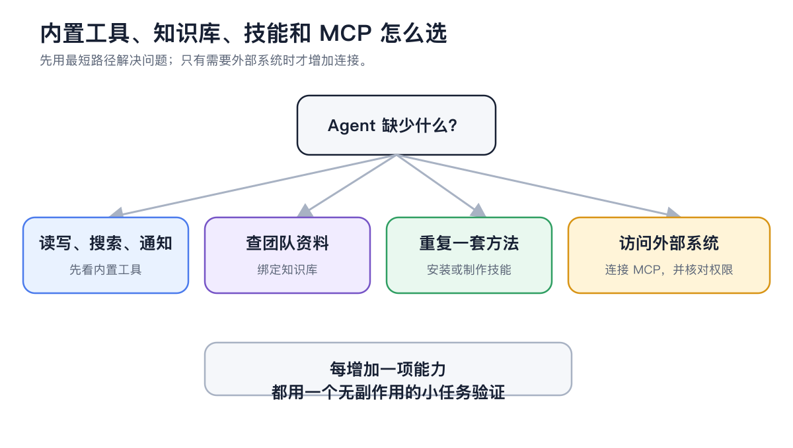
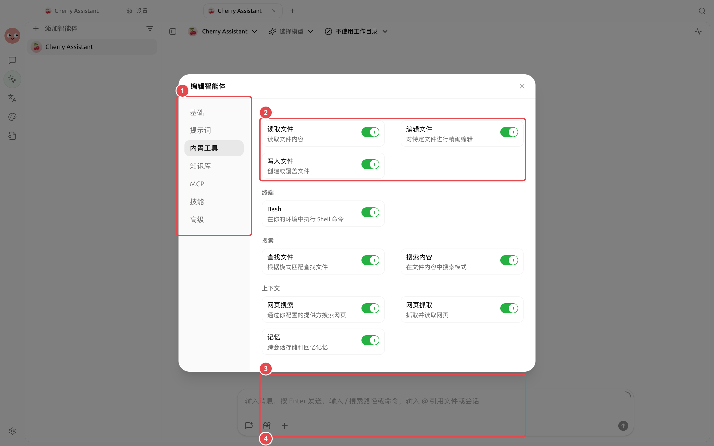

# Étendre les capacités de l'Agent

L'Agent dispose déjà d'outils intégrés pour les fichiers, la recherche, les images, la mémoire, les workflows et les tâches planifiées. Ajoutez des compétences pour des méthodes de travail fixes, et des MCP pour connecter des systèmes externes. Ils résolvent des problèmes différents ; inutile de tout installer pour avoir « plus de fonctionnalités ».

<figure><figcaption>
Privilégiez le chemin le plus court ; n'ajoutez un MCP que si l'Agent doit réellement accéder à un système externe. 
</figcaption></figure>

## Déterminer d'abord le besoin

| Besoin | Choix |
| ----------------- | ---------- |
| Définir une série d'étapes, un modèle ou une liste de contrôle | Compétence |
| Interroger une base de données, un navigateur ou un système tiers | MCP |
| Rechercher dans vos propres documents | Base de connaissances |
| Lire/écrire les fichiers du projet actuel, générer des images ou envoyer des notifications | Outils intégrés de l'Agent |


La méthode la plus simple consiste à décrire l'objectif directement dans [Travail] et à laisser l'Agent déterminer s'il manque une compétence, un MCP ou une base de connaissances. Consultez [Paramètres] pour gérer manuellement les sources, les paramètres de connexion ou les autorisations si nécessaire.


## Dernière étape après l'installation

Une installation globale ou une connexion réussie ne signifie pas que chaque Agent peut l'utiliser. Ouvrez [Travail] → Menu Agent → [Modifier], puis sélectionnez dans [Compétences], [MCP] ou [Base de connaissances]. La configuration prend effet à partir du prochain message.

<figure><figcaption>
Les outils intégrés, la base de connaissances, les MCP et les compétences de l'Agent sont configurés séparément ; activez-les selon les besoins de la tâche. 
</figcaption></figure>

<table data-view="cards"><thead><tr><th></th><th></th><th data-hidden data-card-target data-type="content-ref"></th></tr></thead><tbody><tr><td><strong>Compétences et bibliothèque de capacités</strong></td><td>Installer et réutiliser des méthodes de travail stables</td><td><a href="skills.md">skills.md</a></td></tr><tr><td><strong>MCP et outils externes</strong></td><td>Connecter des outils et sources de données supplémentaires</td><td><a href="../../../../advanced-basic/extensions/mcp">mcp</a></td></tr><tr><td><strong>Dépannage MCP</strong></td><td>Identifier le problème étape par étape le long de la chaîne de connexion</td><td><a href="mcp/troubleshooting.md">troubleshooting.md</a></td></tr></tbody></table>
