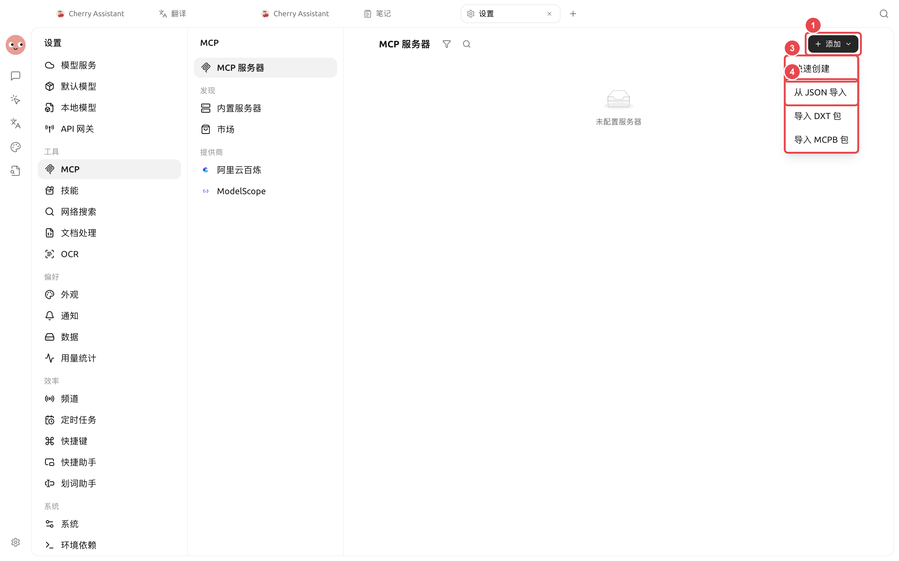
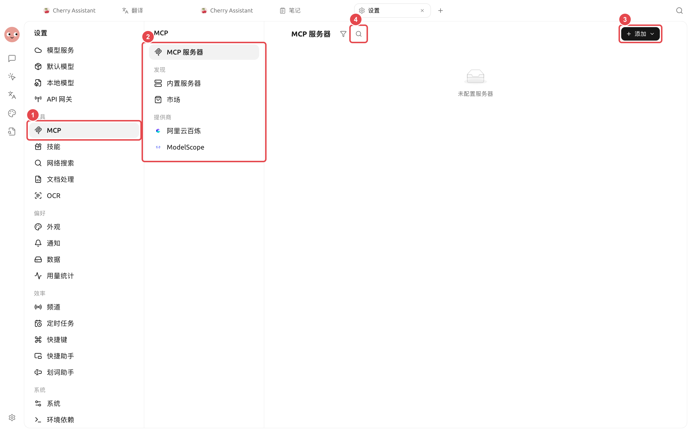
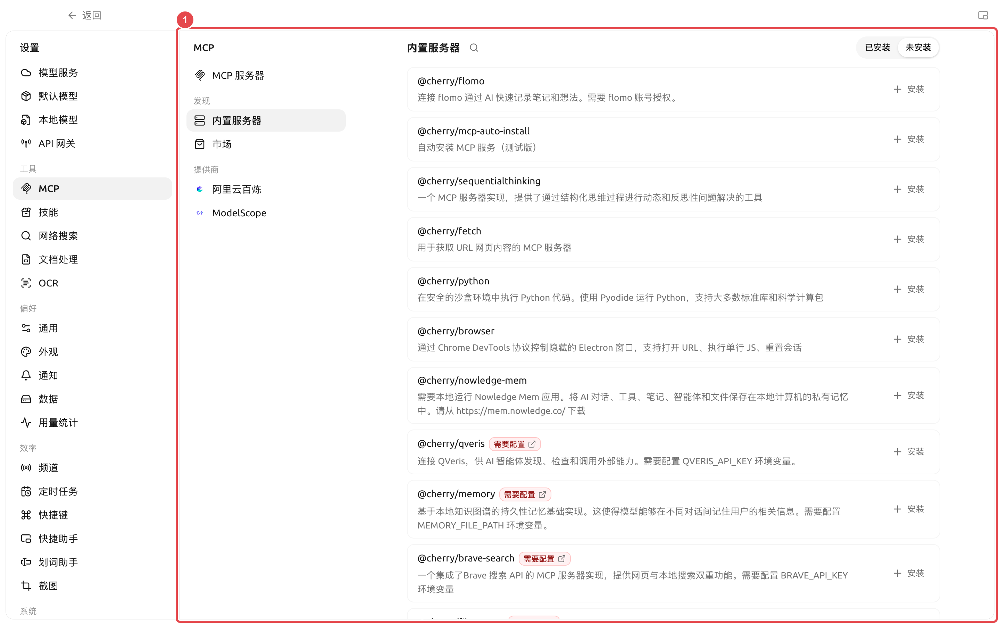

# MCP et outils externes

MCP est la méthode de connexion permettant à un Agent d'utiliser des outils et des ressources externes. Cherry Studio peut gérer les serveurs MCP, les serveurs intégrés, le marché de services et certains points d'entrée de fournisseurs, puis associer les serveurs connectés à des Agents spécifiques.

### Quand utiliser MCP

<figure><figcaption></figcaption></figure>

<figure><figcaption></figcaption></figure>

* L'Agent doit appeler des services autres que les outils intégrés de Cherry Studio ;
* L'équipe dispose déjà de bases de données, de navigateurs ou de systèmes métier fournissant des interfaces MCP ;
* Vous souhaitez réutiliser les mêmes capacités externes par plusieurs Agents ;
* Vous devez fournir des outils, des ressources ou des prompts au modèle de manière unifiée.

Utilisez des compétences pour les flux de travail fixes, et associez directement une base de connaissances si vous ne faites que rechercher dans la base de connaissances de Cherry Studio. Il n'est pas nécessaire de configurer MCP uniquement pour être « plus avancé ».

### Ajouter un serveur

Chemin : [Paramètres] → [MCP] → [Serveurs MCP] → [Ajouter].



#### 1. Vérifier la méthode de connexion

Les commandes locales utilisent généralement l'entrée/sortie standard ; les services distants fournissent généralement une adresse SSE ou HTTP permettant le streaming. Remplissez la configuration selon les instructions du fournisseur du service, sans deviner à partir du nom.



#### 2. Remplir la configuration et vérifier les autorisations

Les serveurs locaux nécessitent une commande, des paramètres et des variables d'environnement ; les serveurs distants nécessitent une URL, et certains services exigent une autorisation. Avant d'enregistrer, vérifiez la source de la commande et la portée des données.



#### 3. Démarrer et consulter les outils

Activez le serveur, attendez que l'état soit normal, puis ouvrez les détails pour vérifier les outils, les ressources et les prompts qu'il fournit. En cas d'échec de connexion, consultez d'abord les journaux du serveur.

Dans la liste des outils, déployez un outil pour afficher la description Markdown complète, ainsi que les paramètres, les types, les marqueurs obligatoires et les valeurs énumérées présentés par niveau. Vérifiez les paramètres obligatoires avant l'appel ; les paramètres d'objets ou de tableaux doivent être déployés niveau par niveau pour éviter de deviner le format d'entrée uniquement à partir du nom de l'outil.



#### 4. Associer à un Agent

Ouvrez [Travail] → Menu Agent → [Modifier] → [MCP], puis activez ce serveur. Les serveurs non démarrés ne peuvent pas être associés et utilisés correctement.



### Serveurs intégrés et marché de services

[MCP intégré] fournit des capacités courantes pouvant être installées ou activées directement ; [Marché de services] sert à gérer les sources de marché tierces. Avant l'installation, consultez toujours les instructions, les commandes, les variables d'environnement et les autorisations. L'entrée intégrée ne signifie pas que toutes les opérations du service externe sont sans risque.

<figure><figcaption>
① La liste intégrée indique si un compte, une clé API ou une configuration de répertoire est requise ; après l'installation, il faut toujours finaliser la configuration et vérifier la connexion. 
</figcaption></figure>

QVeris se trouve dans [Serveurs intégrés] et permet à l'Agent de découvrir, d'inspecter et d'appeler des capacités externes. Après l'installation, il faut configurer `QVERIS_API_KEY` ; ne placez jamais les clés dans les prompts de l'Agent, les compétences ou les captures d'écran publiques.

### Utiliser les prompts et ressources MCP dans la zone de saisie

En plus des outils, les serveurs peuvent fournir des « prompts » et des « ressources ». Une fois le serveur associé à l'assistant ou à l'Agent actuel, ouvrez le panneau [+] de la zone de saisie :

* Sélectionnez [Prompts MCP] pour insérer le modèle du serveur dans la zone de saisie ; les paramètres obligatoires du modèle s'affichent comme des champs à remplir ;
* Sélectionnez [Ressources MCP] pour choisir des fichiers, des enregistrements ou d'autres ressources depuis les serveurs associés ;
* Les ressources texte courtes sont insérées directement dans la zone de saisie ; les ressources volumineuses ou binaires sont ajoutées comme référence, lues par le modèle prenant en charge l'appel d'outils si nécessaire.


Le panneau n'affiche que les serveurs connectés dans la portée de la conversation actuelle et qui fournissent réellement la capacité correspondante. Si [Prompts MCP] ou [Ressources MCP] ne sont pas visibles, vérifiez d'abord l'onglet correspondant dans les détails du serveur, puis confirmez que l'assistant ou l'Agent actuel est associé à ce serveur.


### Recommandations de configuration

| Élément de configuration | Valeur par défaut du produit | Point de départ recommandé | Rôle | Cas d'usage | Précautions |
| -------- | -------------- | ----------------- | --------- | ------------- | ------------ |
| État du serveur | Déterminé par la configuration après ajout | Activer un seul serveur à la fois et vérifier | Contrôle la disponibilité du serveur | Première intégration, dépannage | Difficile de localiser les pannes si plusieurs services échouent simultanément |
| Association Agent | Ne pas associer automatiquement tous les serveurs | N'associer que les serveurs nécessaires à l'Agent actuel | Contrôle la portée des capacités | Répartition des tâches entre plusieurs Agents | Éviter que les outils non pertinents n'occupent le contexte |
| Variables d'environnement | Pas de clés préremplies | Utiliser les identifiants aux moindres privilèges requis par le service | Fournit l'authentification ou les paramètres d'exécution | Services privés | Masquer les contenus sensibles avant capture d'écran ou export |
| Approbation des outils | Déterminé par le mode d'autorisation de l'Agent | Maintenir la confirmation pour les outils d'écriture ou de facturation | Empêche les opérations involontaires | Bases de données, fichiers, API externes | Les points d'entrée de canal peuvent utiliser un mode plus strict |

### Cas d'utilisateur : Connecter la base de données du projet à un Agent d'analyse

L'administrateur fournit une connexion MCP en lecture seule, l'utilisateur vérifie le bon fonctionnement du serveur dans [Paramètres] → [MCP], puis l'associe uniquement à l'Agent « Analyse de données ». L'Agent utilise les outils en lecture seule pour récupérer les données et écrit le rapport dans le répertoire de travail ; les outils impliquant la mise à jour des données ne sont pas activés. Ainsi, même en cas de mauvaise interprétation du prompt, la base de données métier ne sera pas modifiée directement.

Quelle est la différence entre MCP et une passerelle API ? 

MCP permet d'intégrer des outils externes à Cherry Studio ; une passerelle API permet de fournir les capacités de modèle de Cherry Studio à d'autres programmes via une API compatible. Le sens du flux de données est inverse.

Le serveur affiche « Connecté », mais l'Agent ne trouve toujours pas les outils, que faire ? 

Vérifiez si l'Agent est associé à ce serveur, si les outils sont désactivés, et si des demandes d'autorisation sont en attente. Après modification de la configuration de l'Agent, envoyez un nouveau message pour que le temps d'exécution charge les nouveaux outils.

Le serveur affiche « Connecté », mais l'Agent ne trouve toujours pas les outils, que faire ? 

Vérifiez si l'Agent est associé à ce serveur, si les outils sont désactivés, et si des demandes d'autorisation sont en attente. Après modification de la configuration de l'Agent, envoyez un nouveau message pour que le temps d'exécution charge les nouveaux outils.

<figure><figcaption></figcaption></figure>
