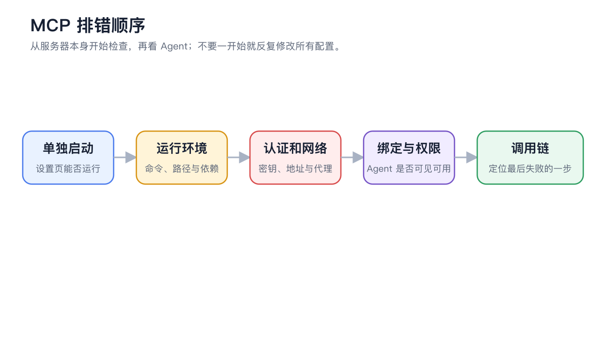

# Dépannage MCP

Faut-il supprimer et réajouter le serveur ?

Consultez d'abord les journaux et corrigez les problèmes un par un. Ne supprimez et ne recréez le serveur que si la configuration est incohérente et que la source peut être récupérée à nouveau ; avant la suppression, conservez une copie de la configuration sans les clés secrètes.

<figure><figcaption></figcaption></figure>
