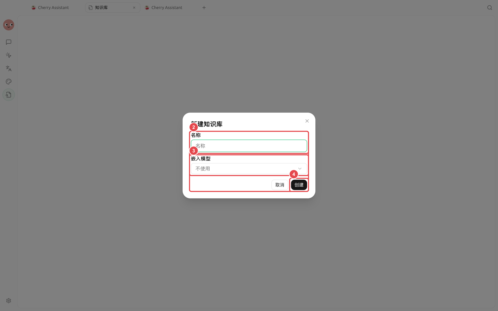
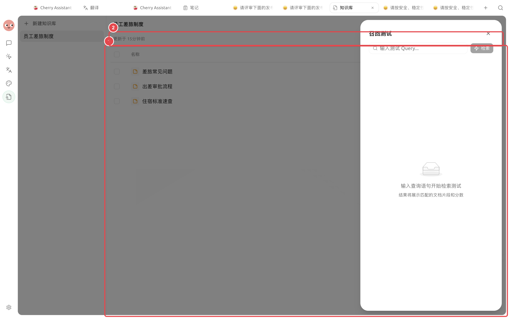
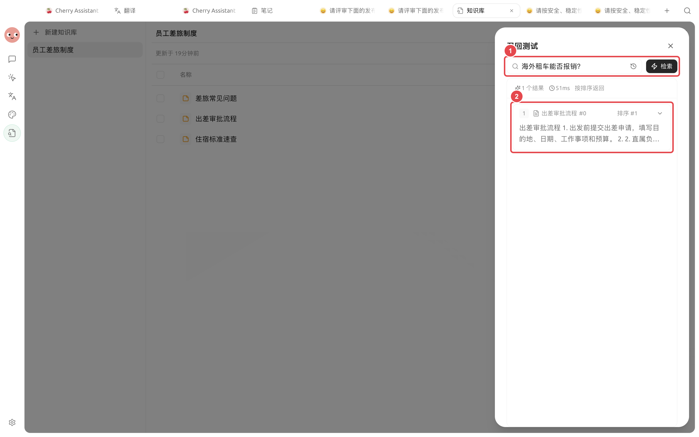
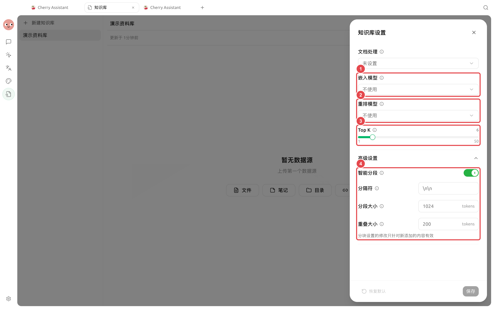

# Construire une base de connaissances et tester la récupération

La base de connaissances transforme les fichiers, les pages web et les notes en fragments consultables. Elle est adaptée pour répondre à des questions du type « que dit le document ? », mais ne permet pas au modèle de mémoriser définitivement l'intégralité du document.

## Créer et importer des ressources



### 1. Ouvrir [Base de connaissances] → [Nouvelle base de connaissances]

Saisissez un nom facilement identifiable et sélectionnez un modèle d'embedding disponible. Le modèle d'embedding convertit les ressources en représentations consultables ; il est distinct du modèle principal utilisé pour les conversations.



### 2. Sélectionner les sources de ressources

Vous pouvez ajouter des fichiers, des dossiers, des notes ou des URL. Les formats de documents courants incluent PDF, DOCX, Markdown, Excel, TXT et CSV ; les documents scannés peuvent nécessiter une OCR pour extraire le texte.



### 3. Attendre la fin du traitement

Ouvrez les détails du fichier pour consulter l'aperçu et la segmentation. En cas de titres manquants, de caractères illisibles ou de perte de structure des tableaux, réorganisez d'abord le fichier source, puis relancez le traitement.



### 4. Effectuer un test de récupération

Testez avec des questions que les utilisateurs réels poseraient, sans vous limiter aux titres de fichiers. Vérifiez si les fragments retournés sont pertinents et s'ils contiennent un contexte complet, avant de décider de les associer à un Agent.



<figure><figcaption>
Lors de la création d'une base de connaissances, saisissez d'abord un nom et sélectionnez un modèle d'embedding disponible.
</figcaption></figure>

<figure><figcaption>
① Les trois documents de voyage d'affaires sont prêts ; ② Cliquez sur [Test de récupération] en haut pour vérifier les questions réelles.
</figcaption></figure>

<figure><figcaption>
① Saisissez des questions réellement posées au travail ; ② Vérifiez les ressources correspondantes, le contenu des fragments et la pertinence.
</figcaption></figure>

### Valider les résultats de récupération avec des questions réelles

Une fois que les ressources affichent [Prêt], effectuez un test avec des questions réellement rencontrées au travail. Par exemple, pour une base de règles internes, vous pouvez demander « Les locations de voiture à l'étranger sont-elles remboursables ? », puis vérifier si le contenu retourné provient de la bonne ressource et s'il contient un contexte suffisant.

| Résultat observé | Prochaine étape |
| --------------- | ----------------------- |
| Bonne ressource trouvée, fragment suffisant pour répondre | Peut être associé à un Agent |
| Bonne ressource trouvée, mais fragment tronqué | Vérifiez d'abord la structure du document, puis ajustez la longueur de segmentation |
| Ancienne règle ou ressource non pertinente trouvée | Nettoyez les ressources obsolètes, ajoutez des titres et contenus plus explicites |
| Aucun résultat | Vérifiez l'état des ressources et la formulation de la question, n'augmentez pas aveuglément le nombre de résultats retournés |


Après la réussite du test de récupération, validez la conversation complète dans l'Agent. Cela permet de distinguer « la ressource n'a pas été trouvée » de « la ressource a été trouvée mais la réponse est insuffisante ».


## Comprendre les paramètres RAG

RAG signifie « récupérer d'abord les ressources, puis laisser le modèle répondre ». Les paramètres courants contrôlent la longueur de segmentation, la zone de chevauchement, le nombre de résultats retournés et le seuil de pertinence.

| Paramètre | Rôle | Point de départ recommandé | Quand ajuster |
| ----- | -------------- | -------- | ------------------- |
| Longueur de segmentation | Détermine la quantité de contenu incluse dans chaque fragment de récupération | Utilisez d'abord la valeur initiale de la page | Lorsque les fragments tronquent souvent des phrases ou mélangent trop de sujets |
| Chevauchement de segmentation | Préserve la continuité entre les fragments adjacents | Maintenez un léger chevauchement | Lorsque les clauses traversent les segments et que le contexte est souvent coupé |
| Nombre de résultats retournés | Nombre de fragments candidats fournis à la fois | Commencez avec un petit nombre de résultats | Augmentez si des ressources clés sont manquées, réduisez si trop de bruit |
| Seuil de pertinence | Filtre le contenu non pertinent | Déterminez via le test de récupération | Augmentez si trop de résultats non pertinents, réduisez si les bons fragments sont filtrés |

<figure><figcaption>
N'ajustez les paramètres RAG selon la structure des ressources que si les résultats de récupération sont instables.
</figcaption></figure>

### Cas d'application : Créer une base de questions-réponses sur les règles internes

Organisez les règles en vigueur par département, en incluant le sujet et le périmètre d'application dans le nom du fichier. Après l'importation, effectuez un test de récupération avec des questions réelles telles que « Que faire en cas de dépassement du budget d'hébergement en voyage d'affaires ? » ou « Qui doit approuver une demande de congé pendant la période d'essai ? ». Une fois la précision des fragments confirmée, associez uniquement cette base de connaissances à l'Agent « Questions-réponses sur les règles », et exigez que les réponses citent le nom de la ressource ; en cas de contenu manquant, indiquez clairement qu'il n'a pas été trouvé.


La base de connaissances ne détermine pas automatiquement si un fichier est obsolète. Lorsque les règles, les prix ou les processus changent, mettez à jour ou supprimez les anciennes ressources, puis refaites un test de récupération.


Pourquoi n'y a-t-il aucun résultat après l'importation ?

Vérifiez l'état de traitement des fichiers, la connexion au modèle d'embedding et l'aperçu du document. Si un PDF scanné ne contient pas de texte extractible, configurez d'abord une OCR ou remplacez-le par une version consultable.

