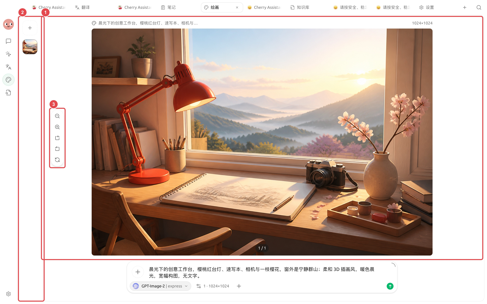

# Génération, édition et amélioration d'images

La fonction [Peinture] permet non seulement de générer des images à partir de texte, mais aussi d'utiliser des images de référence, d'éditer des zones spécifiques, de fusionner plusieurs images, de réutiliser des modèles et d'améliorer la résolution. Déterminez d'abord l'usage de l'image, puis choisissez la méthode de génération ou d'édition appropriée.

## Choisir le bon point de départ

| Besoin | Méthode recommandée |
| ------------ | ------------ |
| Créer une direction visuelle à partir de zéro | Génération texte-vers-image ou modèle |
| Conserver le sujet principal, changer l'arrière-plan ou le style | Édition après téléchargement d'une image de référence |
| Modifier uniquement une partie de l'image | Utiliser un masque pour délimiter la zone à modifier |
| Combiner plusieurs éléments en une seule image | Fusion d'images multiples en précisant la hiérarchie |
| Rendre une image existante plus nette | Utiliser la fonction d'amélioration/redimensionnement |

### Exemple : d'une description à l'image finale

Ouvrez [Peinture], sélectionnez un modèle d'image compatible avec la tâche, saisissez le sujet, l'environnement, le style, l'éclairage, la composition et les contraintes, puis envoyez la requête. Exemple de prompt :

> Espace de travail créatif sous la lumière du matin, lampe de bureau rouge cerise, carnet de croquis, appareil photo et une branche de cerisier en fleurs, montagnes paisibles à travers la fenêtre ; style d'illustration 3D douce, lumière du matin chaude, composition panoramique, sans texte.

1. Précisez l'usage et la composition, puis sélectionnez le modèle de peinture.
2. Générez la première version, vérifiez le sujet, les bords et les dimensions.
3. Si le résultat n'est pas encore exploitable, modifiez un seul aspect, régénérez et vérifiez à nouveau.
4. Une fois le résultat validé, zoomez pour vérifier les détails puis exportez.


L'exemple utilise [GPT-Image-2 | express] pour générer une illustration panoramique d'un espace de travail. Les modèles, dimensions et actions disponibles dépendent de l'affichage de votre page actuelle ; ne copiez pas les paramètres invisibles.


Après la génération, ne quittez pas immédiatement : zoomez d'abord pour vérifier le sujet, les bords et les éléments superflus, puis basculez entre les versions via l'historique à gauche. Si des ajustements sont nécessaires, conservez la description valide et modifiez un seul aspect.

<figure><figcaption>
① Les miniatures de l'historique de la génération actuelle sont conservées à gauche ; ② L'image finale complète est affichée au centre ; ③ Zoomez pour vérifier avant de télécharger, copier ou continuer l'édition. 
</figcaption></figure>

## Finaliser une image exploitable



### 1. Choisir le modèle et le mode

Les dimensions, les images de référence et les capacités d'édition varient selon les modèles d'image. Ne forcez pas la saisie de paramètres non affichés sur la page.



### 2. Préciser l'usage et la composition

Décrivez le sujet, l'environnement, la perspective, la palette de couleurs, les proportions, les espaces vides et les éléments à exclure. Pour ajouter un titre, laissez généralement le modèle créer des espaces vides et ajoutez le texte via un outil de conception.



### 3. Valider un seul aspect à la fois

Générez d'abord un petit lot de résultats, sélectionnez l'image la plus proche de l'objectif, puis éditez ou améliorez-la. Générer plusieurs images simultanément augmente la consommation et complique l'identification de l'aspect qui a eu un effet.



### 4. Vérifier les détails avant l'export

Zoomez pour vérifier les mains des personnages, la structure des produits, le texte, les logos de marque et les bords. Pour un usage commercial, confirmez la source des éléments et les conditions de service applicables.



### Dessiner dans Agent

Accédez d'abord à [Paramètres] → [Modèles par défaut] pour sélectionner le [Modèle de peinture], puis ouvrez les [Outils intégrés] de l'Agent pour confirmer que [Générer des images] est activé. Vous pouvez ensuite demander à l'Agent dans [Travail] de lire un article, extraire la direction visuelle et générer directement les images d'illustration.

<figure><figcaption>
Le [Modèle de peinture] dans [Modèles par défaut] détermine le modèle prioritaire utilisé par l'Agent et les entrées de peinture associées. 
</figcaption></figure>

### Cas d'application : créer une série d'images pour une campagne de marque

Définissez d'abord des règles unifiées de palette de couleurs, de cadrage et d'espaces vides dans le modèle, puis générez l'image d'en-tête en format paysage. Une fois la direction choisie, utilisez la même image de référence pour créer des images carrées pour les réseaux sociaux et des images verticales pour les stories ; corrigez les incohérences d'apparence du produit par édition locale, puis améliorez enfin les versions destinées à la diffusion. Évitez de demander au modèle de générer du texte de marque tout au long du processus, afin d'éviter les fautes et les déformations.


Les images de référence peuvent être envoyées au service du modèle sélectionné. Avant le téléchargement de documents clients, portraits ou images de produits non publics, vérifiez l'étendue des services autorisés.

