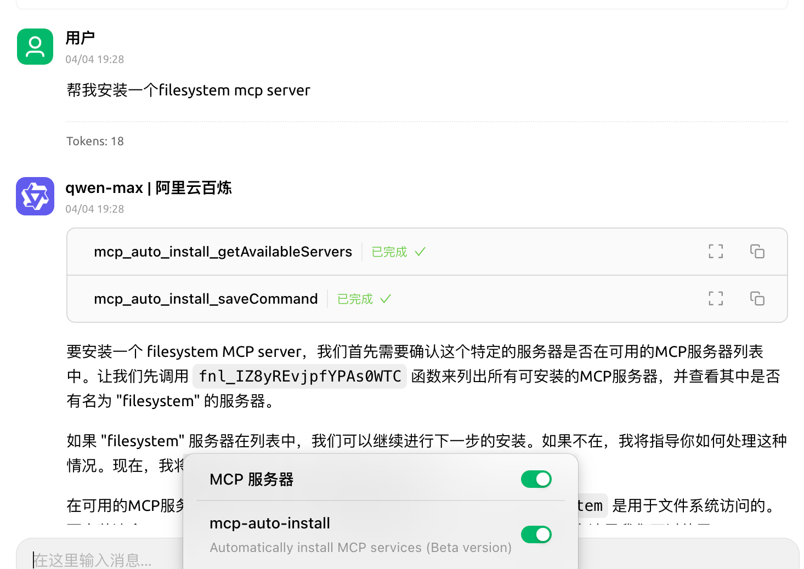
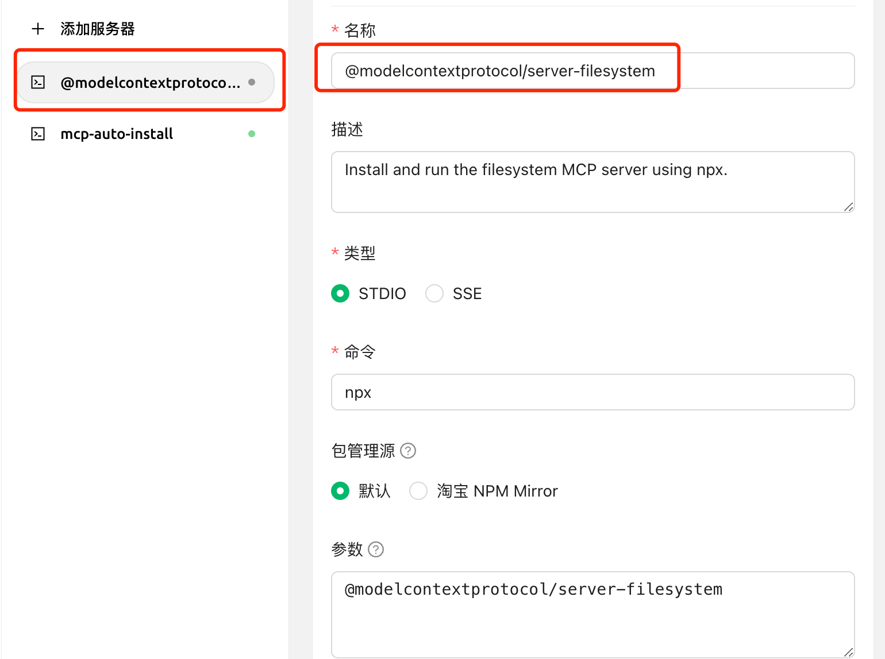

# Installation automatique du MCP

> L'installation automatique du MCP nécessite la mise à niveau de Cherry Studio en version v1.1.18 ou ultérieure.

## Introduction à la fonctionnalité

En complément de l'installation manuelle, Cherry Studio intègre l'outil `@mcpmarket/mcp-auto-install`, offrant une méthode plus pratique pour installer un serveur MCP. Il suffit d'entrer la commande appropriée dans une conversation avec un modèle prenant en charge les services MCP.


**Rappel de la phase de test :**

* `@mcpmarket/mcp-auto-install` est actuellement en phase de test
* L'efficacité dépend de "l'intelligence" du modèle : certaines configurations s'appliquent automatiquement, d'autres exigent **des ajustements manuels dans les paramètres MCP**
* La source de recherche actuelle est @modelcontextprotocol, modifiable via configuration (voir ci-dessous)


## Instructions d'utilisation

Par exemple, saisissez :

```
Installez un serveur MCP filesystem pour moi
```

<figure><figcaption><p>Saisir la commande pour installer le serveur MCP</p></figcaption></figure>

<figure><figcaption><p>Interface de configuration du serveur MCP</p></figcaption></figure>

Le système identifie automatiquement votre requête et complète l'installation via `@mcpmarket/mcp-auto-install`. Cet outil prend en charge divers types de serveurs MCP, notamment :

* filesystem (système de fichiers)
* fetch (requête réseau)
* sqlite (base de données)
* etc.

> La variable MCP_PACKAGE_SCOPES permet de personnaliser les sources de recherche des services MCP (valeur par défaut : `@modelcontextprotocol`).

## Présentation de la bibliothèque `@mcpmarket/mcp-auto-install`


**Référence de configuration par défaut :**

```json
// `axun-uUpaWEdMEMU8C61K` correspond à l'ID de service, personnalisable
"axun-uUpaWEdMEMU8C61K": {
  "name": "mcp-auto-install",
  "description": "Automatically install MCP services (Beta version)",
  "isActive": false,
  "registryUrl": "https://registry.npmmirror.com",
  "command": "npx",
  "args": [
    "-y",
    "@mcpmarket/mcp-auto-install",
    "connect",
    "--json"
  ],
  "env": {
    "MCP_REGISTRY_PATH": "Détails sur https://www.npmjs.com/package/@mcpmarket/mcp-auto-install"
  },
  "disabledTools": []
}
```

`@mcpmarket/mcp-auto-install` est un package npm open source. Consultez ses détails et sa documentation dans le [dépôt officiel npm](https://www.npmjs.com/package/@mcpmarket/mcp-auto-install). `@mcpmarket` représente la collection officielle des services MCP de Cherry Studio.
