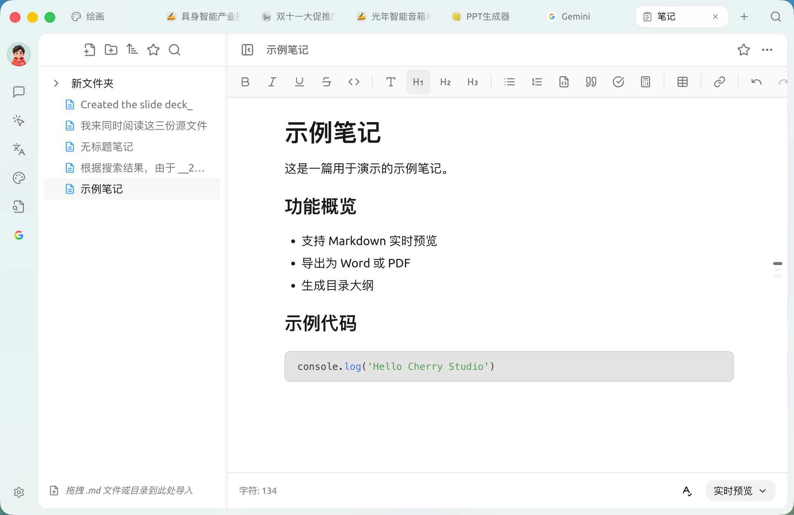
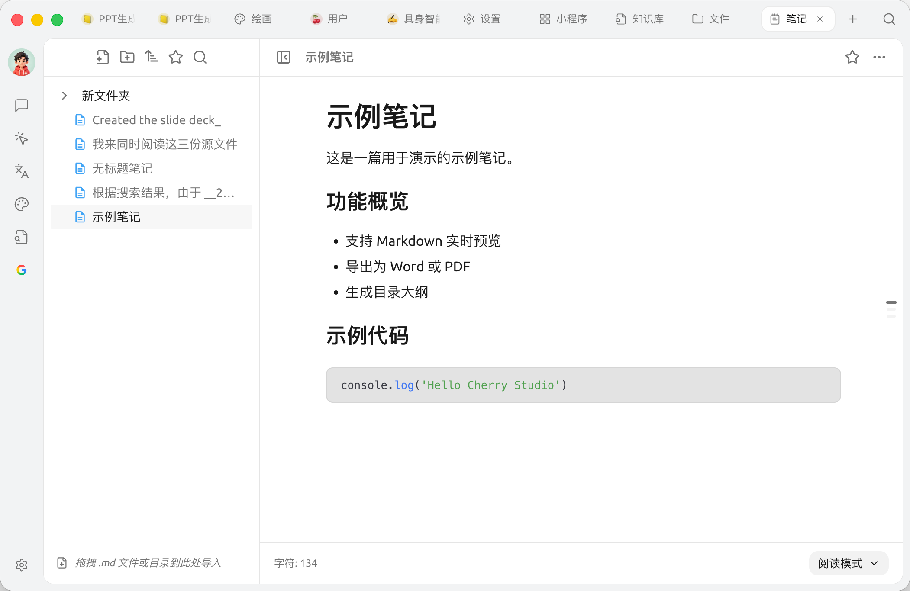
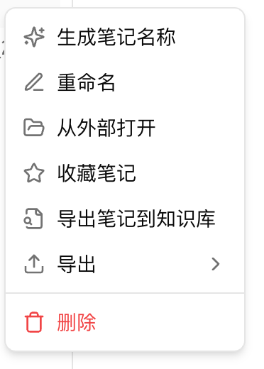
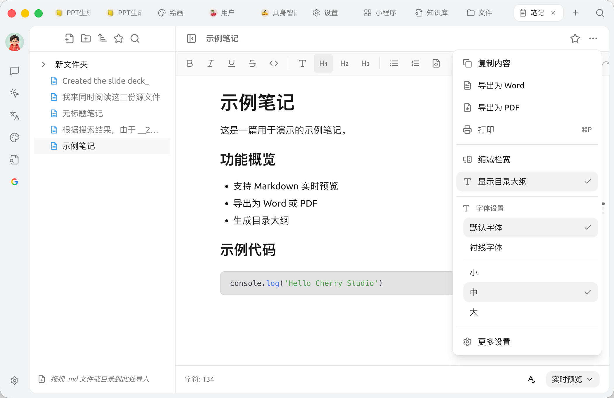

# Notes

Les notes sont l'éditeur Markdown intégré à Cherry Studio, conçu pour organiser vos idées, sauvegarder des résultats intermédiaires et les traiter davantage grâce aux capacités d'IA et de base de connaissances, en dehors des conversations avec l'IA.

### Ouvrir les notes

Cliquez sur [Notes] dans la barre d'onglets supérieure, ou cliquez sur l'icône de l'application [Notes] dans le [Launchpad].

<figure><figcaption>
Interface des notes : à gauche, l'arborescence et la liste des notes ; à droite, l'éditeur Markdown
</figcaption></figure>

### Créer votre première note

1. Cliquez sur la première icône [Nouvelle note] en haut à gauche
2. Saisissez le contenu dans l'éditeur à droite, qui prend en charge la syntaxe Markdown et la barre d'outils de texte enrichi
3. Faites un clic droit sur la note dans la liste pour lui attribuer un nom

### Importer des fichiers Markdown existants

* Glissez-déposez directement un fichier `.md` ou un dossier contenant des fichiers `.md` dans la zone des notes pour les importer en tant que nouvelle note ou nouveau dossier
* Vous pouvez également cliquer sur la deuxième icône [Nouveau dossier] en haut à gauche pour créer d'abord la structure, puis y glisser-déposer les fichiers

### Fonctionnalités de l'éditeur

La barre d'outils en haut de l'éditeur de notes propose les fonctionnalités de texte enrichi courantes :

* **Mise en forme** : gras (<kbd>B</kbd>), italique (<kbd>I</kbd>), souligné (<kbd>U</kbd>), barré
* **Structure** : code en ligne / titres H1–H3 / liste à puces / liste numérotée / bloc de code / citation / liste de tâches / formule
* **Intégration** : tableaux, hyperliens

<figure><figcaption>
Éditeur après la création d'une nouvelle note et la saisie du contenu
</figcaption></figure>

La barre d'état en bas affiche le nombre de **caractères** actuel. L'icône **A✓** en bas à gauche permet d'activer ou de désactiver la vérification orthographique. Le menu déroulant en bas à droite permet de basculer entre **Aperçu en direct**, **Mode source** ou **Mode lecture**.

### Gestion de l'arborescence

En haut de la barre latérale gauche, vous trouverez dans l'ordre : [Nouvelle note] / [Nouveau dossier] / [Trier] / [Favoris] / [Rechercher].

* **Trier** : 6 options — nom de fichier `A→Z` / `Z→A`, date de modification du plus récent au plus ancien / du plus ancien au plus récent, date de création du plus récent au plus ancien / du plus ancien au plus récent
* **Favoris** : le bouton étoile bascule vers la vue « Favoris »
* **Rechercher** : bouton loupe, saisissez votre requête dans la zone de recherche. **La recherche correspond aux titres et au contenu** ; les entrées correspondant au contenu affichent une étiquette « Contenu » ou « Nom+Contenu » à côté du titre pour indiquer la source

### Menu contextuel (Liaison IA + Exportation)

Un clic droit sur n'importe quelle note dans l'arborescence à gauche ouvre un menu d'actions — c'est l'entrée pour la liaison IA et l'exportation multi-formats :

<figure><figcaption>
Menu contextuel d'une note unique
</figcaption></figure>

* **Générer un nom de note** ✨ : permet à l'IA de générer automatiquement un titre basé sur le contenu (uniquement pour les fichiers)
* **Renommer** / **Ouvrir à l'extérieur** (afficher dans Finder / Explorateur de fichiers)
* **Ajouter aux favoris** / **Retirer des favoris**
* **Exporter la note vers la base de connaissances** : envoyer vers la [base de connaissances](../../knowledge-base/knowledge-base.md) spécifiée
* **Exporter ›** sous-menu : Markdown / Word (.docx) / Notion / Yuque / Obsidian / Joplin / Siyuan, ainsi que « Copier en image / Exporter en image » — l'affichage de chaque élément peut être activé ou désactivé individuellement dans [Paramètres] → [Paramètres de données] → [Paramètres du menu d'exportation]
* **Supprimer**

> Le menu contextuel des dossiers est plus épuré, ne contenant que : Nouvelle note / Nouveau dossier / Renommer / Ouvrir à l'extérieur / Supprimer.

### Menu [⋯] en haut à droite (Accès rapide à la vue et à l'exportation)

Le bouton [⋯] en haut à droite du titre de la note est l'accès rapide aux options de vue / exportation de la **note actuelle**. Ne le confondez pas avec le menu contextuel :

<figure><figcaption>
Menu [⋯] en haut à droite
</figcaption></figure>

* **Copier le contenu** : copie en texte brut
* **Exporter en Word** : génère rapidement un `.docx` (pour plus de formats, utilisez « Exporter › » dans le menu contextuel)
* **Exporter en PDF** : exporte la note actuelle en fichier PDF
* **Imprimer** : lance l'impression système de la note actuelle
* **Réduire la largeur de la colonne** : limite le nombre maximal de caractères par ligne
* **Afficher l'arborescence des titres** : affiche l'arborescence des titres de la note actuelle à droite
* **Paramètres de police ›** : police par défaut / police à empattements, trois tailles de police (Petit / Moyen / Grand)
* **Plus de paramètres** : ouvre le panneau de paramètres des notes (trois groupes : Données / Éditeur / Affichage)

### Dossier de travail et sauvegarde

Le contenu des notes est stocké sous forme de fichiers locaux. Le **dossier de travail** peut être consulté et modifié dans [Paramètres de données] du panneau de paramètres des notes (accessible via [⋯] en haut à droite → [Plus de paramètres]).

* Par défaut, il est situé dans le répertoire de données de l'application Cherry Studio
* Sélectionnez d'abord un chemin personnalisé via [Sélectionner], puis cliquez sur [Appliquer] pour basculer (les modifications ne migrent pas automatiquement les fichiers existants, une copie manuelle est nécessaire) ; cliquez sur [Réinitialiser par défaut] pour revenir au répertoire par défaut
* Il est recommandé de combiner la sauvegarde avec [WebDAV](../../pre-basic/data-settings/webdav.md) / [Stockage compatible S3](../../pre-basic/data-settings/s3-compatible.md)

### Paramètres de l'éditeur et de l'affichage

Ouvrez le panneau de paramètres des notes via [⋯] en haut à droite → [Plus de paramètres]. En plus de [Paramètres de données], il y a deux autres groupes :

**Paramètres de l'éditeur**

* **Vue par défaut** : les nouvelles notes s'ouvrent-elles en [Mode édition] ou en [Mode lecture] par défaut
* **Vue d'édition par défaut** : en mode édition, utilisez [Aperçu en direct] ou [Mode source] par défaut

**Paramètres d'affichage**

* **Police** : police par défaut / police à empattements
* **Taille de police** : entre 10 et 30 px
* **Réduire la largeur de la colonne** : limite le nombre de caractères par ligne pour éviter que les longues lignes ne s'étendent sur toute l'écran
* **Afficher l'arborescence des titres** : affiche l'arborescence des titres de la note actuelle à droite pour faciliter la navigation dans le document

> La police et la taille de police peuvent être ajustées dans ce panneau de paramètres d'affichage, ou basculées rapidement via [⋯] en haut à droite → [Paramètres de police].

### Astuces et conseils

* Les notes prennent en charge la syntaxe de liste de tâches `- [ ]`, utile pour les tâches quotidiennes
* Glissez-déposez des fichiers `.md` (ou des dossiers contenant des `.md`) dans l'arborescence pour un import en masse
* Si le dossier des notes est vide après la restauration des paramètres sur un autre appareil, copiez manuellement les fichiers selon le chemin indiqué


Pour que l'IA réponde **directement** en se basant sur le contenu des notes, la méthode la plus simple est d'**exporter la note cible vers la base de connaissances**, puis d'activer cette base de connaissances dans la conversation.


***

### Obtenir de l'aide et envoyer des retours

Si vous avez des questions, des bugs ou des suggestions d'amélioration lors de la configuration ou de l'utilisation, veuillez consulter les canaux officiels fournis dans [Retours et suggestions](../../question-contact/suggestions.md).
