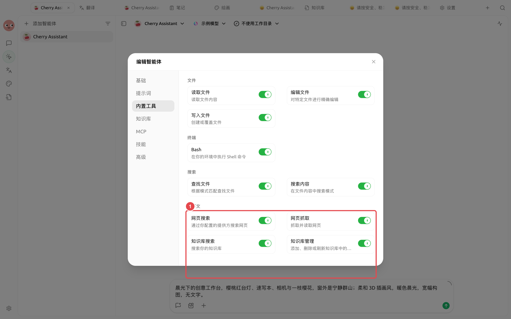
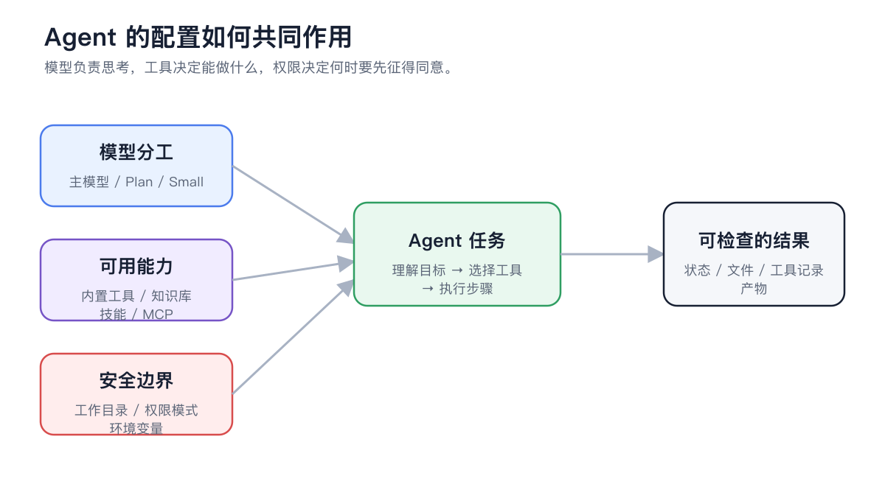

# Utilisation avec un Agent

Une fois la base de connaissances liée à un Agent, celui-ci peut rechercher et lire les documents autorisés dans le cadre de tâches multi-étapes. Si la mise à jour des documents est explicitement requise, la gestion de la base de connaissances peut également être activée.


Les conversations standard conviennent aux questions-réponses ponctuelles, tandis que les Agents sont adaptés à la recherche continue, aux comparaisons, à la génération de fichiers et à la validation par étapes. L'Agent n'accède qu'aux bases de connaissances liées dans sa configuration.


## Différences entre conversation standard et Agent

| Conversation standard | Agent |
| ------------ | --------------- |
| Sélection temporaire de la base de connaissances avant chaque message | Liaison permanente dans la configuration de l'Agent |
| Adapté aux questions-réponses immédiates et aux comparaisons courtes | Adapté à la recherche multi-étapes et à la livraison de fichiers |
| Répond principalement à l'aide de fragments récupérés | Peut rechercher des documents et gérer les bases de connaissances selon les autorisations |
| La conversation actuelle détermine le périmètre des documents | La configuration de l'Agent détermine le périmètre d'accès |

## Configuration d'un Agent en lecture seule sur la base de connaissances



### 1. Valider d'abord la base de connaissances

Vérifiez que les documents cibles sont prêts et effectuez des tests de récupération avec des questions réelles. L'Agent ne peut pas corriger les corps de texte manquants ou les découpages erronés.



### 2. Ouvrir la fenêtre d'édition de l'Agent

Accédez à [Travail], sélectionnez l'Agent cible et ouvrez [Éditer l'agent] dans le menu.



### 3. Lier les bases de connaissances minimales nécessaires

Onglet [Bases de connaissances], cliquez sur [Ajouter une base de connaissances]. Liez uniquement les bases nécessaires à la tâche actuelle afin d'éviter les interférences entre documents de différents départements ou versions.



### 4. Activer la recherche dans la base de connaissances

Ouvrez [Outils intégrés] et activez [Recherche dans la base de connaissances]. Pour la recherche en lecture seule, les questions-réponses, les résumés et les comparaisons, cela est généralement suffisant.

<figure><figcaption>
La recherche sert à lire, la gestion sert à modifier les documents ; commencez par défaut avec les moindres privilèges.
</figcaption></figure>



### 5. Tester avec des tâches aux limites claires

Exigez que l'Agent liste d'abord les sources, puis donne ses conclusions ; s'il n'y a pas de support documentaire, cela doit être explicitement indiqué, sans complétion basée sur le bon sens.



### 6. Valider les sources et les livrables

Vérifiez de quelle base de connaissances provient chaque conclusion, si les faits et les recommandations dans les fichiers sont distincts, et si les parties sans preuve sont marquées.



## Comment choisir entre outils intégrés, bases de connaissances, compétences et MCP

<figure><figcaption>
Utilisez les bases de connaissances pour consulter des documents, les compétences pour les méthodes répétitives, et MCP pour accéder aux systèmes externes ; n'utilisez pas l'élargissement des privilèges à la place de tâches claires.
</figcaption></figure>

## Recherche et gestion de la base de connaissances

| Capacité | Ce qu'elle permet | Tâches applicables | Recommandation par défaut |
| ----- | -------------- | ----------- | ----------- |
| Recherche dans la base de connaissances | Rechercher, lister et lire les bases de connaissances liées | Questions-réponses, recherche, résumés, comparaisons | Garder activé |
| Gestion de la base de connaissances | Ajouter, supprimer ou actualiser les documents de la base de connaissances | Maintenance des documents approuvée | Désactivé par défaut, à activer temporairement si nécessaire |


Lier une base de connaissances n'accorde que le périmètre d'accès, elle ne crée pas une copie de la base de connaissances. Après la mise à jour des documents ou la réindexation, l'Agent utilisera le contenu mis à jour lors de sa prochaine recherche.



Après activation de [Gestion de la base de connaissances], l'ajout, la suppression et l'actualisation modifieront les documents ou l'index. Avant approbation, confirmez la base de connaissances cible, les éléments spécifiques, la gestion des conflits de noms et le plan de repli.


## Comment la configuration de l'Agent agit-elle ensemble

<figure><figcaption>
Le modèle détermine la compréhension et la génération, la base de connaissances fournit les preuves, et les autorisations déterminent jusqu'où l'Agent peut exécuter.
</figcaption></figure>

## Modèles de tâches recommandés

### Recherche et génération de rapport

> Trouvez toutes les règles concernant l'approbation des voyages d'affaires à l'étranger et l'assurance dans les bases de connaissances liées. Listez d'abord les sources et les points de conflit, puis générez une liste de contrôle Markdown. Ne complétez pas le contenu non soutenu par des documents.

### Mise à jour des FAQ

> Recherchez les entrées existantes sur le remboursement de l'hébergement, comparez le règlement le plus récent avec l'ancienne FAQ. Fournissez d'abord la liste des modifications proposées ; après approbation, actualisez les documents concernés.

### Comparaison multi-bases de connaissances

> Recherchez des preuves séparément dans les bases de connaissances « Manuel produit » et « Cas après-vente », et organisez-les en trois colonnes : « Règles officielles / Cas réels / Recommandations de discours ». Conservez le nom de la source pour chaque conclusion.

## Notes de configuration

| Paramètre | Point de départ recommandé | Quand augmenter | Contrôle des risques |
| ----- | ---------- | ------------ | ------------- |
| Bases de connaissances liées | 1 base liée à la tâche | Besoin réel de comparaison inter-bases | Préciser l'usage de chaque base dans le prompt |
| Recherche dans la base de connaissances | Activé | Tant que la tâche nécessite de consulter des documents | Valider si les sources proviennent du périmètre lié |
| Gestion de la base de connaissances | Désactivé | Besoin explicite d'ajouter, supprimer ou actualiser | Approbation élément par élément, et sauvegarde préalable des documents importants |
| Exigences de sortie | Séparer faits, inférences et recommandations | Nécessité de générer un rapport ou un fichier | Conserver le nom de la source pour chaque fait |

## Cas d'utilisateur

Xiao Lin a lié [Manuel officiel] et [Cas d'audit] à l'Agent après-vente, en activant uniquement la recherche dans la base de connaissances. Il exige que l'Agent liste les avertissements de sécurité, les étapes officielles et les recommandations de cas par modèle d'équipement, et les sépare. Lorsque des cas anciens nécessitent une mise à jour, il active temporairement l'outil de gestion, consulte d'abord la liste des modifications proposées avant d'approuver.

Les critères de réussite sont : l'Agent n'accède pas aux documents non liés, ne présente pas les recommandations de cas comme des règles officielles, et toutes les opérations d'écriture ont un objectif et un résultat de validation clairs.

## Validation des résultats

* Les sources proviennent uniquement des bases de connaissances liées à l'Agent actuel.
* Les résultats de recherche couvrent chaque condition de la tâche.
* Les livrables séparent les faits documentaires, les inférences de l'Agent et les recommandations.
* Les opérations de gestion précisent l'objectif, l'impact et le résultat.
* Après mise à jour des documents, relancer les questions de récupération fixes.

## Questions fréquentes

Pourquoi l'Agent ne trouve-t-il pas ce que la conversation standard trouve ?

Vérifiez si la base de connaissances cible est liée à l'Agent actuel et si [Recherche dans la base de connaissances] est activée. Les périmètres de liaison des différents Agents ne s'héritent pas mutuellement.

Quand ne pas activer la gestion de la base de connaissances ?

Pour la recherche en lecture seule, les bases de connaissances partagées par l'équipe et les bases conservant des versions historiques, seules la recherche est activée par défaut. Activez la gestion temporairement et approuvez élément par élément si une mise à jour est nécessaire.

Que faire si l'Agent veut opérer sur une base de connaissances non liée ?

N'élargissez pas à toutes les bases de connaissances. Après confirmation du besoin réel de la tâche, ajoutez la base cible à l'Agent actuel ou utilisez un Agent qui a déjà cette base liée.

## Continuer la lecture

<table data-view="cards"><thead><tr><th></th><th></th><th data-hidden data-card-target data-type="content-ref"></th></tr></thead><tbody><tr><td><strong>Utilisation dans la conversation</strong></td><td>Effectuer une question-réponse immédiate avec sources.</td><td><a href="chat.md">chat.md</a></td></tr><tr><td><strong>Données, confidentialité et maintenance</strong></td><td>Comprendre les limites des autorisations, des services cloud et des sauvegardes.</td><td><a href="data.md">data.md</a></td></tr><tr><td><strong>Cas d'application des bases de connaissances</strong></td><td>Référez-vous aux flux de travail après-vente et de recherche.</td><td><a href="cases.md">cases.md</a></td></tr></tbody></table>
