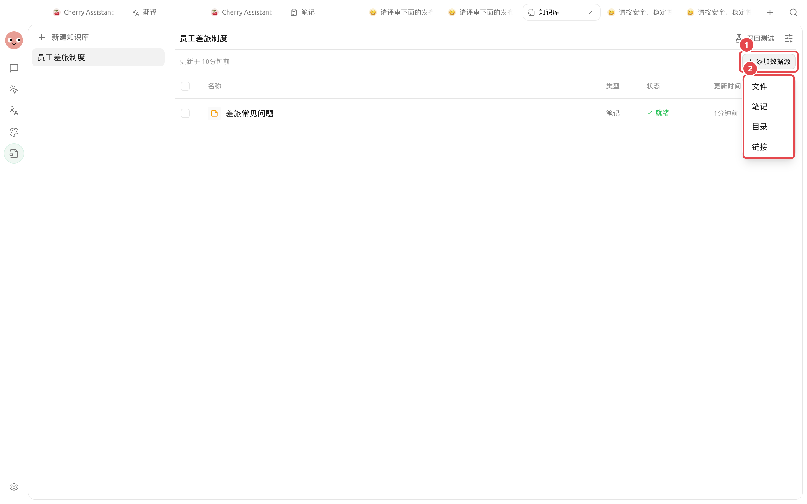
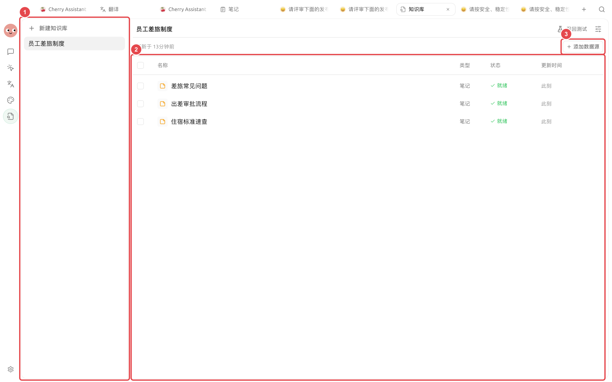
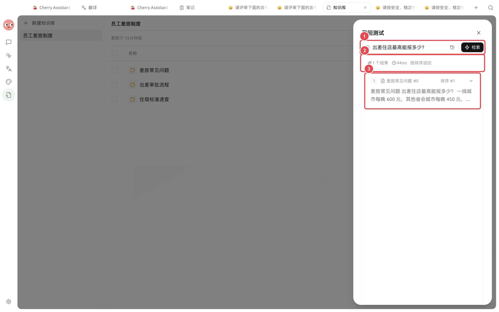

# Ajouter et organiser les ressources

La base de connaissances prend en charge les fichiers, les notes Cherry Studio, les répertoires locaux et les adresses de pages web individuelles. Après l'importation, vérifiez l'état de traitement, le contenu principal et les Chunks, puis réindexez lorsque les ressources sont mises à jour.


Le critère de réussite n'est pas que « le fichier apparaît dans la liste », mais que la ressource soit lisible, que les Chunks soient complets et que les questions réelles permettent de récupérer la bonne source.


## Choisir le bon point d'entrée

<figure><figcaption>
Sélectionnez le point d'entrée selon la source : utilisez 【Fichier】 pour un petit nombre de fichiers, 【Répertoire】 pour un ensemble de fichiers similaires, 【Note】 pour le contenu Cherry Studio et 【Lien】 pour les pages web publiques. 
</figcaption></figure>

| Point d'entrée | Ressources adaptées | Relation après importation | Points d'attention principaux |
| -- | ----------------------- | ----------- | ------------------ |
| Fichier | PDF, Office, Markdown, texte, etc. | Sauvegarde d'une copie hébergée | Sélection maximale de 20 éléments par opération |
| Note | Contenu déjà organisé dans Cherry Studio | Importation d'un instantané du contenu au moment de l'importation | Les modifications ultérieures de la note d'origine ne sont pas synchronisées automatiquement |
| Répertoire | Un lot de fichiers locaux sur le même sujet | Création d'entrées de ressources selon le contenu du répertoire | Ne pas importer un répertoire entier contenant des éléments non pertinents |
| Lien | Une page web accessible publiquement | Sauvegarde d'un instantané de la page web au moment de la récupération | Les pages nécessitant une connexion, le rendu par script ou les pages restreintes peuvent être incomplètes |


Les fichiers pris en charge incluent PDF, DOCX, DOC, PPTX, XLSX, XLS, MD, TXT, CSV, HTML et EPUB. Pour les PDF scannés ou le contenu sous forme d'image, il est également nécessaire de vérifier l'OCR.


## Ajouter et valider les ressources



### 1. Choisir la source de la ressource

Ouvrez la base de connaissances, cliquez sur le bouton Ajouter une ressource et sélectionnez 【Fichier】, 【Note】, 【Répertoire】 ou 【Lien】.



### 2. Confirmer le contenu sélectionné

Les fichiers et les notes peuvent être sélectionnés par lot ; l'ajout interactif unique est limité à 20 éléments maximum. Pour un plus grand volume de ressources, ajoutez-les par lots ou utilisez le point d'entrée Répertoire.



### 3. Gérer les conflits de noms

Si une nouvelle ressource porte le même nom qu'une entrée existante, choisissez 【Tout conserver】 ou 【Remplacer】. Pour mettre à jour des réglementations, des manuels et des instantanés de notes, choisissez généralement 【Remplacer】.


Choisir 【Tout conserver】 permet aux contenus anciens et nouveaux de participer simultanément à la récupération. Ne faites cela que si vous devez réellement interroger différentes versions en parallèle, et indiquez la date ou la version dans le nom.




### 4. Attendre la fin du traitement

Les ressources passent par des étapes de copie, de lecture, de découpage et d'indexation. Si aucun modèle d'incorporation n'est configuré, aucun vecteur n'est créé, mais un index de mots-clés est toujours établi.

<figure><figcaption>
Une fois la ressource dans un état disponible, effectuez un contrôle aléatoire du contenu principal et des Chunks. 
</figcaption></figure>



### 5. Vérifier le contenu principal et les Chunks

Ouvrez la ressource pour consulter le contenu principal, ou affichez les Chunks depuis le menu de la ligne de la ressource. Vérifiez en particulier l'ordre des titres, les tableaux, le texte OCR et si les phrases clés ont été incorrectement séparées.



### 6. Effectuer le test de récupération

Utilisez une question avec une réponse claire pour vérifier la bonne source et le fragment. Après la mise à jour de la ressource, effectuez à nouveau le test avec le même ensemble de questions.

<figure><figcaption>
La validation finale doit porter sur la source, l'intégrité des fragments et le classement, et pas seulement sur le fait que des résultats soient retournés. 
</figcaption></figure>



## État des ressources et méthodes de traitement

| Phénomène | Cause possible | Méthode de traitement |
| ----------- | ------------------ | ------------------ |
| Traitement en cours depuis longtemps | Fichier volumineux, analyseur ou modèle indisponible | Vérifiez le fichier d'origine, le traitement des documents et le modèle d'incorporation |
| Affichage d'une erreur | Échec de la copie, de la lecture, du découpage ou de l'indexation | Ouvrez le message d'erreur et traitez selon l'étape en échec |
| Contenu principal manquant ou illisible | Inadéquation du processeur de fichiers, contenu scanné non OCR | Changez la méthode de traitement des documents ou configurez l'OCR |
| Phrase clé manquante dans un Chunk | Limites de découpage inappropriées | Ajustez le découpage puis exécutez 【Réindexer】 |
| Versions anciennes et nouvelles détectées simultanément | 【Tout conserver】 a été choisi pour des ressources homonymes | Supprimez l'ancienne entrée, ou réimportez en choisissant 【Remplacer】 |

## Réindexation et suppression

Après un changement de découpage, d'analyseur ou de paramètres d'incorporation, les anciennes entrées n'appliquent pas automatiquement les nouveaux paramètres. Utilisez 【Réindexer】 pour une ressource individuelle, ou sélectionnez plusieurs ressources pour les réindexer en lot.


La suppression d'une entrée retire la copie hébergée et l'index de la base de connaissances actuelle. Elle ne supprime pas le fichier d'origine ou la note d'origine, mais vérifiez toujours si la base de connaissances contient la seule copie avant de supprimer.


## Notes de configuration

| Paramètre | Valeur par défaut du produit | Point de départ recommandé | Rôle | Scénarios applicables | Points d'attention |
| ------ | ------- | ---------- | --------------- | ---------- | ---------------- |
| Nombre d'ajouts par opération | Maximum 20 éléments | Commencez par ajouter un petit nombre de ressources représentatives | Contrôle de l'échelle d'une importation | Première création de base ou dépannage | Validez l'analyse et la récupération avant une importation en masse |
| Gestion des noms identiques | Choix en cas de conflit | Priorité à 【Remplacer】 pour les mises à jour | Détermine si les entrées anciennes et nouvelles coexistent | Mise à jour de réglementations, manuels, notes | 【Tout conserver】 peut permettre aux anciens contenus de participer à la récupération |
| Réindexation | Exécution manuelle | Exécuter après un changement de paramètres | Permet aux anciennes ressources d'utiliser la nouvelle analyse, le découpage ou le modèle | Optimisation ou correction des ressources | Le test de récupération doit être refait après la fin |

## Cas utilisateur

Xiaolin met à jour la réglementation sur les frais de déplacement chaque mois. Il importe le nouveau fichier avec le même nom et choisit 【Remplacer】, puis vérifie le contenu principal et les Chunks après le traitement, et teste les règles d'hébergement, de transport et d'approbation avec des questions fixes.

Le critère de réussite est : les anciennes règles n'apparaissent plus dans les résultats de récupération, et les conditions et montants des nouvelles règles sont détectés de manière stable.

## Questions fréquentes

La base de connaissances se met-elle à jour automatiquement après modification de la note d'origine ? 

Non. L'importation de la note crée un instantané du contenu au moment de l'importation. Après modification, il faut réajouter et choisir 【Remplacer】, ou exécuter 【Réindexer】 sur la ressource correspondante.

Pourquoi la page web n'a-t-elle récupéré qu'une partie du contenu ? 

Les pages nécessitant une connexion, dépendant du rendu par script ou soumises à des restrictions d'accès peuvent ne pas être récupérées intégralement. Vous pouvez utiliser un fichier ou une note pour sauvegarder le contenu principal avant l'importation.

La suppression d'une entrée de la base de connaissances supprime-t-elle le fichier d'origine ? 

Non, le fichier d'origine ou la note d'origine n'est pas supprimé, mais la copie hébergée et l'index dans la base de connaissances sont retirés.

## Continuer la lecture

<table data-view="cards"><thead><tr><th></th><th></th><th data-hidden data-card-target data-type="content-ref"></th></tr></thead><tbody><tr><td><strong>Analyse des documents et OCR</strong></td><td>Gérer le contenu principal manquant, illisible et les contenus scannés. </td><td><a href="document-preprocessing.md">document-preprocessing.md</a></td></tr><tr><td><strong>Vérification des ressources et de la récupération</strong></td><td>Valider la qualité de la recherche avec des questions fixes. </td><td><a href="recall-test.md">recall-test.md</a></td></tr><tr><td><strong>Données, confidentialité et maintenance</strong></td><td>Comprendre la sauvegarde, la suppression et les limites du service. </td><td><a href="data.md">data.md</a></td></tr></tbody></table>
