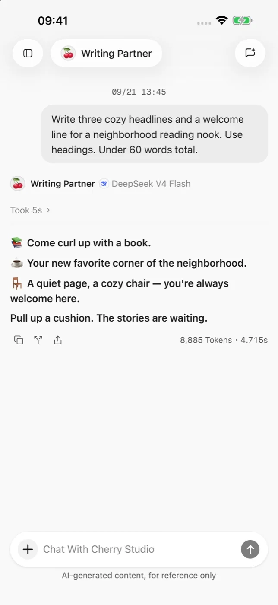
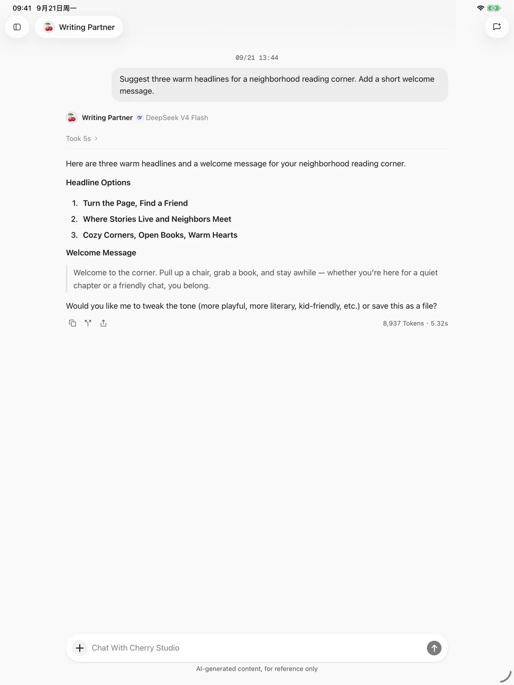

# Cherry Studio Mobile

Cherry Studio Mobile est un client IA conçu pour Android, iPhone et iPad. Connectez vos propres services de modèles pour discuter, configurer des agents et générer des images depuis un appareil mobile.

<figure data-mobile-shot="phone"><figcaption>
<strong>iPhone</strong> · Conversation complète et actions sur les messages ; touchez pour agrandir
</figcaption></figure>
<figure data-mobile-shot="tablet"><figcaption>
<strong>iPad</strong> · La conversation s'étend à l'espace disponible sur tablette
</figcaption></figure>

## État actuel

L'application mobile est en **version bêta** :

* Android est distribué sous forme d'APK officiel.
* iPhone et iPad sont distribués via Apple TestFlight.
* Les écrans et les fonctionnalités peuvent évoluer rapidement. Fiez-vous au comportement de la version installée sur votre appareil.

Ouvrez [l'option mobile de la page de téléchargement](https://cherryai.com/download?platform=mobile) ou lisez d'abord le [guide d'installation](installation.md).

## Ce que vous pouvez faire

* Ajouter des fournisseurs de modèles intégrés ou personnalisés et organiser les modèles que vous utilisez.
* Changer de modèle dans une conversation et envoyer du texte, des images ou des fichiers.
* Créer des agents avec leurs propres instructions, leur modèle et les outils système autorisés.
* Générer et prévisualiser des images avec un modèle d'image configuré.
* Utiliser une interface pensée pour le tactile sur téléphones Android, iPhone et iPad.

## Parcours conseillé

1. [Téléchargement et installation](installation.md)
2. [Démarrage rapide](quick-start.md)
3. [Fournisseurs et modèles](providers-and-models.md)
4. [Conversations et fichiers](chat-and-files.md)
5. [Agents et outils](agents-and-tools.md)
6. [Génération d'images](image-generation.md)
7. [Données, confidentialité et autorisations](data-privacy.md)
8. [Dépannage](troubleshooting.md)

> Cherry Studio est un client et n'inclut aucun crédit de modèle. Les tarifs, la disponibilité régionale et les conditions de service sont fixés par le fournisseur de modèles que vous choisissez.
