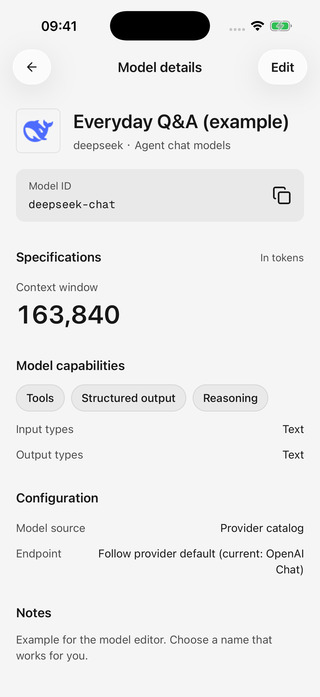
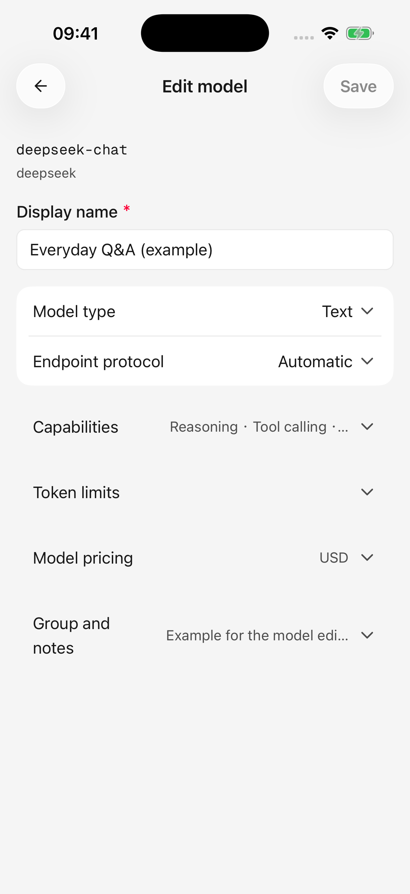
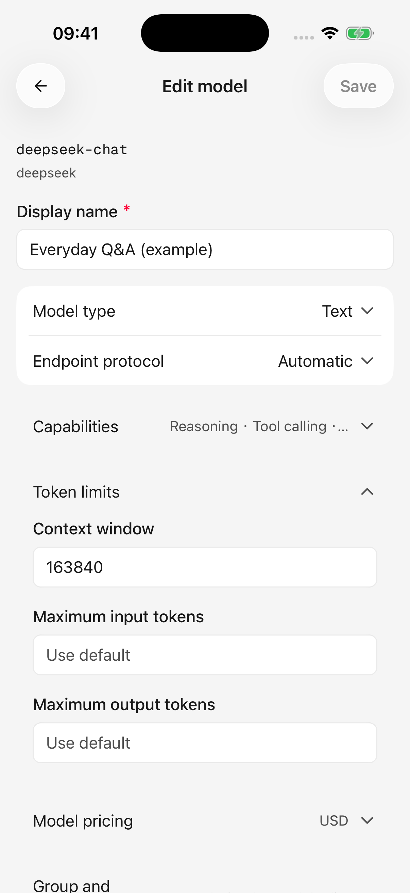
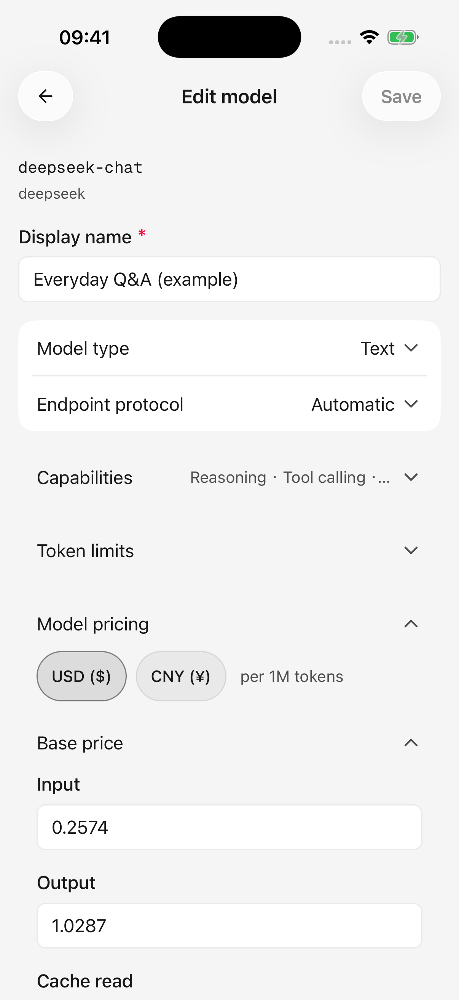

# Ajouter, modifier et gérer les modèles

Habituellement, il vous suffit de récupérer la liste d'un fournisseur et d'ajouter les modèles que vous utilisez. La configuration manuelle est utile lorsqu'un modèle est manquant, nécessite un nom plus clair ou contient des informations différentes de celles de votre plate-forme.

Ouvrez **Paramètres → Service modèle → Votre fournisseur → Modèles**.

## Ajouter un modèle manuellement

1. Appuyez sur le bouton Ajouter dans l'onglet Modèles.
2. Saisissez le **ID du modèle**, l'identifiant exact utilisé par votre plateforme. Copiez-le depuis la documentation ou le catalogue de la plateforme sans le traduire.
3. Choisissez un nom d'affichage, tel que « Questions quotidiennes ». Cela change la façon dont vous reconnaissez le modèle, et non le modèle appelé.
4. Vérifiez le type de modèle et API. Laissez les autres options par défaut en cas de doute.
5. Appuyez sur **Ajouter**. Si vous configurez un fournisseur pour la première fois, terminez la configuration et assurez-vous que son commutateur est activé dans la liste des fournisseurs.

La saisie manuelle ajoute un modèle à la fois. Utilisez [synchronisation des modèles](model-updates.md) pour plusieurs modèles. Les identifiants en double au sein du même fournisseur ne sont pas autorisés.

## Afficher et modifier

Appuyez sur un modèle pour voir ses détails et copier son identifiant, puis appuyez sur **Modifier** en haut à droite. Vous pouvez également appuyer longuement sur un élément de la liste pour obtenir des détails, le modifier, le sélectionner ou le supprimer.

L'éditeur de modèles utilise la **sauvegarde explicite**. Développez la section dont vous avez besoin, apportez des modifications, puis appuyez sur **Enregistrer**. Si la sauvegarde échoue, corrigez les champs indiqués et réessayez avant de quitter.

Un **ID de modèle existant ne peut pas être modifié dans l'éditeur**. Si c'est faux, ajoutez un modèle avec l'ID correct, remplacez les agents ou les valeurs par défaut par la nouvelle entrée, puis supprimez l'ancienne.

<figure data-mobile-shot="phone"><figcaption>
<strong>iPhone · Interface en anglais</strong> · Inspectez l'ID du modèle et les détails, puis utilisez Modifier en haut à droite.
</figcaption></figure>
<figure data-mobile-shot="phone"><figcaption>
<strong>iPhone · Interface en anglais</strong> · Développez les paramètres pertinents et enregistrez vos modifications
</figcaption></figure>

## Que signifient les paramètres ?

| Paramètre | Effet | En cas de doute |
| --- | --- | --- |
| Nom d'affichage, groupe, notes | Organiser et reconnaître les modèles | Utilisez vos propres étiquettes |
| ID du modèle | Identifie le modèle appelé sur la plateforme | Conserver la valeur exacte de la plateforme |
| Type de modèle | Distingue le texte, la génération d'images et d'autres objectifs | Suivez la description de la plateforme |
| API | Sélectionne la manière dont les requêtes se connectent au modèle | Conserver la sélection automatique/par défaut |
| Raisonnement | Enregistre la prise en charge des fonctionnalités liées à la réflexion | Conservez les informations fournies |
| Appel d'outil | Prise en charge des enregistrements pour les outils de recherche, de calendrier ou de plug-in | Correspondre au support réel du modèle |
| Entrées prises en charge | Enregistre la prise en charge des entrées image, audio ou vidéo | Ne pas activer les entrées non prises en charge |
| Diffusion en continu | Enregistre le support des réponses progressives | Conservez la valeur par défaut ; ce drapeau à lui seul ne change pas l'exécution |

**Les indicateurs de capacité n'ajoutent pas de fonctionnalités.** Marquer un modèle contenant uniquement du texte comme étant compatible avec les images ne lui permettra pas de comprendre les photographies. Les indicateurs audio/vidéo ne signifient pas non plus que l’application mobile peut envoyer toutes ces pièces jointes.

L'intégration et le reclassement sont des catégories de modèles utilisées pour la récupération. Leurs informations peuvent être gérées, mais elles ne sont actuellement pas disponibles pour le chat mobile ordinaire. Choisissez du texte pour la conversation ou la génération d'images pour le dessin.

## Contexte et limites d’entrée/sortie

Un **jeton** est une unité utilisée par les modèles pour mesurer le contenu, et non un nombre de caractères ou de mots.

* **Fenêtre contextuelle :** l'espace total pour l'historique, les résultats de l'outil et la nouvelle réponse.
* **Entrée maximale :** quantité de contenu qu'une requête peut apporter.
* **Sortie maximale :** combien le modèle peut produire en une seule réponse.

Augmenter un numéro ne contourne pas les limites du fournisseur et peut entraîner le rejet de demandes. Modifiez ces valeurs uniquement lorsque la plateforme vous donne des limites différentes. Utilisez des entiers positifs et résolvez tout avertissement de limite conflictuelle.

Effacez un remplacement de limite et enregistrez-le pour restaurer les paramètres par défaut du catalogue ou de l'application. Si une longue conversation dépasse toujours les limites, réduisez les pièces jointes, raccourcissez le contenu ou démarrez une nouvelle conversation.

## Estimations de prix et de coûts

La tarification prend en charge les estimations d'utilisation ; **le modifier ne modifie pas la facture du fournisseur**.

* Sélectionnez USD ou CNY. Les taux d'entrée/sortie sont **par million de jetons**.
* Les taux de lecture/écriture du cache décrivent comment la plateforme évalue le contenu réutilisé. Les taux de cache vide utilisent le taux d’entrée.
* Inconnu est différent de gratuit. `0` signifie explicitement un taux zéro ; ne l'utilisez pas pour un prix inconnu.
* Les niveaux d’entrée peuvent représenter des prix plus élevés pour les demandes longues. Les seuils de départ doivent augmenter. Le niveau applicable tarife la totalité de la demande, plutôt que seulement la partie située au-dessus du seuil.

Conservez les valeurs par défaut lorsque vous ne disposez pas de prix fiables. Voir [paramètres et utilisation](settings-and-usage.md) pour connaître les coûts estimés et incomplets.

<figure data-mobile-shot="phone"><figcaption>
<strong>iPhone · Interface en anglais</strong> · Les limites de longueur peuvent hériter des valeurs par défaut ; ne les augmentez pas sans les conseils du prestataire
</figcaption></figure>
<figure data-mobile-shot="phone"><figcaption>
<strong>iPhone · Interface en anglais</strong> · Les prix sont par million de jetons ; les valeurs illustrées illustrent les champs, et non les prix actuels du fournisseur.
</figcaption></figure>

## Le changement du API permet-il d'économiser immédiatement ?

La modification du API d'un modèle directement dans la liste de gestion s'enregistre immédiatement. Le sélectionner dans **l'éditeur** modifie un brouillon jusqu'à ce que vous appuyiez sur Enregistrer.

Suivre la valeur par défaut utilise la valeur par défaut actuelle du fournisseur, API. S'il devient indisponible, vérifiez la connexion configurée par le fournisseur plutôt que de renommer le modèle à plusieurs reprises.

## Supprimer et organiser des modèles

Appuyez longuement pour accéder au mode de sélection et supprimer plusieurs modèles dans le filtre actuel. En cas d'échec de la suppression, la sélection est conservée afin que vous puissiez résoudre le problème et réessayer.

* Un modèle global par défaut est protégé : modifiez-le ou effacez-le dans **Paramètres → Modèle par défaut** avant de le supprimer.
* La suppression d'un modèle utilisé par un agent signifie que l'agent a besoin d'un autre modèle sélectionné.
* La suppression de la configuration locale ne ferme pas le compte d'un fournisseur et n'annule pas les frais.

En cas d'inutilisation temporaire, désactivez le fournisseur au lieu de reconstruire sa configuration ultérieurement. Voir [Mises à jour du modèle](model-updates.md) pour savoir ce qui arrive à vos modifications lorsque les informations distantes changent.
