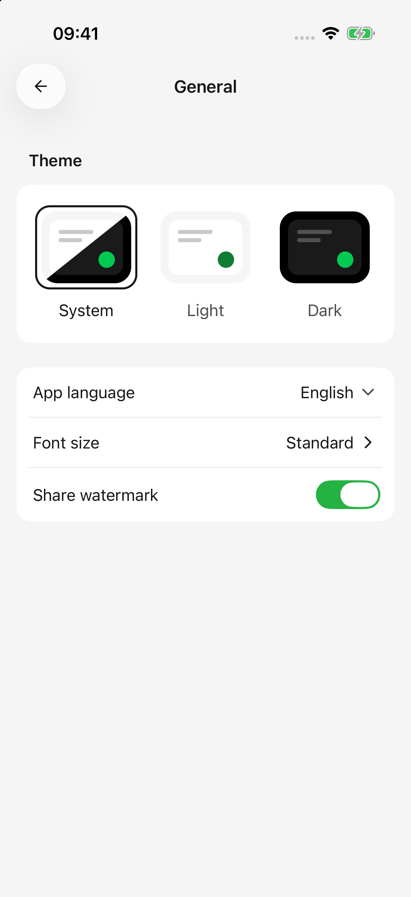
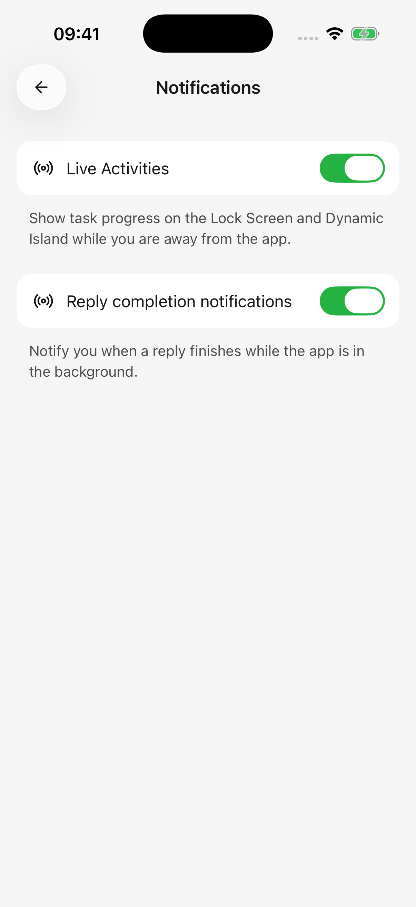

# Paramètres, utilisation et réponses en arrière-plan

Ouvrez Paramètres dans la barre latérale pour modifier les préférences de lecture, les valeurs par défaut et le comportement en arrière-plan.

## Thème, langue et taille du texte

Dans **Paramètres → Général** :

* Choisissez un thème clair, sombre ou système.
* Choisissez la langue de l'application. Les langues de l'application et de la documentation sont sélectionnées séparément.
* Ouvrez la taille de la police et utilisez son aperçu pour choisir une taille confortable.
* Activez/désactivez le filigrane de partage pour les exportations futures.

Les modifications sont enregistrées directement. Réessayez toute sauvegarde échouée avant de partir.

<figure data-mobile-shot="phone"><figcaption>
<strong>iPhone · Interface en anglais</strong> · Ajustez le thème, la langue, la taille du texte et le filigrane de partage
</figcaption></figure>

## Modèles par défaut et de dessin

Dans **Paramètres → Modèle par défaut** :

* **Modèle par défaut** fournit le choix initial de modèle de texte pour les nouveaux agents.
* **Modèle de dessin** fournit le dessin par défaut et l'outil de génération d'images utilisé par les agents de texte.

Le choix d’un modèle ou l’effacement de la sélection est enregistré immédiatement. Les agents existants conservent leur propre modèle ; modifiez-le dans leur éditeur ou dans le sélecteur de la conversation.

Si la liste est vide, ajoutez les modèles disponibles et activez d'abord leur fournisseur. Voir [gestion des modèles](model-management.md) pour connaître les fonctionnalités, les limites et les tarifs.

## Comprendre l'utilisation

Ouvrez Accueil depuis la barre latérale et inspectez **l'utilisation de l'IA**. Sa vue détaillée regroupe l'activité enregistrée par date, modèle ou fournisseur.

Une réponse contient également des détails d'utilisation pour son modèle, ses entrées/sorties, le temps écoulé et son coût. Un **jeton** est l'unité de contenu d'un modèle, pas un nombre de mots. L’historique, la réflexion et les appels répétés aux outils peuvent également consommer des jetons.

* Les frais et estimations déclarés par le fournisseur basés sur les prix configurés proviennent de différentes sources ; inspectez les étiquettes.
* Des prix manquants peuvent signifier une couverture partielle des coûts et non une utilisation gratuite.
* Répondre à nouveau et travailler avec des outils peut créer des demandes supplémentaires. La suppression du chat ne rembourse pas les crédits ni ne supprime l'utilisation enregistrée.
* Ces chiffres décrivent l'utilisation enregistrée par cette application, et non le solde complet du compte du fournisseur ou la facture officielle.

Vérifiez le compte du fournisseur pour connaître la facturation réelle et les crédits restants.

## Continuer après avoir quitté l'application

Ouvrez **Paramètres → Notifications**.

| Options | Objectif |
| --- | --- |
| iPhone/iPad : activité en direct | Affiche l'état des tâches sur les écrans de verrouillage pris en charge ou sur Dynamic Island après avoir quitté l'application |
| Android : réponses en arrière-plan | Tentatives de poursuivre la génération et d'afficher l'état dans les notifications |
| Notifications de fin de réponse | Tente de vous avertir lorsqu'une réponse se termine alors que l'application est en arrière-plan |

L’affichage de la progression et les alertes d’achèvement sont des options distinctes. L'autorisation de notification du système est également requise ; un commutateur d’application activé ne peut pas remplacer l’autorisation refusée. Appuyez sur une notification de tâche pour revenir à son contenu.

L'achèvement pendant que vous visualisez déjà la tâche est généralement silencieux. Les activités en direct apparaissent principalement après avoir quitté l'application, donc ne pas en voir une au premier plan n'indique pas nécessairement un problème.

<figure data-mobile-shot="phone"><figcaption>
<strong>iPhone · Interface en anglais</strong> · Contrôler séparément la progression et les notifications d'achèvement des tâches
</figcaption></figure>

## Pourquoi le verrouillage de l'écran a-t-il interrompu la génération ?

La prise en charge en arrière-plan n'est pas une garantie d'exécution continue. Les politiques de batterie, les limites du système d'exploitation, la perte de réseau ou l'arrêt des processus peuvent arrêter le travail. Gardez les tâches longues au premier plan lorsque cela est possible.

Les interruptions que l'application peut gérer conservent les réponses partielles et affichent l'état d'interruption sans renvoyer automatiquement. Si le système d'exploitation met fin au processus de force, seul le contenu enregistré peut être utilisé ; la dernière partie non enregistrée peut être perdue. Ouvrez l'enregistrement de conversation ou de dessin, inspectez le résultat, puis décidez si vous souhaitez réessayer.

Une tâche peut également être suspendue pour l'approbation de l'outil ; revenez à l'application et répondez. L'état de la tâche reste disponible dans l'application même si aucune notification n'est envoyée.

## Confidentialité et autorisations

**Paramètres → Confidentialité** dispose de contrôles distincts pour l'utilisation anonyme et le rapport d'erreurs. Le **Paramètres → Autorisations système** gère l’accès à l’appareil photo, aux photos, au calendrier et aux autres fonctions de l’appareil. L'un ne remplace pas l'autre.

Voir [données, confidentialité et autorisations](data-privacy.md).
