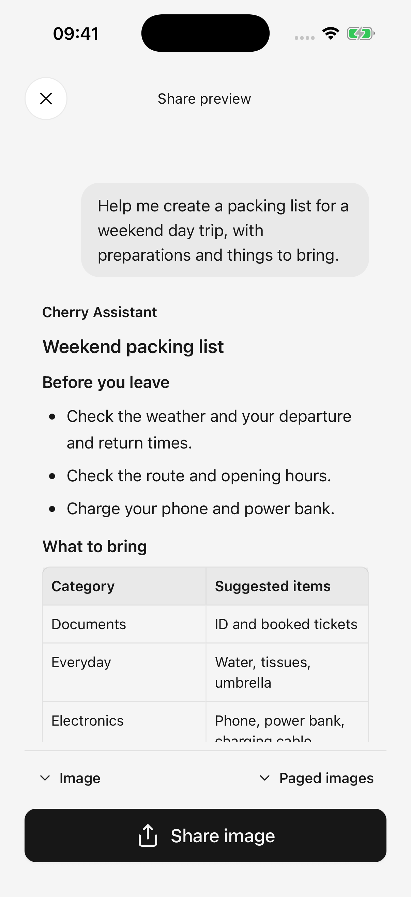
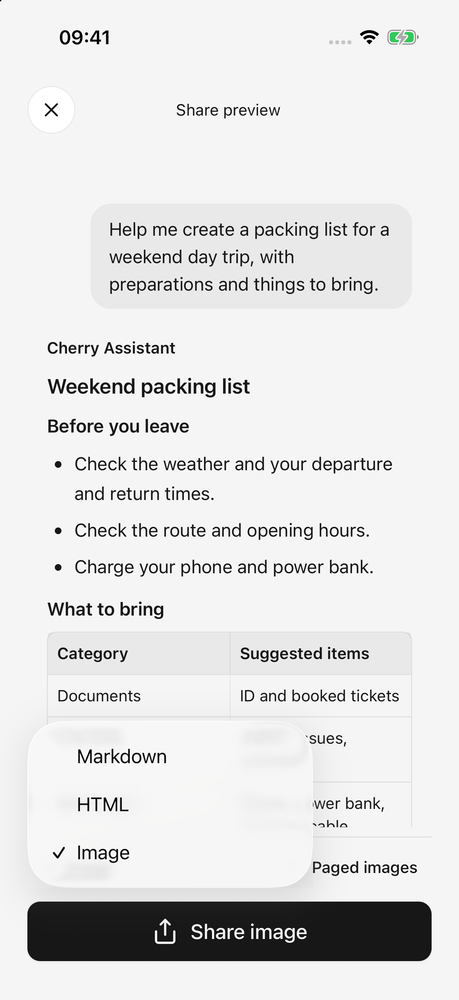

# Partage et exportation

Partagez une réponse ou transformez plusieurs échanges en images, en document Web ou en texte modifiable. Sélectionnez le contenu, inspectez l'aperçu, puis choisissez la destination.

## Partager les messages sélectionnés

1. Utilisez l'action de partage de la réponse ou le menu de partage d'un message.
2. Sélectionnez les messages sur la page de sélection ; le message original est sélectionné initialement.
3. Confirmez pour ouvrir l’aperçu plein écran.
4. Choisissez un format, une mise en page de l'image et si vous souhaitez inclure du contenu de réflexion.
5. Appuyez sur Partager et choisissez une destination dans la feuille système.

Seuls les **messages sélectionnés** sont exportés. Les questions ne sont pas incluses automatiquement, alors sélectionnez-les si nécessaire pour le contexte. La sortie suit la chronologie des conversations quel que soit l’ordre de sélection.

Sélectionnez jusqu'à 128 messages à la fois. Les messages inachevés ne peuvent pas être sélectionnés. Les lignes de sélection affichent de courts extraits ; export lit le contenu complet sélectionné et présente le code/images selon le format choisi.

<figure data-mobile-shot="phone"><figcaption>
<strong>iPhone · Interface en anglais</strong> · Prévisualisez ensemble la question et la réponse sélectionnées ; conversation de démonstration affichée
</figcaption></figure>
<figure data-mobile-shot="phone"><figcaption>
<strong>iPhone · Interface en anglais</strong> · Choisissez Image, HTML ou Markdown dans l'aperçu
</figcaption></figure>

## Choisissez un format

| Formater | Bon pour | Limites |
| --- | --- | --- |
| Images PNG | Lecture directe dans les applications de messagerie | Paginé par défaut ; les aperçus du code de bloc affichent uniquement leur partie d'ouverture |
| HTML | Mise en page plus riche, code complet, contenu extensible | Nécessite un navigateur ou un lecteur compatible |
| Markdown | Conserver le texte source, le code et les tableaux pour des modifications ultérieures | Le rendu dépend de l'application réceptrice |

Les exportations d'images longues produisent des pages ordonnées ; une option d’image longue unique est également disponible. Les images uniques très longues nécessitent plus de mémoire et peuvent échouer lors de la réception des applications. Préférez les pages, HTML ou Markdown dans ce cas.

Les exportations Image/HTML simplifient la présentation des sources. Revenez aux sources originales de la conversation pour une vérification détaillée des citations ; un aperçu d'image n'est pas une archive source complète.

## Pourquoi l'écran de sélection décrit-il différents formats ?

Certaines versions conservent un message plus ancien indiquant que la sélection multiple ne prend en charge que HTML et Markdown. L'aperçu actuel prend également en charge les images pour plusieurs messages ; utilisez les formats réellement proposés dans l’aperçu. Si la préparation de l'image échoue, utilisez HTML ou Markdown.

## Inclure la réflexion et l’activité des outils

Ceux-ci sont omis par défaut. **Inclure du contenu de réflexion** ajoute un raisonnement visible, une prose intermédiaire et des noms d'outils lisibles, sans exporter de requêtes d'outils brutes ou de données de diagnostic.

HTML peut étendre ce contenu ; la sortie d’image étend le processus inclus. Consultez l'aperçu avant de partager des détails intermédiaires inutiles.

## Les images Markdown peuvent-elles fonctionner hors ligne ?

Les images PNG et JPEG locales/générées sont intégrées dans le fichier Markdown, ce qui peut augmenter sa taille. Certains lecteurs bloquent les images intégrées ; utilisez HTML ou l'exportation d'images si le destinataire ne peut pas les afficher.

Les formats locaux GIF, WebP ou autres qui ne peuvent pas être intégrés deviennent des notes d'image indisponibles. Les autres pièces jointes peuvent conserver uniquement leurs noms/descriptions ; leurs fichiers originaux ne sont pas tous regroupés dans le document. Partagez les fichiers originaux séparément si nécessaire.

Les URL d'images externes restent des liens distants et ne sont pas automatiquement mises à disposition hors ligne.

## Échec de l'exportation de l'image

Si la conversion d'image échoue, l'application tente HTML. Si l'aperçu de HTML échoue également, il conserve Markdown et indique le format disponible. Vérifiez le format avant de partager.

La mise en arrière-plan ou l’annulation interrompt la conversion plutôt que de changer automatiquement de format. Gardez les exportations longues au premier plan ; réduisez la sélection ou utilisez des images paginées si nécessaire.

La fermeture de l'aperçu revient à la sélection des messages. La fermeture de la menu de partage système revient au chat. **L'ouverture de la menu de partage ne prouve pas la destination enregistrée ou envoyé le contenu.**

## Supprimer le filigrane

Désactivez **Paramètres → Général → Filigrane de partage** avant d’exporter. Il est activé par défaut et affecte les futures exportations de conversations, d'images et de fichiers associés. Les fichiers enregistrés/partagés existants ne changent pas.

## Bibliothèque de fichiers et fichiers originaux

Ouvrez **Fichiers** dans la barre latérale pour rechercher les pièces jointes importées et les fichiers générés/exportés enregistrés. Les images, textes, Markdown et HTML pris en charge s'ouvrent dans l'application ; d'autres formats peuvent s'ouvrir via le système ou une autre application.

* Les aperçus d'images prennent en charge le zoom, le partage et l'enregistrement dans Photos.
* Les aperçus de texte volumineux peuvent être partiels et la copie utilise le contenu affiché. **Le partage du fichier original inclut l'original complet.**
* Les aperçus HTML ayant échoué peuvent revenir à la vue source ou être ouverts ailleurs.
* Conservez tous les fichiers nécessaires avant de les supprimer. L'annulation du partage système ne supprime pas automatiquement les fichiers d'exportation déjà enregistrés dans la bibliothèque.

## Transformez le HTML en images ou en diapositives

Pour un fichier HTML entièrement prévisualisable, choisissez **Partager en tant qu’image** ou **Partager en tant que PPT**, attendez la conversion, puis enregistrez via le partage système.

Les diapositives PPTX contiennent des images des pages. Ils préservent l'apparence, **le texte, les tableaux et les formes non modifiables individuellement**. Conservez l’original lorsque des modifications ultérieures sont importantes.

Avant de désinstaller ou d'effacer les données de l'application, enregistrez les fichiers en dehors de Cherry Studio ou sur un autre appareil et confirmez leur ouverture. Les fichiers uniquement présents dans la bibliothèque d'applications peuvent être perdus avec les données d'application.

Les exportations préservent le travail sélectionné, et non une sauvegarde restaurable de l'intégralité de l'application. Voir [importation de bureau](desktop-sync.md) pour connaître les limites de transfert de configuration.

## Partager un fichier ou une présentation généré

Pour partager un fichier enregistré au lieu des messages de discussion sélectionnés, ouvrez sa fiche et utilisez le menu Plus. Voir [Créer et modifier des fichiers](file-generation.md). Les fichiers HTML proposent également [Partager en tant qu'image et Partager en tant que PPT](html-export.md) ; le PPT résultant contient des images de page, et non des objets texte modifiables.
