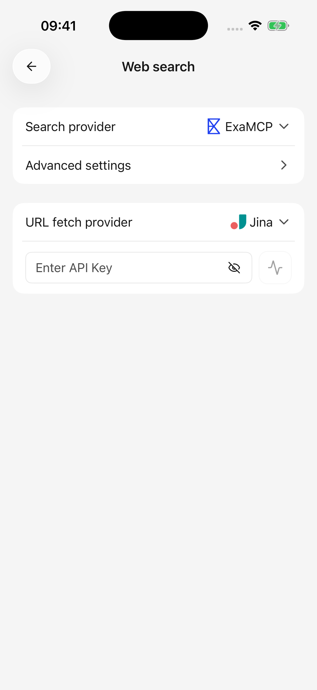

# Recherche Web et lecture de pages

La recherche trouve les pages pertinentes ; la lecture de page extrait le contenu d’un lien. Ils peuvent utiliser différents services.

## Essayez une recherche

1. Choisissez un modèle de texte prenant en charge l'appel d'outil et activez **Recherche sur le Web** dans l'éditeur de l'agent actuel.
2. Demandez « Recherchez les versions récentes de ce projet et incluez les sources » ou « Lisez ce lien et résumez les points principaux : [URL] ».
3. Inspecter le processus et les sources de l'outil ; ouvrez une source pour lire la page originale.

Les nouvelles installations sélectionnent normalement ExaMCP pour la recherche et Jina pour la lecture de pages sans nécessiter de clé personnelle. Les utilisateurs existants conservent leurs sélections. Les services par défaut dépendent toujours de la connectivité et des limites du service.

La zone de saisie actuelle n'a pas de commutateur de recherche Web distinct. Activez **Recherche sur le Web** dans l'éditeur d'agent, configurez les services, puis demandez une recherche dans votre message. Recherchez l'activité et les sources réelles de l'outil plutôt que de vous fier au modèle indiquant qu'il a recherché.

## Changer de service de recherche ou de lecture

Ouvrez **Paramètres → Recherche sur le Web** :

* **Fournisseur de recherche :** recherche les pages à l'aide de mots clés.
* **Fournisseur de récupération d'URL :** lit le contenu d'un lien Web spécifié.

Choisissez un service, entrez la clé/adresse demandée et utilisez **Vérifier** avant d'envoyer un nouveau message. La sélection du service est enregistrée immédiatement. Les clés API sont enregistrées une fois l’édition terminée ; surveillez les erreurs. Les sélections avancées/saisies numériques sont également enregistrées sans action d'enregistrement de page séparée.

Les clés du fournisseur de modèle et les clés du service de recherche sont généralement distinctes. La recherche Zhipu renvoie aux paramètres de son fournisseur de modèles pour la configuration des clés ; d'autres services utilisent leurs propres formulaires.

<figure data-mobile-shot="phone"><figcaption>
<strong>iPhone · Interface en anglais</strong> · La recherche et la lecture de pages ont des fournisseurs distincts ; valeurs par défaut affichées
</figcaption></figure>

## Paramètres avancés

Conservez les valeurs par défaut dans un premier temps, puis ajustez-les en fonction d'un besoin spécifique.

| Paramètre | Objectif | Compromis |
| --- | --- | --- |
| Nombre de résultats | Nombre de résultats de recherche | Plus de perspectives signifie aussi plus de matière à traiter |
| Compression du résultat | Si le contenu de la recherche est raccourci | La coupure réduit l'utilisation ; aucune compression ne signifie pas une capacité de modèle illimitée |
| Contenu total de la recherche | Limite la quantité de texte conservé | Les limites inférieures peuvent omettre des détails ultérieurs |

La lecture des pages a également des limites distinctes. Les pages longues peuvent être lues seulement partiellement. Ouvrez l'original lors de la vérification des détails ; répéter la même récupération ne récupère pas automatiquement le segment suivant.

## Le chat fonctionne, mais pas la recherche

Le modèle de chat, le service de recherche et le service de lecture se connectent séparément. Vérifiez :

1. Indique si le modèle prend en charge l'appel d'outil et si le commutateur **Recherche sur le Web** de l'agent est activé.
2. Si le service sélectionné réussit la vérification de ses paramètres.
3. Que votre demande demande clairement une recherche et fournisse des mots-clés ou un lien.
4. Erreurs d'outil pour des problèmes de réseau, de clé, d'autorisation, de quota ou d'accès aux pages.

Après un échec de recherche ou de lecture de page, cette réponse cesse de démarrer de nouvelles tentatives Web et utilise les informations déjà obtenues lorsque cela est possible. Il ne change pas silencieusement de fournisseur. Résolvez le problème et envoyez un nouveau message pour réessayer.

## Pourquoi ne parvient-il pas à lire une page connectée ?

Les services de lecture accèdent aux liens de leur propre réseau et n'héritent pas de la connexion du navigateur de votre téléphone. Les pages restreintes ou réservées à la connexion uniquement peuvent être inaccessibles.

Utilisez le [plug-in correspondant](plugins.md) pour les ressources Feishu ou Notion, ou joignez une exportation autorisée à l'aide de [chat et fichiers](chat-and-files.md).

## Où vont les données ?

Les mots-clés de recherche et les URL cibles renvoient au service de recherche/lecture sélectionné. Le matériel retourné est utilisé par le modèle. Évitez d'inclure des clés ou des informations privées qui n'ont pas leur place dans une recherche sur le Web. Voir [données et confidentialité](data-privacy.md).
