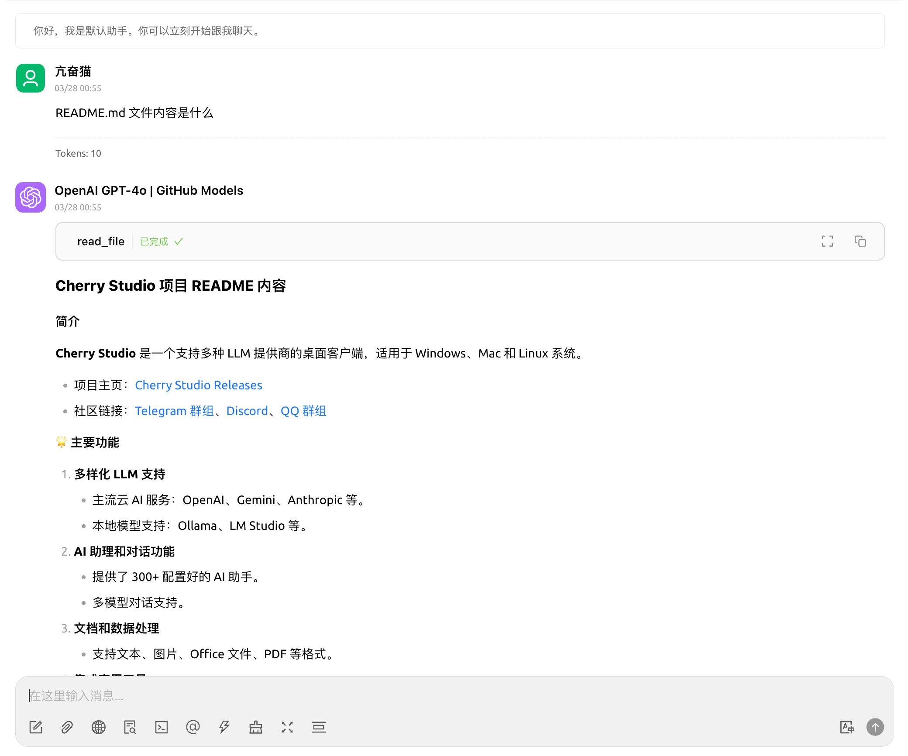
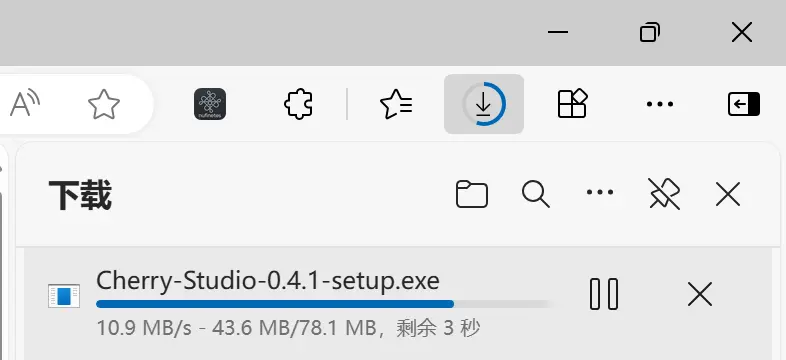
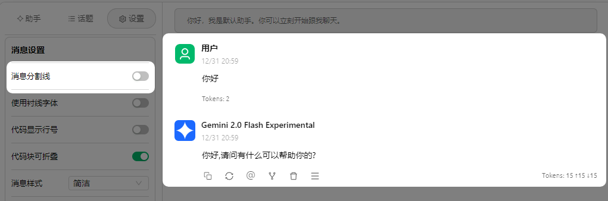
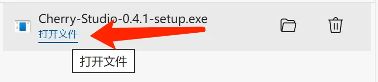

# Windows


Ce document a été traducido del chino por IA y aún no ha sido revisado.


## Ouvrir le site officiel


Remarque : Windows 7 ne prend pas en charge l'installation de Cherry Studio.


Cliquez pour télécharger et sélectionner la version appropriée



<figure><figcaption>
Ouvrir le site officiel
</figcaption></figure>

## Attendre la fin du téléchargement

<figure><figcaption>
Téléchargement en cours avec le navigateur Edge
</figcaption></figure>

> Si le navigateur indique que le fichier n'est pas approuvé, etc., choisissez simplement "Conserver"
>
> `Choisir Conserver` → `Faire confiance à Cherry-Studio`

<figure><figcaption></figcaption></figure>

## Ouvrir le fichier

<figure><figcaption>
Liste de téléchargement d'Edge
</figcaption></figure>

## Installer

<figure><figcaption>
Interface d'installation du logiciel
</figcaption></figure>