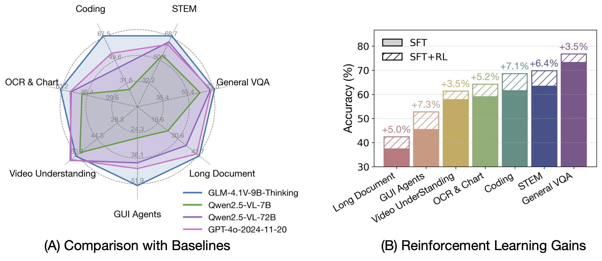

# Zhipu GLM-4.6V

Les utilisateurs de Cherry Studio peuvent désormais tester gratuitement **Zhipu GLM-4.6V** via le service intégré **CherryIN** — le modèle visuel phare publié par Z.ai (Zhipu AI) en décembre 2025, doté d'une architecture MoE, d'un contexte natif multimodal de 128K et d'appels d'outils natifs multimodaux, idéal pour la compréhension d'images et de textes ainsi que pour les scénarios d'agents multimodaux.

***

## Qu'est-ce que GLM-4.6V ?

GLM-4.6V est la dernière génération de modèles de langage visuel de la série GLM-V de Z.ai. Il prend en charge nativement la modélisation unifiée du texte et des images, en étendant les capacités de contexte et d'appels d'outils par rapport à GLM-4.5V.

- Architecture : Mixture-of-Experts (MoE)
- Nombre total de paramètres : 106B
- Paramètres activés : environ 12B
- Longueur de contexte : 128K tokens
- Licence open source : MIT
- Date de publication : 8–9 décembre 2025
- Encodeur visuel : prend en charge les images multi-résolutions (jusqu'à 4K)

La série inclut également **GLM-4.6V-Flash (9B)**, destiné aux scénarios locaux et à faible latence, gratuit et utilisable commercialement.

<figure><figcaption></figcaption></figure>

***

## Poursuite du système d'entraînement multimodal de la série GLM-V

GLM-4.6V suit la voie technique de GLM-4.1V-Thinking / GLM-4.5V, avec des renforcements supplémentaires dans les domaines visuel et agentique :

1. **Modélisation multimodale native** : entraînement conjoint du texte et des images, prise en charge des entrées mixtes texte-image
2. **Extension du contexte** : le contexte d'entraînement est étendu à 128K tokens, permettant de traiter environ 150 pages de documents denses, 200 diapositives ou 1 heure de vidéo en une seule fois
3. **Appels d'outils multimodaux natifs** : les outils peuvent recevoir et retourner directement des images, gérant les artefacts multimodaux via des URL dans le cadre du protocole MCP étendu
4. **Renforcement par apprentissage** : maintien du processus RL extensible de la série GLM-V

<figure><figcaption></figcaption></figure>

***

## Multimodalité native, orientée vers les cas d'usage réels

Les capacités multimodales de GLM-4.6V couvrent les scénarios quotidiens et professionnels :

- ✅ **Compréhension de contenu riche** : documents longs, textes multi-pages et mise en page mixte texte-image
- ✅ **Recherche web visuelle** : recherche et compréhension en ligne combinées à des entrées visuelles
- ✅ **Reproduction de front-end** : génération de code front-end à partir de maquettes ou de captures d'écran d'interface
- ✅ **Analyse de documents multimodaux à long contexte** : entrées complètes de PDF / diapositives / vidéos
- ✅ **Analyse de graphiques et de tableaux** : extraction d'informations structurées

***

## Appels d'outils multimodaux natifs et capacités d'Agent

L'une des améliorations clés de GLM-4.6V est la boucle fermée **« perception visuelle → action exécutable »** : les appels d'outils prennent nativement en charge les images en entrée et en sortie, permettant aux agents multimodaux de s'intégrer dans des flux métier réels.

| Scénario | Utilisation recommandée | Exemple |
| --- | --- | --- |
| Questions simples texte-image | Dialogue direct | « Que voit-on sur cette image ? » |
| Tâches de complexité moyenne | Activation des appels d'outils | Lecture d'un graphique puis recherche de données |
| Agent multimodal complexe | Multi-outils + MCP | Capture d'écran → compréhension → appel d'API → génération de rapport |

***

## MoE efficace, ouvert et accessible

- ⚡ Activation sparse MoE : 106B de paramètres au total, seulement environ 12B activés
- 💰 **Utilisation gratuite** via CherryIN dans Cherry Studio
- 🖥️ Les poids, le code d'inférence et les outils MCP sont open source sur GitHub et Hugging Face, sous licence MIT

***

## Capacités pratiques : assistant multimodal

GLM-4.6V est adapté aux scénarios suivants en usage réel :

- **Assistant documentaire** : lecture et résumé de documents longs, scans et diapositives complètes
- **Analyse de données** : identification et interprétation de graphiques et de captures d'écran de tableaux de bord
- **Front-end et design** : génération ou modification de code front-end à partir de captures d'écran d'interface
- **Recherche visuelle** : recherche en ligne et intégration d'informations combinées à des images
- **Agent multimodal** : accomplissement de tâches complexes en combinant des outils tels que le navigateur, l'exécution de code et la recherche

***

## Comment l'utiliser dans Cherry Studio ?

1. Ouvrez Cherry Studio et accédez à **Paramètres → Services de modèles**.
2. Trouvez le fournisseur **CherryIN** et activez-le.
3. Sélectionnez **Zhipu GLM-4.6V** dans la liste des modèles.
4. Retournez à l'interface de chat, basculez sur **GLM-4.6V** dans le sélecteur de modèle en haut, puis téléchargez directement des images dans la conversation pour une interaction texte-image.

> 💡 Astuce : Le quota de modèles gratuits fourni par CherryIN est pris en charge par Cherry Studio officiel, idéal pour l'expérience quotidienne et les tests ; pour les environnements de production, il est recommandé d'utiliser l'API officielle de Z.ai (Zhipu).

***

📘 **Testez Zhipu GLM-4.6V dès maintenant et débloquez les capacités multimodales natives et d'agent visuel !**

***

### Obtenir de l'aide et soumettre des retours

Si vous rencontrez des questions, des bugs ou avez des suggestions d'amélioration lors de la configuration ou de l'utilisation, veuillez consulter les canaux officiels fournis dans [Retours et suggestions](../../../question-contact/suggestions.md).
