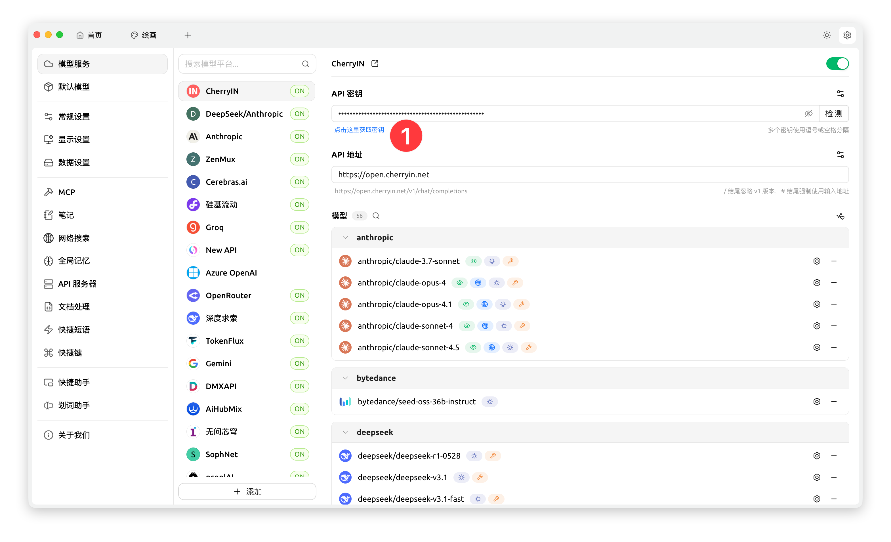
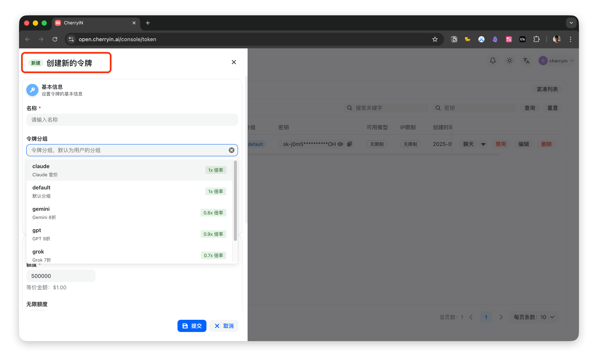
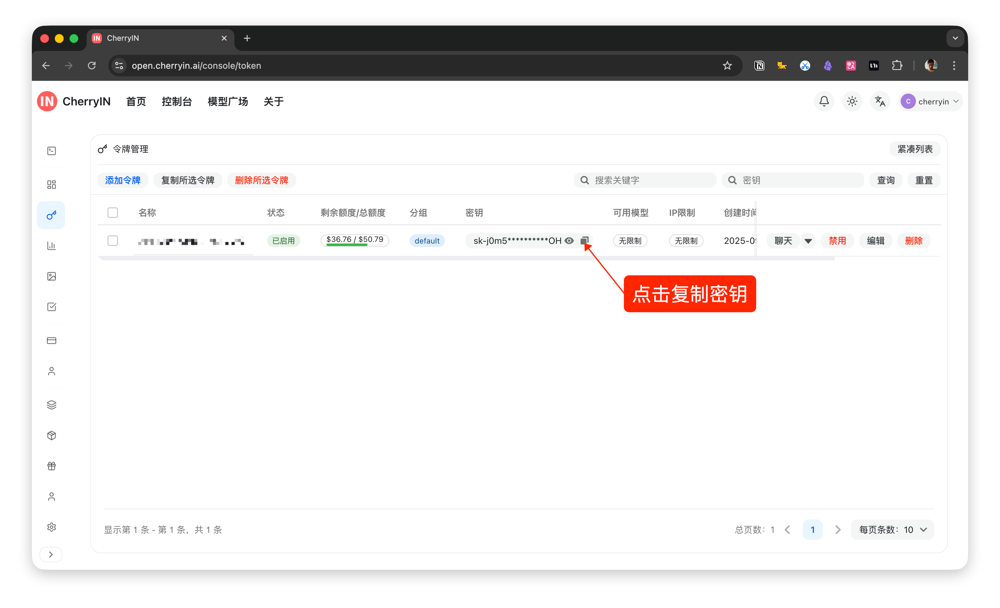
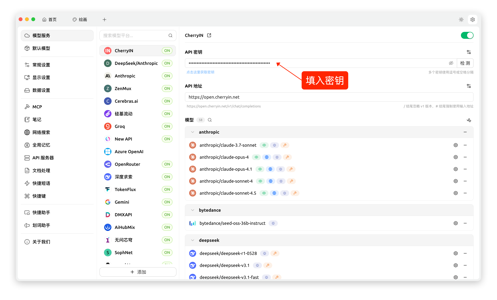
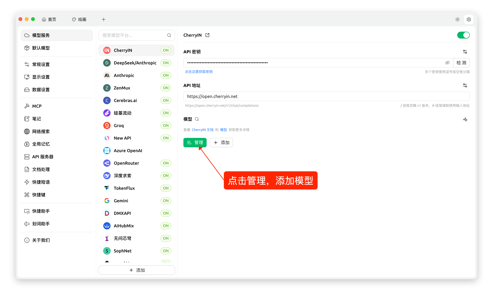
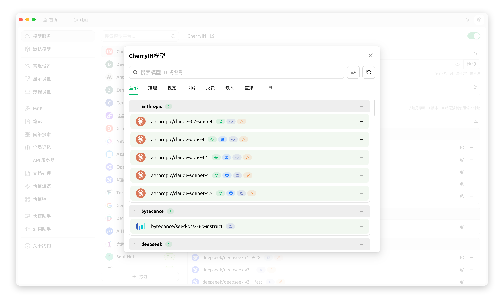
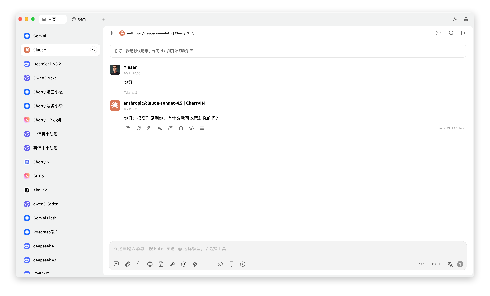

# CherryIN

1. Cliquez sur « Cliquez ici pour obtenir la clé » du fournisseur CherryIN

<figure><figcaption></figcaption></figure>

2. Créez une clé dans la console CherryIN. Remarquez que lors de la création de la clé, les taux de modèles varient selon les groupes de jetons, c'est-à-dire que les réductions diffèrent.

<figure><figcaption></figcaption></figure>

3. Cliquez sur le bouton à côté de la clé et copiez-la dans le presse-papiers

<figure><figcaption></figcaption></figure>

4. Saisissez la clé dans Cherry Studio

<figure><figcaption></figcaption></figure>

5. Cliquez sur le bouton de gestion et ajoutez des modèles

<figure><figcaption></figcaption></figure>

<figure><figcaption></figcaption></figure>

6. Sélectionnez le modèle correspondant dans Cherry Studio pour commencer une conversation

<figure><figcaption></figcaption></figure>