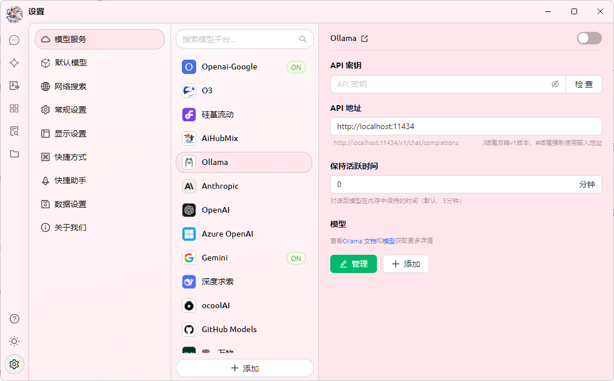

# Ollama

Ollama est un excellent outil open source qui vous permet d'exécuter et de gérer facilement divers grands modèles de langage (LLM) localement. Cherry Studio prend désormais en charge l'intégration d'Ollama, vous permettant d'interagir directement avec des LLM déployés localement dans une interface familière, sans dépendre des services cloud !

## Qu'est-ce qu'Ollama ?

Ollama est un outil qui simplifie le déploiement et l'utilisation des grands modèles de langage (LLM). Il présente les caractéristiques suivantes :

* **Exécution locale :** Les modèles s'exécutent entièrement sur votre ordinateur local, sans nécessiter de connexion Internet, protégeant ainsi votre vie privée et la sécurité de vos données.
* **Simplicité d'utilisation :** Avec de simples commandes en ligne de commande, vous pouvez télécharger, exécuter et gérer divers LLM.
* **Modèles variés :** Prend en charge de nombreux modèles open source populaires tels que Llama 2, Deepseek, Mistral, Gemma, etc.
* **Multiplateforme :** Compatible avec les systèmes macOS, Windows et Linux.
* **API ouverte :** Prend en charge une interface compatible avec OpenAI, permettant une intégration avec d'autres outils.

## Pourquoi utiliser Ollama dans Cherry Studio ?

* **Pas de service cloud nécessaire :** Plus de limitations de quotas ou de frais liés aux API cloud, profitez pleinement de la puissance des LLM locaux.
* **Confidentialité des données :** Toutes vos données de conversation restent sur votre appareil local, vous n'avez pas à craindre la fuite de vos données privées.
* **Disponible hors ligne :** Vous pouvez continuer à interagir avec le LLM même sans connexion Internet.
* **Personnalisation :** Vous pouvez sélectionner et configurer le LLM qui vous convient le mieux selon vos besoins.

## Configurer Ollama dans Cherry Studio

### **1. Installer et exécuter Ollama**

Tout d'abord, vous devez installer et exécuter Ollama sur votre ordinateur. Suivez ces étapes :

* **Télécharger Ollama :** Visitez le site officiel d'Ollama ([https://ollama.com/](https://ollama.com/)), téléchargez le package d'installation correspondant à votre système d'exploitation.  
  Pour Linux, vous pouvez directement exécuter la commande suivante pour installer Ollama :

  ```sh
  curl -fsSL https://ollama.com/install.sh | sh
  ```
* **Installer Ollama :** Suivez les instructions de l'installateur pour terminer l'installation.
* **Télécharger un modèle :** Ouvrez un terminal (ou invite de commandes), utilisez la commande `ollama run` pour télécharger le modèle que vous souhaitez utiliser. Par exemple, pour télécharger le modèle Llama 2, vous pouvez exécuter :

  ```sh
  ollama run llama3.2
  ```

  Ollama téléchargera et exécutera automatiquement ce modèle.
* **Gardez Ollama en cours d'exécution :** Pendant que vous interagissez avec les modèles Ollama via Cherry Studio, assurez-vous qu'Ollama reste en cours d'exécution.

### **2. Ajouter Ollama en tant que fournisseur de services dans Cherry Studio**

Ensuite, ajoutez Ollama en tant que fournisseur de services d'IA personnalisé dans Cherry Studio :

* **Ouvrir les paramètres :** Dans la barre de navigation gauche de l'interface Cherry Studio, cliquez sur "Paramètres" (icône d'engrenage).
* **Accéder aux services de modèle :** Sur la page des paramètres, sélectionnez l'onglet "Services de modèle".
* **Ajouter un fournisseur :** Cliquez sur Ollama dans la liste.

<figure><figcaption></figcaption></figure>

### **3. Configurer le fournisseur de services Ollama**

Dans la liste des fournisseurs de services, trouvez l'Ollama que vous venez d'ajouter et configurez-le en détail :

1. **État d'activation :**
   * Assurez-vous que l'interrupteur à l'extrême droite du fournisseur Ollama est activé, indiquant qu'il est en service.
2. **Clé API :**
   * Ollama n'a **pas besoin** par défaut d'une clé API. Vous pouvez laisser ce champ vide ou y mettre n'importe quel contenu.
3. **Adresse API :**
   * Remplissez l'adresse de l'API locale fournie par Ollama. Généralement, l'adresse est :
     ```
     http://localhost:11434/
     ```
     Si vous avez modifié le port, ajustez-le en conséquence.
4. **Temps de maintien en activité :** Cette option définit la durée de maintien de la session en minutes. Si aucune nouvelle conversation n'a lieu dans le temps imparti, Cherry Studio se déconnecte automatiquement d'Ollama pour libérer des ressources.
5. **Gestion des modèles :**
   * Cliquez sur le bouton "+ Ajouter" pour ajouter manuellement le nom du modèle que vous avez déjà téléchargé dans Ollama.
   * Par exemple, si vous avez téléchargé le modèle `llama3.2` via `ollama run llama3.2`, vous pouvez entrer `llama3.2` ici.
   * Cliquez sur le bouton "Gérer" pour modifier ou supprimer les modèles ajoutés.

## Commencer à utiliser

Une fois la configuration ci-dessus terminée, vous pouvez dans l'interface de chat de Cherry Studio, sélectionner le fournisseur de services Ollama et le modèle que vous avez téléchargé, et commencer à dialoguer avec votre LLM local !

## Conseils et astuces

* **Première exécution d'un modèle :** Lors de la première exécution d'un modèle, Ollama a besoin de télécharger les fichiers du modèle, ce qui peut prendre du temps, soyez patient.
* **Voir les modèles disponibles :** Exécutez la commande `ollama list` dans un terminal pour voir la liste des modèles Ollama que vous avez téléchargés.
* **Exigences matérielles :** L'exécution de grands modèles de langage nécessite certaines ressources informatiques (CPU, mémoire, GPU), assurez-vous que la configuration de votre ordinateur répond aux exigences du modèle.
* **Documentation d'Ollama :** Vous pouvez cliquer sur le lien `Voir la documentation et les modèles d'Ollama` dans la page de configuration pour accéder rapidement à la documentation officielle d'Ollama.