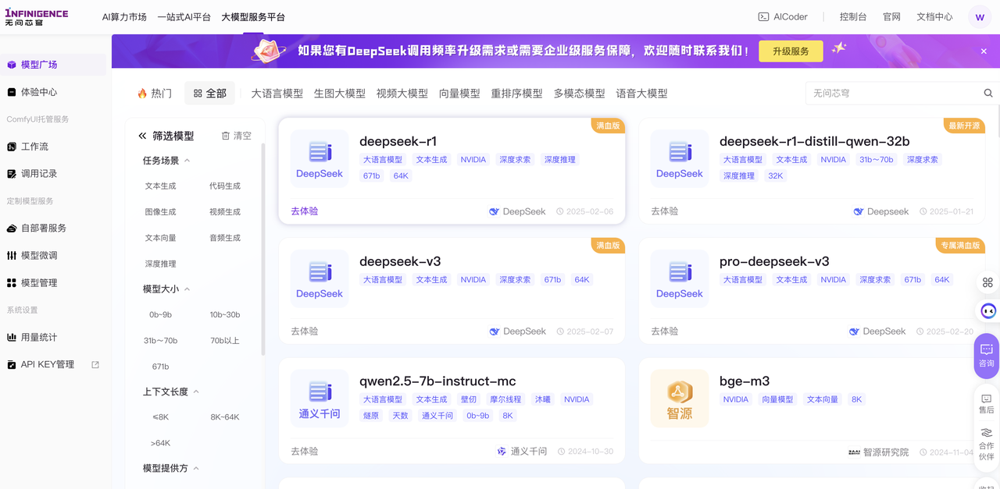
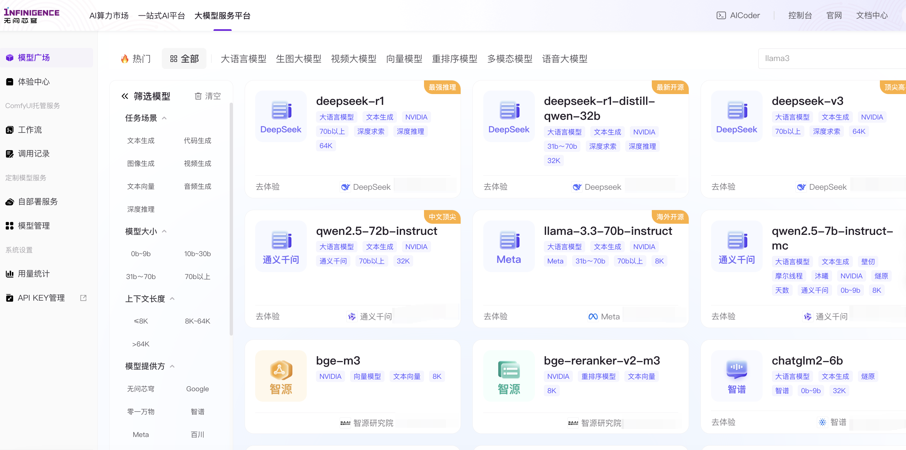
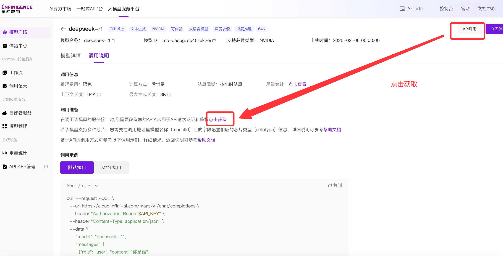
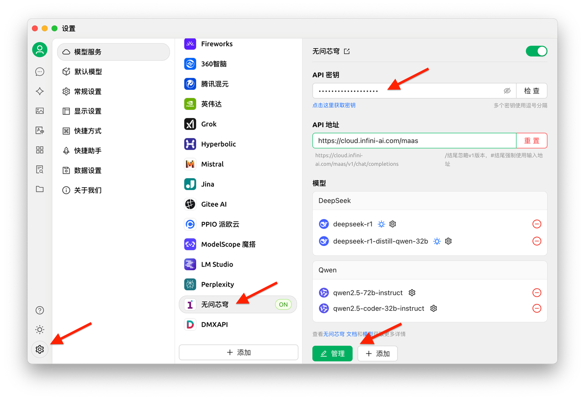
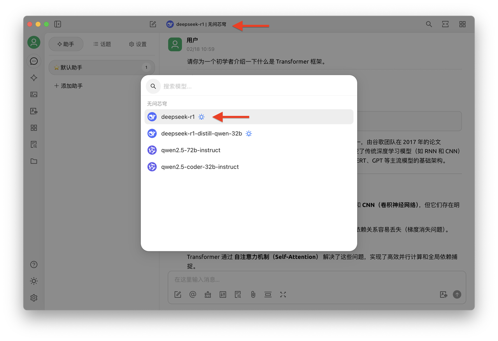
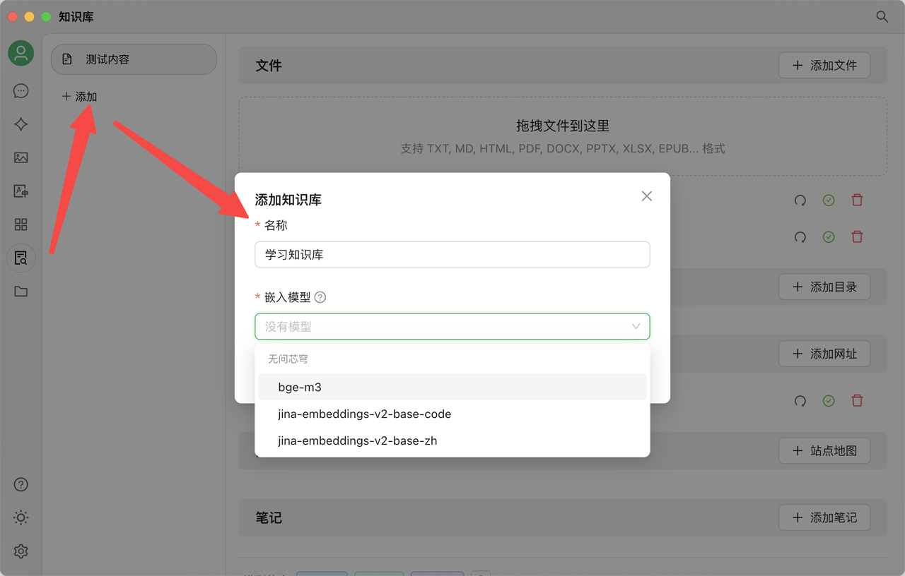
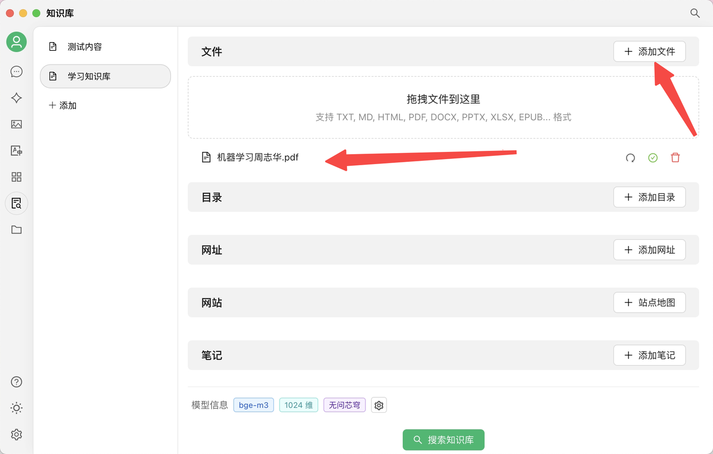
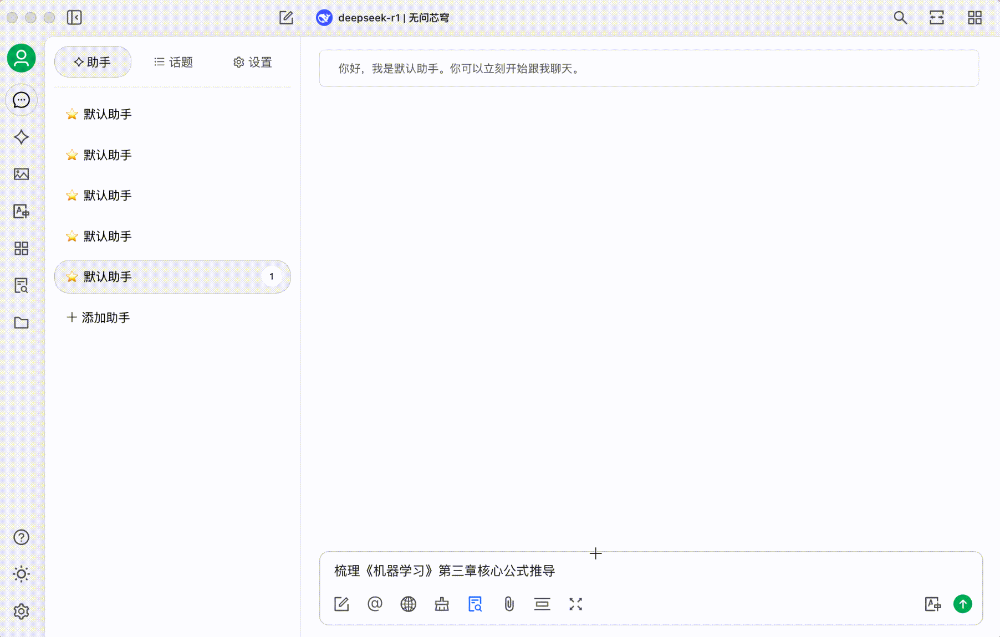
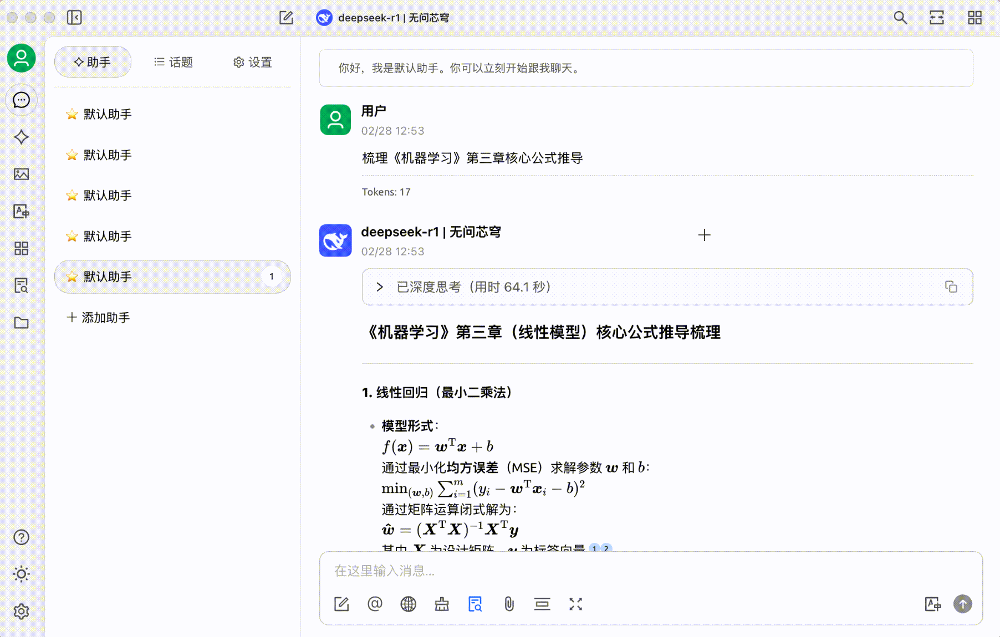

# Infini-AI（无问芯穹）

Vous vivez peut-être cette situation : 26 articles utiles épinglés sur WeChat jamais relus, plus de 10 fichiers éparpillés dans votre dossier "Ressources d'apprentissage", cherchant désespérément une théorie lue il y a six mois avec seulement quelques mots-clés en tête. Quand le volume quotidien d'information dépasse la capacité de traitement de votre cerveau, 90% des connaissances précieuses sont oubliées en 72 heures.\
Désormais, avec l'API de la plateforme de grands modèles Infini-AI + Cherry Studio, vous pouvez créer une base de connaissances personnelle transformant articles WeChat oubliés et contenus fragmentés en savoir structuré, accessible avec précision.

### I. Construction de votre base de connaissances personnelle

#### 1. Service API Infini-AI : le « cerveau réflexif » de votre base, fiable et performant

En tant que « cerveau réflexif » de la base de connaissances, la plateforme Infini-AI propose des versions de modèles comme DeepSeek R1 version complète, offrant un service API stable. **Actuellement, l'utilisation est gratuite après inscription, sans conditions.** Elle prend en charge les modèles d'embedding populaires (bge, jina) pour construire votre base, **tout en intégrant continuellement les derniers modèles open-source puissants**, incluant des capacités multimodales (images, vidéos, audio).

<figure><figcaption></figcaption></figure>

#### 2. Cherry Studio : construisez votre base sans code

Cherry Studio est un outil IA intuitif. Alors que le développement traditionnel d'une base RAG nécessite 1 à 2 mois, cet outil offre l'avantage d'une **configuration zéro code**. Importez en un clic des contenus aux formats Markdown/PDF/web. L'analyse d'un fichier de 40MB prend 1 minute. Ajoutez également des dossiers locaux, des articles sauvegardés dans WeChat ou des notes de cours.

<figure><figcaption></figcaption></figure>

### II. 3 étapes pour créer votre assistant de savoir personnel

#### Étape 1 : Préparatifs

1. Téléchargez Cherry Studio sur le site officiel (https://cherry-ai.com/)
2. Créez un compte : connectez-vous à la plateforme Infini-AI (https://cloud.infini-ai.com/genstudio/model?cherrystudio)
3. Obtenez votre clé API : dans la « Place des modèles », choisissez deepseek-r1, cliquez sur Créer et copiez la clé API + le nom du modèle

<figure><figcaption></figcaption></figure>

#### Étape 2 : Dans les paramètres de Cherry Studio, sélectionnez "Infini-AI", saisissez votre clé API et activez le service

<figure><figcaption></figcaption></figure>

Après ces étapes, choisissez le modèle dans l'interface pour utiliser le service API Infini-Ai dans Cherry Studio.\
Pour plus de simplicité, vous pouvez définir un « modèle par défaut ».

<figure><figcaption></figcaption></figure>

#### Étape 3 : Ajoutez une base de connaissances

Sélectionnez un modèle d'embedding (série bge ou jina) de la plateforme Infini-AI.

<figure><figcaption></figcaption></figure>

<figure><figcaption></figcaption></figure>

### III. Test réel par un utilisateur

* Après import de ressources d'apprentissage : "Synthétisez les dérivations clés du chapitre 3 du livre 'Machine Learning'"

<figure><figcaption></figcaption></figure>

**Résultat généré :**

<figure><figcaption></figcaption></figure>